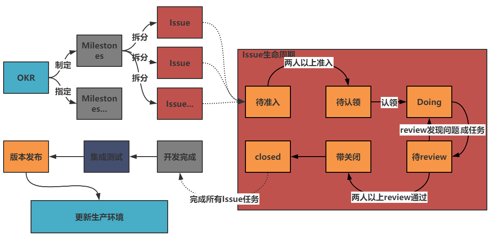
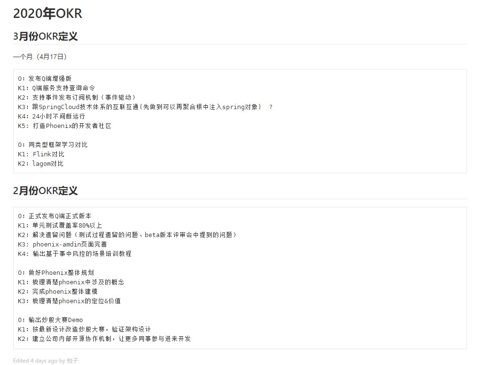
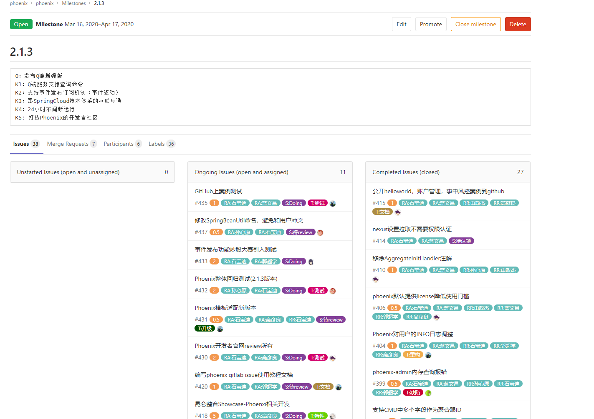
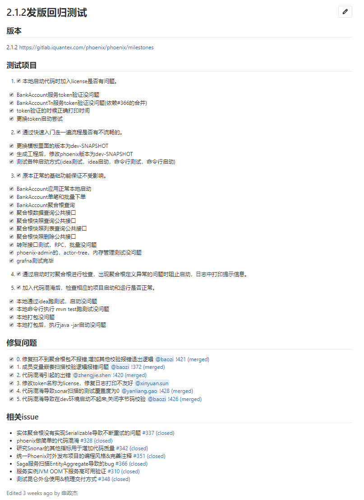
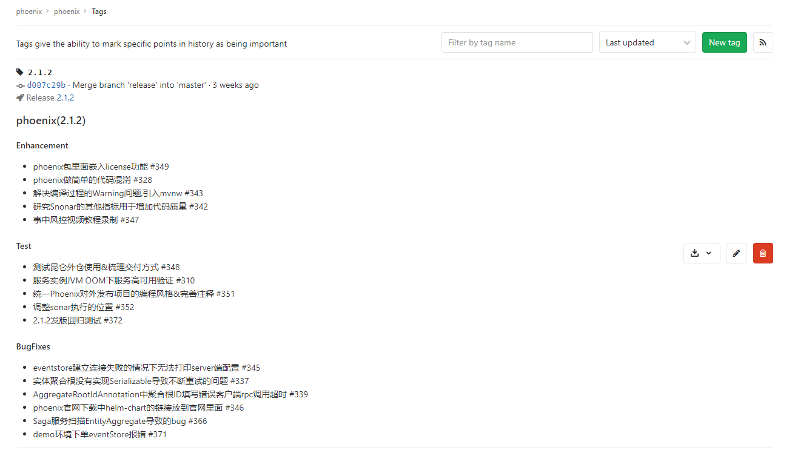
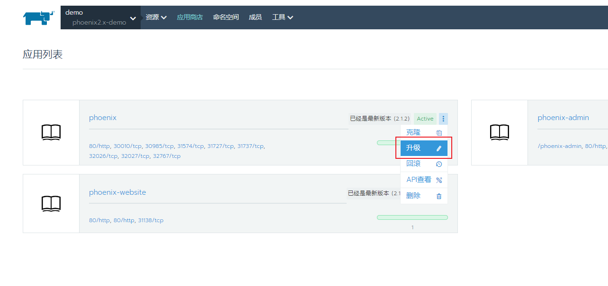
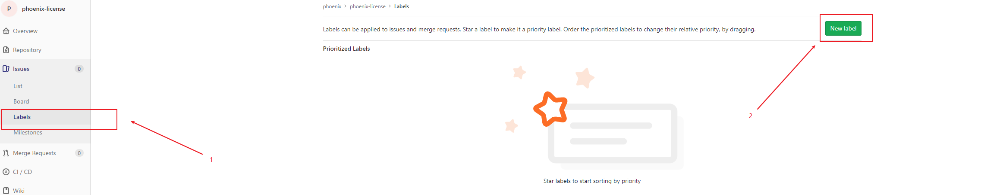
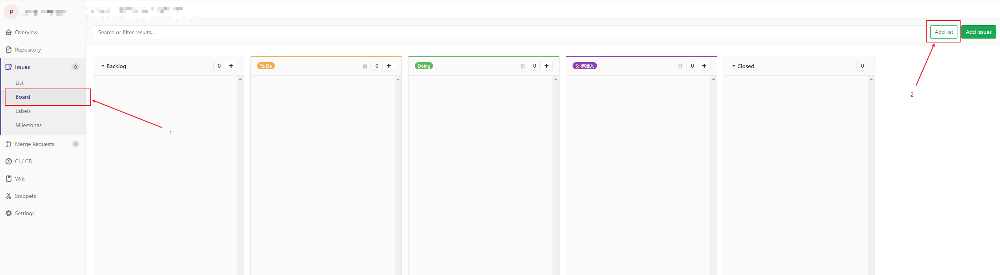
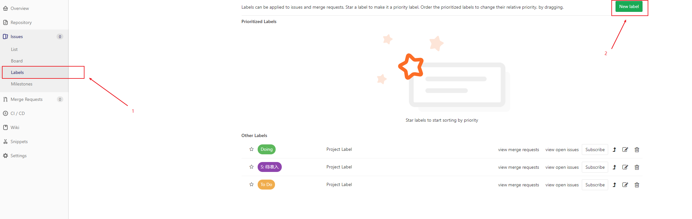
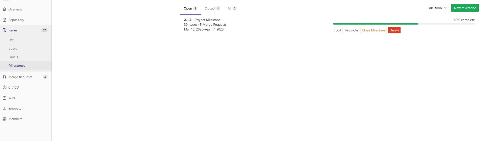

> 本篇文章介绍了宽拓科技Phoenix组如何使用GitLab进行高效的远程开发协作。

{/* truncate */}

## 开发流程介绍
总体流程分为Issue指定，开发，版本发布三个步骤。

### OKR制定

创建一个新的OKR的时候，首先小组组长罗列出这个OKR中的主要目标，然后发起电话会议邀请组内成员一起讨论分析OKR的具体任务是那些

### 制定Milestones

根据OKR讨论出来的任务创建Milestones，用来关联OKR中讨论出来的任务，这样可以在Milestones面板很直观的看到当前任务的进度以及开发状态

### Issue整理
创建Milestones之后就可以根据Milestones来拆分出具体任务，拆分出来的Issue需要遵循一下规定:

 1. 每个Issue都需要关联到对应的Milestones
 2. Issue描述应尽可能详细，例如：完成Issue的目标，Issue的交付物都有哪些等等
 3. 可以根据Issue的描述来评估Issue工作量，以便之后对每个人工作的量化统计
 4. 刚创建的Issue应放在**待准入**面板中让其他同事一起来评估是否合理等，如果评估没有发现问题即可打上自己的RA标签（尽可能在Issue下的评论区进行讨论，这样同组的同事都可以看到，发现问题也可以及时补充）

### 任务开发

 1. 在待认领面板中认领Issue
 2. 并且将Issue拖入**Doing**面板
 3. 认领的Issue需要在**Assignee**中设置为自己
 4. 设置**Due date**(Issue接完成截至日期)
 5. 进行开发测试或文档整理，如果任务是开发任务需要将**Merge Requests**关联到相关`Issue`，如果是文档任务需要将文档地址关联到`Issue`（在开发中遇到问题可以将问题提现到Issue中，或者拉上组内成员一起讨论）
 6. 任务完成后将`Issue`拖入**待review**面板
 7. 其他同事应主动去`review`其他人的任务，如果有建议或者问题及时在Issue上进行评论
 8. review没有发现问题的话可以打上RR标签
 9. 当**待review**中的`Issue`的`RR`标签超过两个，可以将`Issue`拖入待关闭并且合并`Issue`中的代码
 10. 合并代码后环境测试没有问题机可彻底关闭`Issue`

### 集成测试

OKR中的所有任务都开发完成，需要罗列出OKR关联所有变动的测试案例进行封板测试。封板测试案例：

### 版本发布

全部测试完成即可升级相应项目版本，并制作相应tag（建议在tag中表明本次升级的所有变动点）

### 更新生产环境
phoenix集成了helm，当合并到master分支后即可在rancher应用商店页面直接升级

### 总结

Phoenix组通过以上开发流程完成了高效、可视、线上化的从任务创建到版本升级整个任务的流程分配于协作。

- 以上所有步骤全部遵循[Gitflow](https://portal.iquantex.com/confluence/pages/viewpage.action?pageId=35816806)开发规定

## GitLab功能介绍

### 标签介绍

- **公告:** 可以存放一些公共信息 **例如：**OKR内容、环境信息、会议记录等
- **讨论:** 存放一些项目发展方向的讨论记录，项目整体设计等
- **待准入:** 用来存放新创建待其他同事检查的`Issue`
- **待认领:** 存放检查通过的`Issue`
- **Doing:** 存放正在开发的`Issue`
- **待review:** 存放可以进行`review`的`Issue`
- **待关闭:** 存放已经合并的，但是需要在环境上进行测试的Issue

### 面板配置

1. 在`Issues->Labels`增加面板标签：**待准入**、**待认领**、**Doing**、**待review**、**待关闭**等标签

2. 在`Issues->Board`中点击**Add List**，增加面板

### 标签功能介绍

- **RA标签:**待准入检查没问题后打入**RA:张三**的标签（只能使用自己的标签）

- **RD标签:**如果**Issue**由多个同事完成，需要在**Issue**中打入一起来完成**Issue**的同事，同事在Issue中说明时间分配

- **RR标签:** **待review**检查没问题后打入

- **时间标签:** 主要用来衡量一个Issue的工作量，这里可以是完成该Issue需要的时间。

### 标签配置

1. 进入**Issues -> Labels**进行配置

### 其他功能介绍

- **Due date** 截止时间，指认领Issue后Issue最后的完成时间
- **Milestones** GitLab中的里程碑是一种跟踪问题并合并为在特定时期内实现更广泛目标而创建的请求的方法。

- `Merge Requests` 如何关联Issue

1. 同一个group同一个project：在`Merge Requests`的`Description`中填入`#+ [Issue编号]`的方式关联
1. 同一个group不同project：在`Merge Requests`的`Description`中填入`[project名称]+#+[Issue编号]`的方式关联
1. 不同group：在`Merge Requests`的`Description`中填入`[group名称]+/+[project名称]+#+[Issue编号]`关联

*还有一种简单的方法关联Issue，在`Merge Requests`的`Description`中填入对应Issue的url即可*

# 链接
- [GitLab Labels官方文档](https://docs.gitlab.com/ee/user/project/labels.html)
- [GitLab Milestones官方文档](https://docs.gitlab.com/ee/user/project/milestones/)
- [GitLab ci/cd官方文档](https://gitlab.iquantex.com/help/ci/README.md)