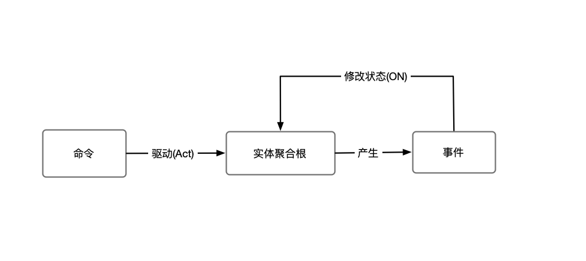
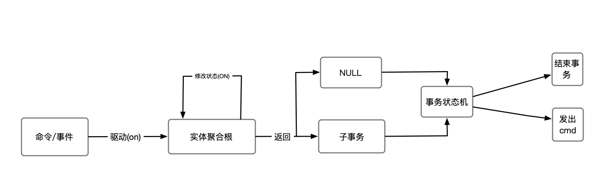
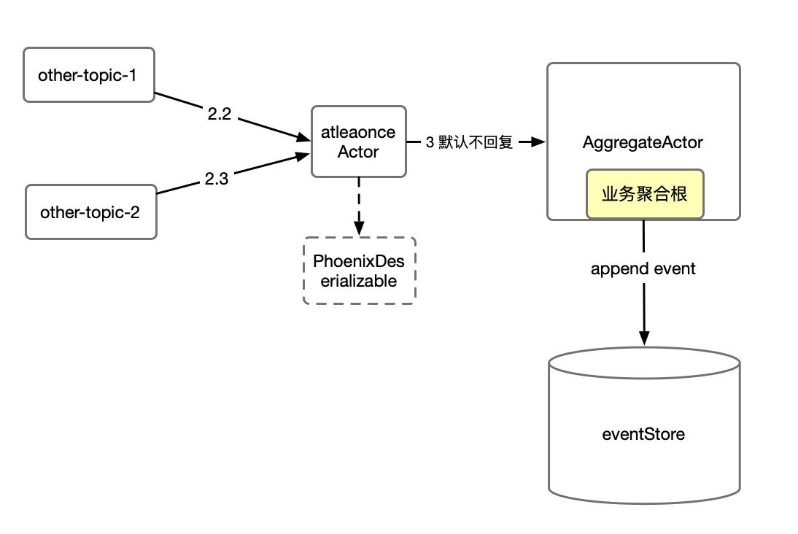
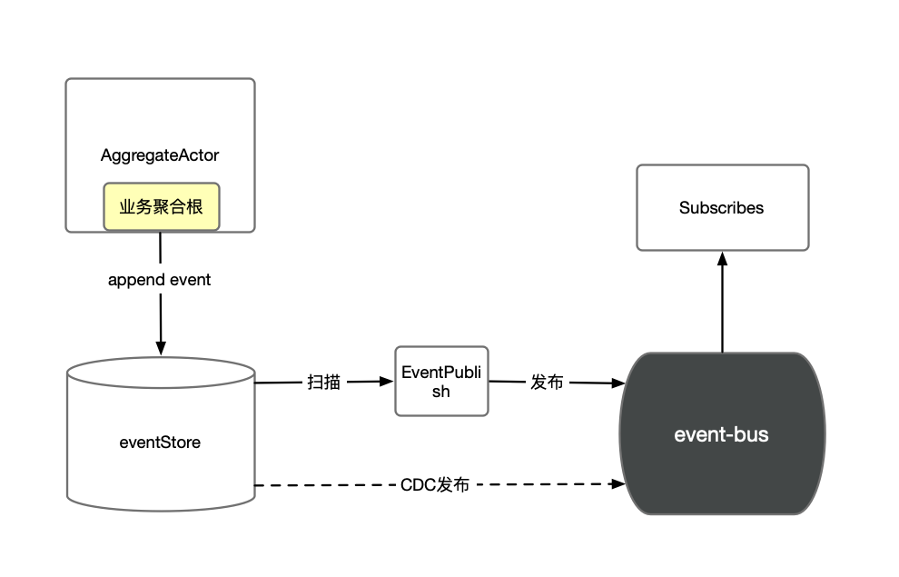
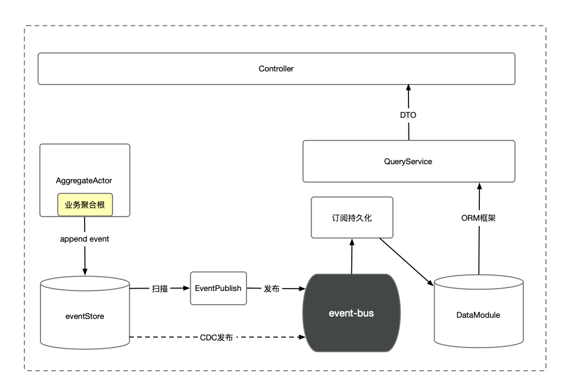
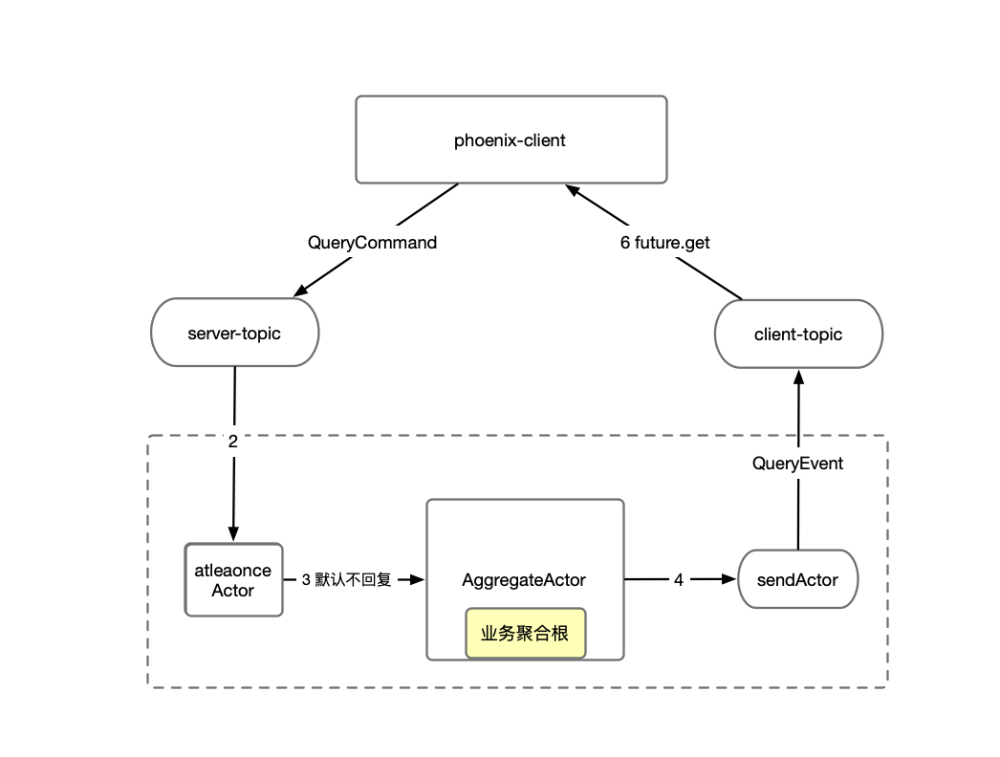

> 本文解析phoenix的特性

{/* truncate */}

## 编程模型

### Actor模型


### 实体聚合根


### 事务聚合根


### 单元测试
``` java
/**
 * 划拨失败
 */
@Test
public void allocate_exceptFail() {
	EntityAggregateFixture fixture = new EntityAggregateFixture();
	// 向 A0 账户划拨 -1500 元，期待划拨失败
	AccountAllocateCmd cmd = new AccountAllocateCmd("A0", -1500);
	// 断言
	fixture.when(cmd).expectRetFailCode().expectMessage(AccountAllocateFailEvent.class);
}
```

## 通讯模型

### 请求-响应


### 非回复


### 主动订阅


## 调用其他服务


## 事件发布


## 查询模型
### Query-Model
最终一致性读
基于数据库query



### QueryCommandHandler
线性一致性读


## 运行模型
- dataSharding
- 聚合根飘逸


