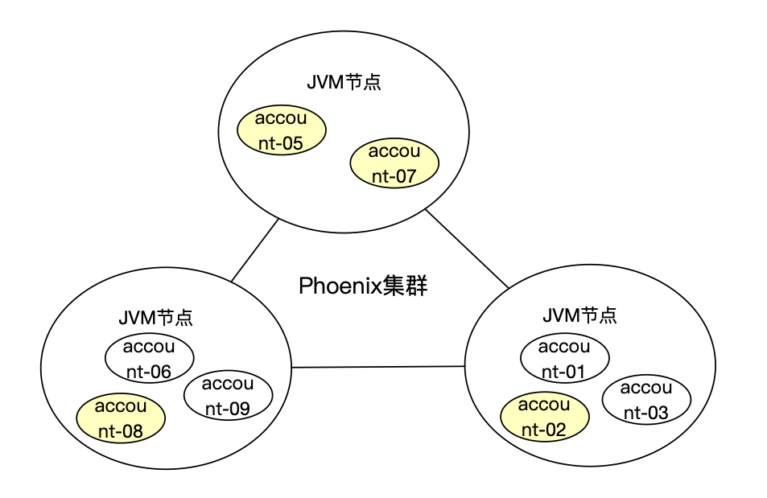

> 本章分析了贫血模型和充血模型的优缺点以及使用场景，进而表明Phoenix的适用场景。
> 
> 本章下面贫血模型和充血模型分析部分内容引用了王争在极客时间[设计模式之美](https://time.geekbang.org/column/intro/250)课程。

{/* truncate */}

## 什么是贫血模型?

贫血模型最早广泛应用是源自于EJB2，把`行为`（也称为方法、过程）和`状态`（可理解为数据，对应到语言就是对象成员变量）分离到不同的对象之中。 那个只有状态的对象就是所谓的“贫血对象”（PO/DTO），而那个只有行为的对象就是我们常见的三层结构中的Service/Manager层。

实际上，你可能一直都在用贫血模型做开发，只是自己不知道而已。据了解，绝大多数的业务后端系统，都是基于贫血模型的。下面用一个银行账户的例子说明一下。

下面实现了简单的银行账户，可以对账户做余额的划拨操作(加钱或者扣钱)。
```java
////////// Service+BO(Business Object) //////////
public class AccountService {
    private AccountRepository accountRepository; //通过构造函数或者IOC框架注入

    public void allocateAmt(Double amt) {
        AccountEntity accountEntity = accountRepository.getAccount(userId);
        AccountBo accountBo = [...convert accountEntity to accountBo...];
        accountBo.amt += amt;
        accountEntity = [...convert accountBo to accountEntity ...];
        accountRepository.update(accountEntity);
    }
}

public class AccountBo {//省略其他属性、get/set/construct方法
    private Long id;
    private String name;
    private String amt;
}

////////// Repository+Entity //////////
public class AccountRepository {
    public AccountEntity getUserById(Long userId) { //... }
    }

    public class AccountEntity {//省略其他属性、get/set/construct方法
        private Long id;
        private String name;
        private String amt;
    }
}
```
像AccountBo这种只包含数据，操作方法在Service中的实现就叫做贫血模型。这种贫血模型将数据与操作分离，破坏了面向对象的封装特性，是一种典型的面向过程的编程风格。


## 什么是充血模型?
在贫血模型中，数据和业务逻辑被分割到不同的类中。充血模型（Rich Domain Model）正好相反，数据和对应的业务逻辑被封装到同一个类中。因此，这种充血模型满足面向对象的封装特性，是典型的面向对象编程风格。

在充血模型当中，会引入domain这一层，把核心业务的数据和方法都写在Domain当中。充血模型是一种重业务的实现方式，要求程序员在研发之初
要做充分的业务分析和设计，[DDD(领域驱动设计)](https://medium.com/the-coding-matrix/ddd-101-the-5-minute-tour-7a3037cf53b8)是一种比较好的指导思想。还用上面银行账户的例子感受一下。

```java
////////// Service负责domain对象持久化转换 //////////
public class AccountService {
    private AccountRepository accountRepository; //通过构造函数或者IOC框架注入

    public void allocateAmt(Double amt) {
        AccountEntity accountEntity = accountRepository.getAccount(userId);
        AccountBo accountBo = AccountDomain.load(accountEntity);
        accountBo.allocate(amt);
        accountEntity = [...convert accountBo to accountEntity ...];
        accountRepository.update(accountEntity);
    }
}

public class AccountDomain {
    private Long id;
    private String name;
    private Double amt;
    
    public static AccountDomain load(AccountEntry entry){//...}

    public void allocateAmt(Double amt) {
        this.amt += amt;
    }        
}

////////// Repository+Entity //////////
public class AccountRepository {
    public AccountEntity getUserById(Long userId) { //... }
    }

    public class AccountEntity {//省略其他属性、get/set/construct方法
        private Long id;
        private String name;
        private Double amt;
    }
}
```
AccountDomain既包含了数据还包含了账户划拨的方法，是真正的面向对象的编程方式。

## 使用场景分析

接下来我们分别看一下贫血模型和充血模型都适合哪些场景，上面的例子当中，无论是贫血模型和充血模型
都可以实现，并且看起来复杂度也差不多，虽然贫血模型是面向过程的，但由于业务简单，也没什么不好。如果我们
增大业务复杂度，来看看两种模型是否有本质区别。

增加需求：
1. 需要账户余额支持多币种。
2. 在多币种之上需要根据汇率实时计算不同币种的市值。
3. 余额增加冻结和解冻操作。
4. 在冻结和解冻之上需要提供总金额和可用金额计算。
5. 假设该账户是证券账户，投资了股票，需要实时根据行情计算收益。
6. 其他等等等。

你可以再脑海当中使用贫血模型的开发方式构造一下如何完成这些需求。 

### 贫血模型场景分析

我们可以使用贫血模型的设计思路推演一下：

1. 给账户表设计并增加这些需求所需要的字段。
2. 为了满足一些特定需求，增加很多自定义的sql，甚至会有join表查询（比如计算收益率join行情表）。
3. 编写service，但是有可能逻辑会在sql，也有可能在service，也有可能特殊的逻辑用特殊的sql实现，导致sql满天飞。
4. Bo,Vo,Entry增加相关字段。

这种开发方式是典型的SQL驱动的开发模式，这样将会导致逻辑不内聚，代码复用性不高，新的开发人员很难通过代码读清楚逻辑，并且单元测试难以编写，随着更多需求加入，整个工程就会臃肿起来，变得难以维护和测试。

那么为什么贫血模型的种种弊端会被广大程序员所接受呢？有以下几个原因：

1. 大部分情况下，我们开发的系统业务可能都比较简单，简单到就是基于 SQL 的 CRUD 操作，所以，我们根本不需要动脑子精心设计充血模型，贫血模型就足以应付这种简单业务的开发工作。除此之外，因为业务比较简单，即便我们使用充血模型，那模型本身包含的业务逻辑也并不会很多，设计出来的领域模型也会比较单薄，跟贫血模型差不多，没有太大意义。
2. 充血模型的设计要比贫血模型更加有难度。因为充血模型是一种面向对象的编程风格。我们从一开始就要设计好针对数据要暴露哪些操作，定义哪些业务逻辑。而不是像贫血模型那样，我们只需要定义数据，之后有什么功能开发需求，我们就在 Service 层定义什么操作，不需要事先做太多设计。
3. 思维已固化，转型有成本。基于贫血模型的传统开发模式经历了这么多年，已经深得人心、习以为常。你随便问一个旁边的大龄同事，基本上他过往参与的所有 Web 项目应该都是基于这个开发模式的，而且也没有出过啥大问题。如果转向用充血模型、领域驱动设计，那势必有一定的学习成本、转型成本。很多人在没有遇到开发痛点的情况下，是不愿意做这件事情的。


### 充血模型场景分析

我们可以尝试再使用充血模型的设计思路推演一下：
1. 充分分析业务需求，通过DDD的设计指导思想，划分领域。
2. 提出Account领域所设计的功能，设计对象，方法。
3. 直接对该领域先进行编程实现业务代码。

实际上，上面提到的需求都是AccountDomain的边界，在我们充分理解业务需求之后，即可直接对现有的AccountDomain代码进行开发。可以参考下面代码示例
```java
public class AccountDomain {
    private Long id;
    private String name;
    // key = 币种 value = 余额
    private Map<String, Double> currencyAmt;
    private Double frozenAmt;
    // 股票持仓 (Position是该领域下又一个实体对象)
    private Map<String, Position> position;
    
    public static AccountDomain load(AccountEntry entry){//...}

    public void allocateAmt(Double amt) {
        this.amt += amt;
    }        
    
    // 获取总资产(RMB)
    public Double getAllAsset() {
        // 遍历所有币种计算市值 + 股票持仓市值
        // 伪代码：currentcyAmt.values().stream(sum) + position.values().stream.stram(getQty * marketValue);    
    }
    
    // 冻结余额
    public void frozenAmt(double amt){
        frozenAmt += amt;
    }
    // 其他等等方法都按照直接该类的角度上编写即可。
}

public class AccountDomainTest{
   // 测试代码也很好编写，不依赖任何中间件，直接构造自己的数据放到对象里面调用对应方法断言即可.
}
```

看到这里相信你应该能get到充血模型的好处了吧，当然你会问，只写一个领域层代码肯定不行，这个对象如何和数据库打交道呢？不还是要定义service,repository来做消息调用和持久化吗?

是的，需要定义这些，但是这些都是辅助domain完成非功能需求，核心的业务代码都内聚在这个domain里面了。实际上越来越多的实践表明，在充血模型下，表结构设计变得不那么重要，你甚至都可以使用NoSQL(MongoDB)，把对象序列化后存进去，需要的时候，再取出来反序列化都可以。

经过上面对比分析，那么什么时候该考虑使用充血模型开发模式呢？

基于贫血模型的传统的开发模式，比较适合业务比较简单的系统开发。相对应的，基于充血模型的 DDD 开发模式，更适合业务复杂的系统开发。比如，包含各种利息计算模型、还款模型等复杂业务的金融系统。

我们知道，越复杂的系统，对代码的复用性、易维护性要求就越高，我们就越应该花更多的时间和精力在前期设计上。而基于充血模型的 DDD 开发模式，正好需要我们前期做大量的业务调研、领域模型设计，所以它更加适合这种复杂系统的开发。

### 非功能场景分析

上面分别介绍了贫血模型，充血模型的优缺点和适用场景。不过，对于完整的系统来说，
无论是充血模型还是贫血模型的系统都会有很多非功能性需求。用户除了完成业务功能外，还需要考虑这些非功能需求，
下面表格简单分析了完成这些非功能需求的技术选型以及用户使用门槛。

|非功能需求|实现方式|使用门槛|
|---|---|---|
|事务保障|本地事务保障可以依赖关系型数据库来完成，借助ORM框架可以比较方便的操作数据库|中|
|高可用|在一个系统中，高可用至关重要，一般高可用要根据所用技术和所依赖的中间件做对应的设计。比如，可以使用RPC框架多点部署，然后客户端通过负载均衡来达到高可用|高|
|接口幂等|用户可能发送同样的业务请求，在后端需要对该请求做接口幂等，一般会依赖数据库唯一索引，识别用户主键ID来做，但是为了满足幂等，表结构设计会增加一些额外要素|高|
|扩缩容|扩容缩容是一件复杂的事情，虽然应用层是无状态可以容易做到，但是却把难点抛到了数据库，数据库的扩缩容不仅仅要涉及到分库分表(业务上拆分)，数据迁移，引入中间层（比如Mycat）等等。需要重点强调的是，在复杂业务场景，如何做分表是一件特别麻烦的事情，和业务的拆分息息相关。|高|
|高并发|设计高并发的系统首要是寻找并发粒度，有时候设计不完善的情况下，业务的并发粒度很难寻找，会导致各种行锁，表锁，甚至分布式锁，锁来锁去，也是个比较头疼的地方。|高|
|分布式事务|业务横向拆分(分库)，纵向拆分(服务化)后，都会带来一些分布式事务的问题，可以利用比如seata的中间件解决，但也需要对业务的一致性和隔离性做一定取舍|中|
|业务监控|系统运维人员希望对业务执行情况做实时监控，一般为了不耦合业务，会从数据库中反向解析形成另一套系统去做，通过实时分析计算技术去完成|高|
|可扩展性|有时候作为核心业务系统，其他系统希望接收该系统的行为做二次数据加工分析，那就对该系统的扩展性要求比较高。有些系统会在service层抓取动作，投递给MQ，有些系统则直接反向解析数据库日志。并且如果对时序要求较高时，也是比较难以处理的地方|高|

上面列举了一些完整系统还将会遇到的一些非功能性需求，并简单分析了实现方式。事实上，这些非功能需求互相之间都是有相互影响的，我们需要根据业务做具体取舍。但是这些其实都不是
业务领域核心的逻辑，充血模型可以指导用户写出的业务逻辑尽量不被这些非功能需求所影响。总体来说，实现非功能场景还有很高的门槛。

当个程序员好难，我只想好好写业务，帮助业务人员解决问题，肿么办？有没有一款框架能减低实现这些非功能需求的门槛？


也许你可以考虑使用Phoenix。

## 使用Phoenix开发充血模型代码

Phoenix是一款有状态分布式计算框架，旨在帮助业务开发人员降低复杂业务的分布式系统开发门槛。在Phoenix中，业务开发人员可以像面向对象编程一样，愉快的编写充血模型代码，而不需要过多考虑数据持久化，分布式计算，并发安全等一些非功能需求。

Phoenix中业务人员首先需要定义`聚合根`，聚合根是一个领域的入口，在运行时，会根据不同的`聚合根ID`产生不同的`聚合根对象`，聚合根对象是可以分部在各个节点当中并发运行的。Phoenix可以保证聚合根对象的事务特性(ACID)。

> 聚合根对象实际上就是领域对象，你可以对比上面例子理解成是AccountDomain类产生的对象。

如下图，一个AccountDomain运行时创建的所有对象会平均分布在各个Phoenix节点当中，当请求到来时，Phoenix会根据聚合跟ID路由到该节点当中，把请求给到对应的聚合根对象处理。
当一个JVM宕机时，Phoenix集群会自动把该节点中运行的聚合根对象飘逸到其他节点当中，继续承担任务。（实际上网络环境会有更多各式各样的故障，Phoenix做了混沌测试都可以保障可靠性，可以[参考文章](https://phoenix.iquantex.com/blog/2021/06/24/phoniex-openchaos)）



用户在编写Phoenix代码时，需要定义Command和Event，Phoenix是利用EventSouring保障聚合根对象的状态持久性的，所以需要遵守一定的Phoenix开发规范。下面为Phoenix一个聚合根的示例代码:

可以看到，没有任何关于数据库操作的事情，当然也不需要再设计表结构，你接到需求后: 抽象需求 -> 设计对象 -> 编写代码 -> 单元测试 -> done。

```java
@Slf4j
@Data
@EntityAggregateAnnotation(aggregateRootType = "Hello")
public class HelloAggregate implements Serializable {

  private static final long serialVersionUID = -1L;

  /**
   * 状态: 计数器
   */
  private long num;

  /**
   * 处理hello指令,产生HelloEvent
   *
   * @param cmd hello 指令
   * @return 处理结果
   */
  @CommandHandler(aggregateRootId = "helloId")
  public ActReturn act(HelloCmd cmd) {
    return ActReturn.builder().retCode(RetCode.SUCCESS).retMessage("Hello World Phoenix " + cmd.getHelloId() + "...")
        .event(new HelloEvent(cmd.getHelloId())).build();
  }

  /**
   * 处理helloEvent
   *
   * @param event hello事件
   */
  public void on(HelloEvent event) {
    num++;
    log.info("Phoenix State: {}", num);
  }
}
```

除此之外，Phoenix还提供了很多非功能特性，为了直观的做对比，我重新引用上面非功能需求分析的表格，从Phoenix的角度上分析如何降低用户使用门槛。

|非功能需求|常见实现方式| Phoenix实现方式                                                                                                                                               |Phoenix使用门槛|
|---|---|-----------------------------------------------------------------------------------------------------------------------------------------------------------|----|
|事务保障|本地事务保障可以依赖关系型数据库来完成，借助ORM框架可以比较方便的操作数据库| Phoenix中的聚合根可以保障ACID，并且完全不需要用户考虑与数据的访问                                                                                                                    |低|
|高可用|在一个系统中，高可用至关重要，一般高可用要根据所用技术和所依赖的中间件做对应的设计。比如，可以使用RPC框架多点部署，然后客户端通过负载均衡来达到高可用| Phoenix集群可以互相感知，对故障节点做剔除，其他节点可以分担故障节点的请求，整个过程对用户是透明的。Phoenix可以做到秒级切换和恢复                                                                                   |低|
|接口幂等|用户可能发送同样的业务请求，在后端需要对该请求做接口幂等，一般会依赖数据库唯一索引，识别用户主键ID来做，但是为了满足幂等，表结构设计会增加一些额外要素| 对于聚合根对象接收的命令，用户可以简单通过配置的指定命令中的成员来形成幂等主键，Phoenix可以保障同一个幂等ID的请求只会完成一次                                                                                       |低|
|扩缩容|扩容缩容是一件复杂的事情，虽然应用层是无状态可以容易做到，但是却把难点抛到了数据库，数据库的扩缩容不仅仅要涉及到分库分表(业务上拆分)，数据迁移，引入中间层（比如Mycat）等等。需要重点强调的是，在复杂业务场景，如何做分表是一件特别麻烦的事情，和业务的拆分息息相关| Phoenix可以方便的增加节点来分担集群的工作负载，对于依赖的数据库，由于Phoenix是在存储事件，扩缩容很容易（可以参考[官方文档理解](https://phoenix.iquantex.com/docs/phoenix-2.x/phoenix-test/elasticity-test)） |中|
|高并发|设计高并发的系统首要是寻找并发粒度，有时候设计不完善的情况下，业务的并发粒度很难寻找，会导致各种行锁，表锁，甚至分布式锁，锁来锁去，也是个比较头疼的地方| Phoenix采用Actor的思想，要求用户设计初期就设计好并发粒度，然后再Actor内部不用在担心并发安全问题。目前Phoenix基础性能报告可以做到10W/S的TPS                                                                     |中|
|分布式事务|业务横向拆分(分库)，纵向拆分(服务化)后，都会带来一些分布式事务的问题，可以利用比如seata的中间件解决，但也需要对业务的一致性和隔离性做一定取舍| Phoenix原生提供分布式事务组件，可以方便的让用户进行TCC,SAGA模式的事务编程                                                                                                              |中|
|业务监控|系统运维人员希望对业务执行情况做实时监控，一般为了不耦合业务，会从数据库中反向解析形成另一套系统去做，通过实时分析计算技术去完成| 得益于Phoenix事件驱动的思想，可以很方便的发布某个聚合根中内的所有事件到分析性数据库(Elasticsearch)然后配合phoenix的grafana视图，用户可以灵活的配置业务监控指标                                                         |低|
|可扩展性|有时候作为核心业务系统，其他系统希望接收该系统的行为做二次数据加工分析，那就对该系统的扩展性要求比较高。有些系统会在service层抓取动作，投递给MQ，有些系统则直接反向解析数据库日志。并且如果对时序要求较高时，也是比较难以处理的地方| 同样，扩展性也是Phoenix的重要特性，事件可以原生的做发布(聚合根对象保证顺序)，其他系统就可以很方便的接收Phoenix产生的事件，做二次业务系统开发                                                                            |低|

关于Phoenix更多介绍和特性，可以参考[官方文档](https://phoenix.iquantex.com)。

如果你的业务场景足够复杂，需要DDD + 充血模型的编程模式时，可以考虑使用Phoenix，Phoenix不仅提供友好的编程方式，而且还帮你解决很多非功能性问题。

## 总结

该篇介绍了贫血模型和充血模型，又介绍了Phoenix是如何友好的支持充血模型，并且phoenix做了大量的工作来帮用户解决了很多非功能性问题。

充血模型是一个编程思想，无论你用什么框架，都值得推荐！


