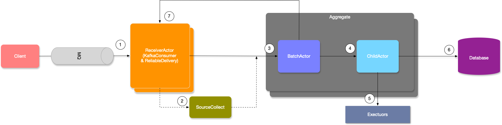
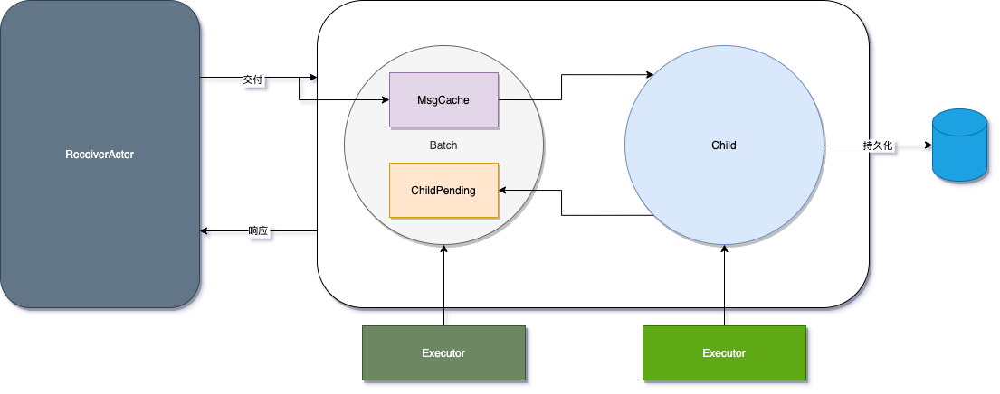

本文介绍了对 Phoenix 进行性能调优的必要条件，包括了了解 Phoenix 的内部主要流程图和利用监控指标进行性能瓶颈分析。

在做性能调优时，首先要保证能够给定足够的负载，如增加 Kafka Topic 的分区数量（避免流量因部分聚合根处理过慢而阻塞）、增加 buffer 大小（避免所有聚合根处理过慢）、调整事务完成结果批次大小等措施。

同时，还介绍了 Phoenix 扩容措施。

{/* truncate */}

## 0. 必要条件 \{#requirement\}

如果需要对 Phoenix 的性能进行调优，以实现硬件性能下的最高利用率，则首先需要了解 Phoenix 的内部主要流程图:

> Phoenix 内部结构的简化版视图如下

其次，我们需要利用完善的监控指标，来帮助我们快速分析性能瓶颈点，目前我们总是推荐用户使用最新版本的 `phoenix-telemetry-otel`(详细文档请参考:[Phoenix Metrics](/docs/phoenix-console/phoenix-console-system-monitor))，
基于 OpenTelemetry 的埋点实现增加了直方图的支持（JMX 实现上较困难），并且丰富了一些指标埋点。对于可视化指标，我们推荐 Grafana 版本是 8.5.6，过低的版本将会无法运行。

此外，还需要 Phoenix 的 Akka Agent 以便与增加 akka-dispatcher（actor 运行线程池）的监控埋点（如需要请联系 Phoenix 团队）

## 1. 数据源调优 \{#source\}

要实现 Phoenix 的性能优化，首先要保证给定了足够的负载，因为 Phoenix 的数据来源主要是 Kafka，所以本质上 Phoenix 在负载模型(workload model)中属于封闭模型(closed model)，也就是 Phoenix 会限制并发的数量（Phoenix 借助
Kafka 将多余流量推入队列），如需了解更多负载模型的背景，请参考论文：**《Open Versus Closed: A Cautionary Tale》**

在头图的架构中，1、2、7 组成了 Phoenix 数据源流速的简化部分，详细的内部流程图如下：

由上图可知，Phoenix 用一个 Buffer 控制并发（或者说控制流量的流入速率），仅当消费者的消费速率（聚合根的处理速度）足够时，才会再次摄入消息，此外 EventStore 的负载或多或少也会影响到
数据源的吞吐能力，因为：

1. 数据源（ReceiverActor）是独占单线程，同时负责 KafkaConsumer，可靠性投递，接收聚合根处理完成的结果
2. 可靠性投递和聚合根共享同一个 EventStore（默认配置下）

因此，为了能让 Phoenix 数据源的给到聚合根的负载足够（聚合根支持批量操作），聚合根的并发能力才能上升，所以通常我们有以下措施：

1. 增加 Kafka Topic 的分区数量：增加分区意味着直接增加了并行度，此时 buffer 也会成倍增加，此外增加分区还可以利用 Key Hash，支持让不同聚合根的命令分散到不同的分区，避免单个聚合根阻塞了整个数据源
2. 增加 buffer 大小：`quantex.phoenix.server.mq.properties.limitMaxLiveThings`（增加 buffer 会导致缓存的消息数量增多，请注意内存开销）
3. 调整事务完成结果批次大小：`quantex.phoenix.server.mq.properties.finishThingsBatch`（更大的批次对于 EventStore 的压力更小，阻塞更少，但 buffer 窗口移动的速度更慢）

数据源调优的目的是为了**保证聚合根并发足够**：消息摄入够快，够分散（多个聚合根能同时并发）

对于聚合根的并发是否足够，可通过 Phoenix Metrics 中 Akka-Dispatcher 观察线程池的使用率：

> 下图通过 活跃线程数量/线程池大小 来计算得出线程池的利用率，从而得出聚合根的并发是否足够

## 2. 聚合根处理调优 \{#handle\}

当数据源能够提供足够的流速和消息分散度后，整个 Phoenix 的性能则完全取决于聚合根的处理速度。

在聚合根层面，Phoenix 为用户新增了一个攒批的实现（当聚合根空闲时立即发送消息缓存 / 当消息满足一定批次大小后直接发送消息缓存），以此提高聚合根处理速度（避免每个 Command 都会发生一次持久化的网络 I/O，从而导致
性能降低，网络 I/O 通常是最大的瓶颈点）

> 下图展示了攒批的层次，攒批和实际处理的聚合根并不在一个线程池中，后者的任务更繁重，因此做了隔离以提高攒批线程池的运行效率（避免任务阻塞在任务队列）

对于 Aggregate 而言，聚合根处理消息的响应时间主要由以下部分组成：

1. Batch 等待调度耗时（默认情况下，总是微妙级别）
2. Batch 攒批耗时（取决于 Child 的处理时间）
3. 聚合根等待调度耗时（聚合根线程池的负载通常更高，处理时间更长，因此发送给聚合根的消息，等待调度的时间是个重要的指标）
4. 聚合根处理耗时（取决于用户代码）
5. 聚合根持久化耗时（持久化数据的 I/O 耗时，在异步模式下，此耗时还包含数据库响应的调度时间）

调度耗时可以在 Akka-Dispatcher 监控中找到，在同步模式下，聚合根线程池为 `aggregate-dispatcher`，Batch 的线程池为 `akka.actor.default-dispatcher`

聚合根的处理和持久化耗时，可以在 Phoenix Performance 监控面板中找到，也可以在 Phoenix Source Aggregate 中找到

对于聚合根处理的调优，可以从以下几个方面入手：

1. 聚合根等待调度耗时过高（观察处理和持久化，哪一个的耗时过高，从而影响了聚合根线程池的处理耗时 -> 调度耗时）
2. 聚合根持久化耗时过高（可使用聚合根异步运行模式尝试优化，如无法提高，观察 EventStore 指标，是否数据库到达瓶颈）
3. 聚合根处理耗时过高（尝试优化代码，或者调低批量处理大小，调低批量处理后能让聚合根线程池的公平策略提高）

通常在聚合根内，我们不建议内部包含阻塞，I/O 行为，从上面可得知，一旦聚合根线程池处理耗时提高，那么等待调度的耗时就会增加，继而影响聚合根响应时间 -> 事务耗时

聚合根运行在 Actor 模型中，而 Actor 模型通过事件驱动的方式，模拟出虚拟线程（纤程）的效果，而当聚合根阻塞越严重，则该效果越差。

当然，用户也可以通过提高聚合根线程池大小的方式，让聚合根从事件驱动模型退化到线程池模型，但此时 EventStore 的攒批效果则大大降低。

## 3. EventPublish 调优 \{#event-publish\}

EventPublish 是一个相对独立的模块，可以不依赖于 Phoenix Server 而运行。

EventPublish 的结构并不复杂，核心主要是一个 Reader 从 EventStore 中按顺序读取事件，并通过 Handler 处理之后发送到 Kafka，如下图所示：

EventPublish 提供用于调优性能的配置如下：

- `quantex.phoenix.event-publish.batch-size`：每次从 EventStore 读取的批次大小，默认是 128
- `quantex.phoenix.event-publish.buffer-queue-size`：Reader 和 Handler 之间缓存事件的队列大小，默认是 64

需要注意的是，EventPublish 在读取 EventStore 时使用了两个参数：已处理的 offset（时间戳）和（当前最大的事务时间戳 - 1）作为范围查询，该数据库列拥有一个索引用于加速查询。

然而，当 EventPublish 的消费远远落后于聚合根持久化的事件生产速度时，索引范围查询太多，从而让数据库优化器放弃使用索引，转而使用全表扫描，这会导致查询的性能急剧下降。

为了避免该问题，我们在 EventStore 的 Slice 模式中支持了两个特性：

1. 支持并发消费（通过一个 slice 字段切分被分片的行）
2. 智能化范围查询（当前 offset 向前的窗口查询依赖于上一次查询的结果，尽可能保证索引命中的行数低于数据库优化器放弃使用索引的阈值）

除此之外，在 Timer 模式中（默认）也可以通过增加每次从 EventStore 读取的批次大小，也就是增加消费速度和队列大小，避免 EventPublish 远落后于事件生产速度（EventPublish 主要的瓶颈还是查库）

## 4. 溯源时间过长 \{#event-sourcing\}

在单个分区下，如果原始流量的分布不均匀（如前 1w 个事件都是某个聚合根），这会导致 Phoenix 出现单线程处理的情况（聚合根处理是单线程，符合 Actor 模型）这种情况可通过在 Phoenix Metrics 观察多个面板分析（主要是 akka dispatcher + aggregate）

除了原始流量不均之外，当某个聚合根发生异常并进入溯源时，该聚合根会停止处理消息并等待溯源完毕，这种情况下，假设该聚合根流量较大（即使是每秒 100 t/S，也会在 10s 内将 ReceiverActor 的 Buffer 撑满）将会造成背压限流，从而影响 Phoenix 的吞吐能力。

解决方案有三种方式：

1. 为聚合根增加独立的背压 buffer（框架目前暂不支持，未来可能支持）
2. 减少聚合根 `on()` 处理耗时, 以此降低 EventSourcing 时间
3. 减少聚合根快照周期`snapshotInterval`（这种情况下聚合根可能会频繁快照，取决于聚合根的流量）

目前我们更推荐第二种方式的调优，在 EventSourcing 的思想中，Event 是不可变的事实，而 `on()` 方法则是 `State -> Event -> State` 的表达，也就是事件改变状态。
任何涉及到计算、外部依赖的操作都应该在 Command 阶段完成，最终通过不可变量的方式存储在 Event 中。

这种情况和数据源的调优一样，都属于聚合根并发不足。

## 5. 扩容 \{#scale-up\}

通常，提升一个应用的性能最简单暴力的方法就是 Scale Up 和 Scale Out.

- ScaleUp：同节点数量下，增加部署 Phoenix 应用的 CPU 核心数量（线程池数量会随着 CPU 核心而增长）
- ScaleOut：在 CPU 核心数量保持不变下，增加 Phoenix 集群节点数量

如果 ScaleUp 后性能没有提升，则通过 Akka-Dispatcher 观察线程池利用率，观察是否聚合根并发不够。

如果 ScaleOut 后性能没有提升，则观察数据源摄入速率是否足够，聚合根并发是否足够。

此外，还有一种情况是聚合根拆分的粒度不够导致聚合根的并发不足，例如将所有应该拆分的聚合根放到一个大单体，此时无论如何扩容，那么性能都无法提升，因为此时 Phoenix 只会单线程池处理。

## 6. CPU 密集型 \{#cpu-bound\}

上述的调优显然更适合 I/O 密集型场景应用，当然部分也适用于 CPU 密集型应用。

对于 CPU 密集型应用，其性能完全取决于给定的节点配置（CPU 核心数量）以及集群节点数量，都是可以通过利特尔法则计算得出：

假设 CPU 密集型任务需要执行 30ms，硬件配置为 8 个核心和 3 个集群节点。在这种情况下，可以使用以下公式计算理论吞吐量：

> 吞吐量 = 核心数 / 平均响应时间

平均响应时间可以近似为计算任务的耗时，即 30ms。 因此根据硬件配置，理论上的吞吐量为：

> 吞吐量 = 8 / 0.03s * 3 = 800 TPS（每秒事务数）

当 CPU 密集任务不会占用全部的 CPU 算力时，如聚合根已处理完，进入持久化流程，此时聚合根的线程池能够突破该 TPS，直到再次进入 CPU 密集。

目前对于 CPU 密集型任务，主要的瓶颈点还是硬件算力，只能通过增加算力来扩展，暂无调优手段。

## 7. EventStore 瓶颈 \{#event-store\}

Phoenix 目前提供了 EventStore-JDBC 作为 EventSourcing 的持久化存储，EventStore 基于 RDBMS 为提供了一些特性（唯一、幂等索引，Console 查询）
但是目前单节点的 RDBMS 在大多数情况中都容易成为 Phoenix 应用的瓶颈点。

对于因 EventStore 导致应用出现瓶颈的情况，请考虑如下方案：

1. 物理机部署数据库
2. 在固态硬盘之上运行数据库
3. 配置多数据源
4. 使用分布式SQL数据库（如 TiDB、YugabyteDB）