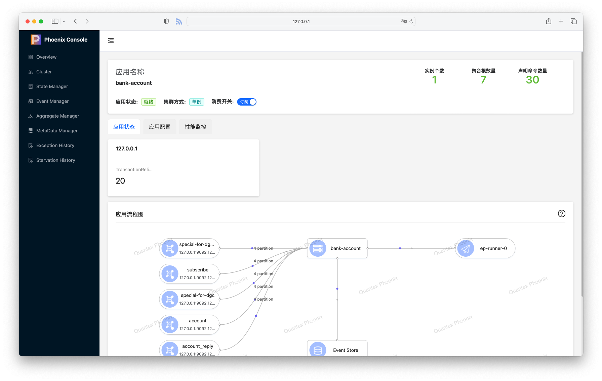

import Link from '@docusaurus/Link';
import "..\/src\/css\/link.css";

> 我们很高兴 Phoenix 2.6.0 即将进入发布流程，本次版本升级涉及到了非常多的变动，但也进一步提升了 Phoenix 的性能，因此处于旧版本的用户可以尽早联系 Phoenix 团队获得体验版本

{/* truncate */}

<Link to="/docs/phoenix/upgrade/2-6-x" class="link">
{'🎉\xa0'}完整发版日志 Release Notes {'\xa0🥳'}  >> 
</Link>

<Link to="/blog/2.6.x-migration-guide" style={{fontSize: "1.6rem"}}>
迁移指南  >>
</Link>

## 变动模块

- Phoenix Server
- Phoenix Console
- Phoenix Telemetry
- Phoenix Subscribe
- Phoenix EventPublish
- Phoenix Transaction

## API 增强

- PhoenixClient API 支持简化同步（无须 `Future.get()`) 语法: 
- 命令支持优先级：[文档说明](/docs/phoenix-core/phoenix-core-entity-aggregate#处理优先级)
  - Client API: [文档链接](/docs/phoenix-core/phoenix-core-client#自定义消息优先级)
  - SourceCollect API: [文档链接](/docs/phoenix-core/phoenix-subscribe-pub#为消息附加元数据)
- PhoenixClient 支持定义 Kafka Producer Key，并且支持 Kafka 分区选择器 API: [文档链接](/docs/phoenix-core/phoenix-core-client#自定义-kafka-record-key)
- [聚合根片段代码特性](/docs/phoenix-advanced/aggregate-segment)
- [集群线程池](/docs/phoenix-advanced/cluster-pool)
- 等...

## 1. Phoenix Server 变化

整个 Phoenix Server 变化分为两个部分，分别是用户无感和可配置的部分：

- 无感：Phoenix 升级底层 Actor 到 Typed Actor, 优化一些代码以提升性能(主要在 Actor 理念下优化)
- 有感：Phoenix 支持异步聚合根，提高聚合根 IO 效率，提升性能，文档链接：[异步模式](/docs/phoenix-core/phoenix-core-entity-aggregate#运行模式)

## 2. Phoenix Console 变化

Phoenix Console 在观感上可能是对用户改变最大的部分, 主要体现在 UI 变化以及模块的增加：

部分变化的清单如下，详细说明请参考：[PhoenixConsole](/docs/phoenix-console/phoenix-console-service-management)

- 新增集群状态统计（主要是聚合根在各个节点的分布）
- 新增简化性能监控
- 优化主页布局
- 优化内存查询聚合根速度
- 优化聚合根状态展示的前端性能
- 优化事件管理的查询性能，支持多种查询方式（如命令、聚合根类型等维度）
- 新增存活聚合根管理页面
- 新增 MetaData 管理页面
- 新增异常历史查询页面
- 新增线程饥饿检测器管理页面
- 优化事务聚合根调用链路展示
- 新增异常事件的异常堆栈展示

## 3. Phoenix APM/Telemetry 变化

Phoenix 在  2.6.x 对 APM 体系进行了重构，以便我们可以在保留 JMX 的同时，支持 [OpenTelemetry](https://opentelemetry.io/) 的监控体系，也为后续支持 Traceing 提供一些基础。文档链接：[PhoenixMetrics](/docs/phoenix-console/phoenix-console-system-monitor)

:::info
需要注意的是，JMX 和 OpenTelemetry 监控方案无法同时引入，并且目前从 2.5.x 及之前升级的用户必须手动引入 OpenTelemetry/JMX 的依赖
:::

相对于 JMX 提供的指标方式，OpenTelemetry 支持直方图的概念，在直方图下，延迟不再是平均的概念，能提供更全面的数据分布信息以及适应非均匀分布的数据（如极端值）

除此之外，OpenTelemetry 模式下，我们基于 LTW 实现了对 Akka Dispatcher 的指标监控埋点，这有助于分析 Phoenix 内部几个核心模块的负载以及性能

## 4. Phoenix Subscribe 变化

在 2.6.x 版本中，我们对 Phoenix Subscribe 遇到的一些问题进行了重构和增强，主要的优化是围绕在内存和使用层面。

Subscribe 中包含了三个部分：

- KafkaConsumer
- SourceCollect
- MetaData
- 可靠性投递

### 4.1 KafkaConsumer

#### StreamSubscribe

在 2.6.x 版本中我们引入了 Reactive Stream 版本的 [StreamSubscribe](/docs/phoenix-core/phoenix-subscribe-pub#stream-sub), 该 Subscribe 如 Reactive Stream 的描述一样不会让代码更快，而是尽可能快，
在此基础上能够获得更好的内存、延迟表现，实际测试时，我们在回归性能测试中发现 StreamSubscribe 的性能优于原本的 Subscribe 实现（具体原因暂未验证，猜测是 RC10 增加了大量的旁路线程），因此我们在 2.6.0 中将默认实现替代为 StreamSubscribe。

默认的 Subscribe 使用的 KafkaConsumer 是自旋模式，当下游消费速度变慢时会存在一定的空转，这会导致无效的对象生成开销以及消息响应的 ACK 处理延迟增加。

#### 分片算法

除了新增的 Subscribe 实现之外, 2.6.x 还为 Kafka Consumer 优化了分片算法，现在的 Kafka Consumer 的在集群中的分区基于分区维度的，在多分区下能更好的均匀各个节点的负载（无须任何配置）。

#### Kafka Clients 扩展

文档链接：[Kafka 扩展](/docs/phoenix-advanced/phoenix-kafka-extend)

开源的 Apache Kafka Clients 不支持发送超过 1m 以上的消息，可以通过调整参数的方式来解决此问题，但这会给 Broker 带来额外的开销（参考：[Handle Large Messages In Apache Kafka](https://www.slideshare.net/JiangjieQin/handle-large-messages-in-apache-kafka-58692297)

因此 Phoenix 提供了 Apache Kafka Clients 的扩展，在 Producer 和 Consumer 端通过 Chunk 的方式解决大体积消息的传输，无须更改 Kafka 配置。

### 4.2 SourceCollect

在 2.6.x 版本中，我们为 SourceCollect 增加了[批量 API](/docs/phoenix-core/phoenix-subscribe-pub#批量处理)。原有的 SourceCollect 不支持批量 API，但在某些外部交互中（如通过 Redis 查询配置），可能会导致 N+1 查询的问题，优化后的 SourceCollect API 能更好的契合 KafkaConsumer
批量拉取的特点。

### 4.3 MetaData

旧版本的 MetaData 存在以下问题：

- 重复注册
- 非指数退避(Exponential backoff)的重试算法
- 内存开销（在 SourceCollect 中的对象生成）
- API 缺失（如 exist/contains）

在 2.6.x 版本中，我们针对这些问题进行了优化，并提供了新的 API 文档：([广播机制](/docs/phoenix-core/phoenix-subscribe-pub#广播))。此外，我们还在 Console 中为用户提供了 MetaData 的查询页面。

然而，由于设计上 MetaData 与可靠性投递耦合，并且持久化级别是分区级别的，因此在多分区场景下，我们目前不推荐使用 MetaData 代替 Redis。Redis 对于 Phoenix Server 来说是单点，可以减少大量流量。

## 5. Phoenix EventPublish 变化

EventPublish 在历史上一直使用 `eventByTime` 的查询方式，在 2.6.x 中我们提供了 `eventBySlice` 作为改进方法。

使用 `eventByTime` 有一个缺点，那就是整个集群只能运行一个 EventPublish 实例，这意味着无法扩展到更多的 Phoenix 节点，导致 EventPublish 相对于插入出现延迟/间隙（Gap）的问题，在数据库索引的特性下，当查询索引的 Gap 足够大时，
索引将会被忽略(全表扫描)，这事因为优化器认为全表扫描的成本比使用索引更低，并且使用索引时还需要额外的多次 IO 来访问数据块（特定于 Phoenix EventPublish 场景）。

文档说明：[切片模式](/docs/phoenix-core/phoenix-core-event-store#切片模式)

2.6.x 提供的 `eventBySlice` 模式下将事件分区存储，并且根据用户选择的运行 EventPublish 的并行度不同，会在 0～1024 的范围为每个实例选择合适的分片。

:::note 
这种方式实际上是限制了分页的数量，在内部我们还使用了类似于 TCP 滑动窗口的概念，来缩短查询索引时的范围。除了这种方式外，我们还可以通过尽可能地使用索引覆盖
扫描的方式来优化偏移量非常大的分页，当目前我们并未引入两个优化，因为分区下查询速度已足够快。
:::

## 6. Phoenix Transaction 变化

在旧版本我们接收到 Phoenix Transaction 的性能问题反馈，因此在 2.6.x 版本中，我们针对 Phoenix Transaction 存在的一些问题进行了性能优化：

- Console：事件管理中事件详情不展示事务聚合根接收的 Command 和 超时类 Event
- Console：支持超时后，事务聚合根调用链路的展示
- 性能：事务聚合根支持全局维度的超时
- 性能：事务聚合根支持批处理
- 性能：事务聚合根心跳时，检查对象生成开销

## 漏洞修复、优化

除此之外，本次 2.6.x 还包含了一些了 BUG 修复、体验优化的补丁，详情请见完整发版日志：[2.6.X Release Notes](/docs/phoenix/upgrade/2-6-x)