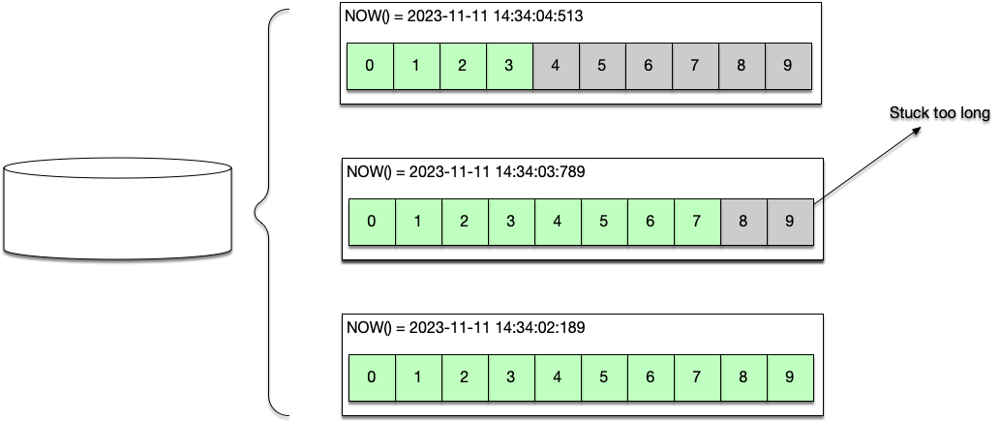
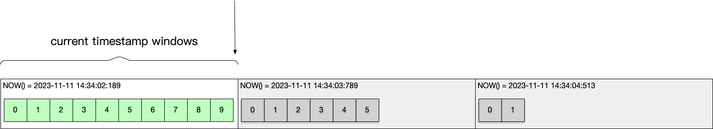
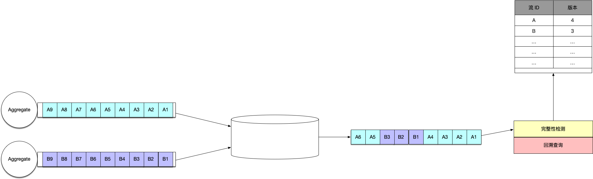
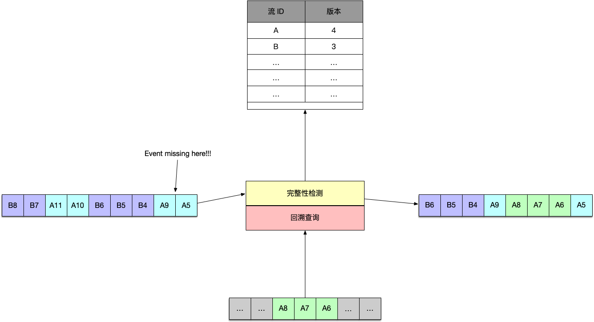
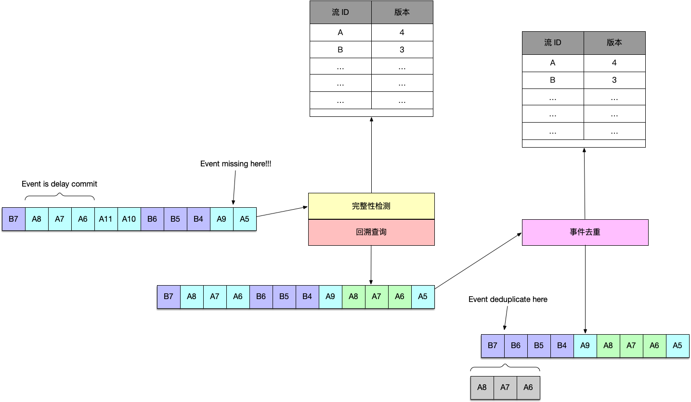
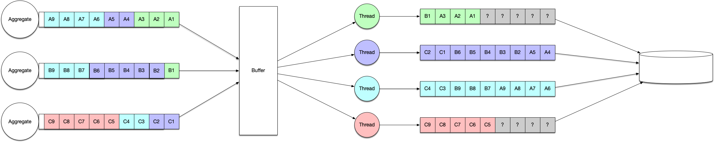
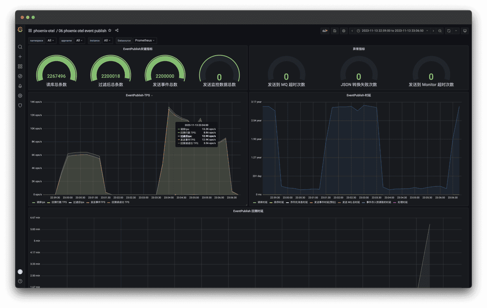

> 在 2.6.0 中, 我们实现了 EventPublish 的回溯和去重机制，修复了之前在部分极端场景下可能出现数据库漏读的问题。

{/* truncate */}

## EventPublish 的挑战1: 性能

在 Phoenix 2.6.0 版本中，为了提升 EventPublish 的读取性能，我们重构了 EventPublish 的核心部分。在这个过程中，我们发现了一些需要解决的问题。让我们首先了解一下 EventPublish 的定义和实现：

EventPublish 实际上是 EventSourcing 中全局事件流的一个投影。全局事件流需要严格有序，否则，多个聚合根的交互可能会导致事件顺序（时间）不一致的问题（例如：在Saga场景下）。
因此，EventPublish使用 `create_time` 字段作为查询索引，且严格按照时间顺序进行排序。同时，我们使用数据库(MySQL)提供的 `CURRENT_TIMESTAMP()` 函数作为时间字段的插入值（使用了单点的时间戳，能避免[分布式系统的事件顺序问题](https://en.wikipedia.org/wiki/Logical_clock)）

为了降低EventPublish到消费者之间的延迟，我们采用了分页和范围查询来加速数据库查询，从而减少端到端的延迟。

然而，在高吞吐量的应用场景下，这些机制仍可能会引发问题： __在我们的性能测试中发现，写入是并行的，而查询则是单线程的。在分页查询的场景下，即使数据库响应时间只有10ms，我们也需要每秒执行超过100次的数据库查询。__

写入和查询速度的不匹配导致了生产者和消费者之间的问题，事件在数据库中积压，查询范围随着时间的推移而增大。根据 [MySQL 查询优化文档](https://dev.mysql.com/doc/refman/8.0/en/where-optimization.html):

```
Each table index is queried, and the best index is used unless the optimizer believes that it is more efficient to use a table scan. 
At one time, a scan was used based on whether the best index spanned more than 30% of the table, but a fixed percentage no longer determines the choice between using an index or a scan. 
The optimizer now is more complex and bases its estimate on additional factors such as table size, number of rows, and I/O block size.
```

当EventPublish Reader的事件消费速率落后于总行数的30%时，索引将失效，查询将退化为全表扫描，这会导致数据库查询的QPS下降到2000/s，消费落后的问题将更加严重。

### 动态边界(索引)

为了解决该问题，Phoenix 在内部对范围查询的边界进行了动态调整：

- 当单次查询条件`(当前 Offset, 数据库时间 - 1s)`下，返回的结果等于查询分页的大小时，EventPublish Reader 则认为当前需要分页， 并进入分页模式
- 在分页模式下，查询条件变成了`(当前 Offset, 第一次响应结果集合中的最大时间戳)`，直到分页模式下查询的结果小于分页大小
- 在分页模式下，数据库响应集合大小低于分页大小，退出分页模式，使用：`(当前 Offset, 数据库时间 - 1s)` 作为索引查询

这种分页机制下，虽然在长时间高吞吐量下，EventPublish 有可能会不断在普通模式和分页模式之间来切换，但相对于全表扫描，索引的利用率更高。

## EventPublish 的挑战2: 完整性

在优化分页查询性能以及实现并行的 EventPublish Reader 后，EventPublish 的性能有了显著的提高。在我们内部的测试中，32 并行度的 EventPublish 能实现 15k/s 的 QPS。

然而，我们在 Phoenix 的 [APM](/docs/phoenix-console/phoenix-console-system-monitor) 中
观察到在高吞吐量下 EventPublish 无法完整地发送所有事件。例如：插入了200,000条数据，但只读取到了199,888条数据，缺失了112条数据。经过详细的深入分析，我们认为EventPublish Reader存在漏读的现象，其主要原因如下：

根据 [MySQL 的文档](https://dev.mysql.com/doc/refman/8.0/en/date-and-time-functions.html#function_now)（其他数据库同理）

> NOW() returns a constant time that indicates the time at which the statement began to execute.

这意味着，它记录的是事务开始的时间，而不是事务提交的时间。因此，在Phoenix的持久化批量处理和 EventPublish 的时间戳读取过程中，可能会丢失一批持久化事件中处于批次尾部的事件。以下是示例说明：

### 1. EventStore 写入示例

EventStore 的写入模式是批处理模式且由多线程执行。在某些极端条件下，可能会出现如下的情况：数据库在处理某一批中部的几个事件时，由于成本较高，导致这一批次尾部的事件无法及时创建快照。



### 2 EventPublish 窗口滑动前

对于运行速度够快的 EventPublish 而言（如下图：只有 Phoenix 手动延后的 1s 查询），此时当前时间窗口和上一批的写入可能还未完全完成，但是在本时间窗口内，EventPublish 已无法查询/读取到更多数据了。因此
EventPublish 将会滑动到下一个时间窗口。



### 3. EventPublish 窗口滑动后

在 EventPublish 的滑动过程中，可能数据库仍然会写入一些当前时间窗口的事件，但也有一种可能，直到当前时间窗口处理完毕，剩余的 "8、9" 事件仍未提交，因此对于 EventPublish 而言，"8，9" 事件相当于"漏读"了。


## EventPublish 回溯机制

为了解决 EventPublish 漏读问题，Phoenix 在 2.6.0 中为 EventPublish 增加了回溯机制，该机制主要的流程如下：

- 实时检测读取事件流的完整性
- 检测事件漏读时，进行回溯查询以回填事件流间隙
- 事件去重机制

### 1. 完整性校验

EventPublish 读取的是 EventSourcing 的全局投影，在全局维度上事件流的完整性难以检查（同一个时间可能写入多次，并无一个全局唯一的 UUID 字段），除非事件的唯一列使用自增的序列（这会带来写入的开销）。
但是我们可以从聚合根维度来检查其事件流的完整性，因为聚合根的版本是完全单调递增的序列。



### 2. 回溯查询

回溯查询建立在完整性校验之上，当检查到事件缺失时，EventPublish 会停下并尝试获取缺失的事件直到该聚合根事件流缺失的事件序列被补齐，或者重试查询次数到达
`maxBackoff` 次数后，略过该段事件序列。



### 3. 去重机制

在支持了回溯查询后，可能存在一种特殊情况，在回溯查询之后的下一个查询窗口中，接收到"已填充的的事件序列"，此时需要将这些重复的事件进行去重过滤，
去重机制的实现与完整性校验机制几乎一样。



对于为何在回溯查询后，会接收到已填充的事件序列，则是另一个原因。在先前本文已提到，写入是线程级并行的，因此当同一个聚合根的不同事件被分散到不同的聚合根之后，
由于线程调度的随机性，有可能同一个聚合根的高版本事件的数据库事务可能会先于较低版本的数据库事务开始。



去重是有意义的，可以避免重复发送事件，在异常重启或提交 offset 失败的情况下特别有用。另外，回溯方案的增加还能保证聚合根的事件顺序得到强一致的保证，这是一个额外的奖励。

## 验证

以每秒 6,000, 每秒 16,000 的案例各测试 100 秒，总共写入 2,200,000 事件的案例来对比回溯机制的实现前后

### 修复前

在高频下（16,000）丢失了 1371 个事件，而低频（6,000）下则基本无事件丢失。


### 修复后

即使是在高频下（16,000）也无事件丢失。


