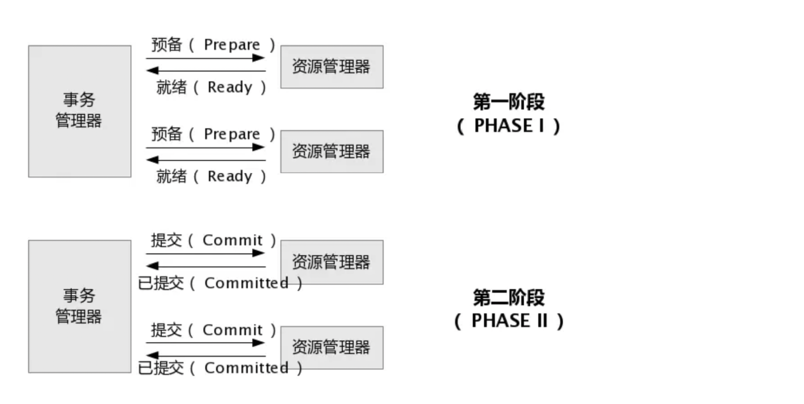
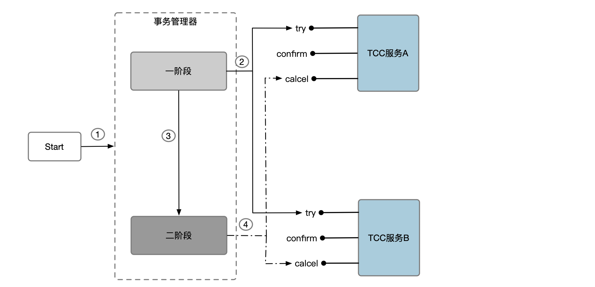

## 聚合根的本地事务解析 \{#local-transaction\}

> 在介绍分布式事务具体之前，先剖析一下 phoenix 中实体聚合根的本地事务。

在Phoenix当中，实体聚合根是最小的逻辑处理单元，一个Phoenix集群会有N多个实体聚合根对象，每个实体聚合根对象在处理消息时都满足事务中`ACID`的特性，下面解析一下实体聚合根对`ACID`的支持能力。

|特性|支持级别|实现原理|
|---|------|----|
|原子性（Atomicity）|支持|实体聚合根处理消息修改多个状态时，可以保证要么全部成功要么全部失败。|
|一致性（Consistency）|支持|实体聚合根处理消息是有序处理的，对于每个消息处理时，状态是线性一致的。|
|隔离性（Isolation）|支持|实体聚合根处理消息是有序处理的，隔离级别是最高（串行化）。|
|持久性（Durability）|支持|实体聚合根的状态依赖EventStore存储，依赖EventSourcing技术恢复。|

## 分布式事务产生的背景 \{#background\}

在Phoenix当中，业务是`实体聚合根`处理的，实体聚合根都有一个唯一id标识(聚合根id)，一个实体聚合根内部处理`消息`时满足事务的`ACID`特性。但业务系统使用Phoenix开发服务时，会对业务做`水平`和`服务化`拆分成不同的聚合根，如果一个业务请求需要多个聚合根一起完成的话，就引出了分布式事务。

### 实体聚合根水平拆分 \{#sharding\}

在使用Phoenix框架时，为了追求并发粒度来承担更大的业务体量，会对一个聚合根做`水平`拆分，通常一个聚合根类通过不同的`聚合根id`来生成不同的`聚合根对象`，那么不同的聚合根对象运行时会在不同的节点当中。如下图所示，一个账户聚合根通过账户id来生成了N个聚合根对象，这些聚合根对象运行在不同的节点当中，如果发起`账户1`对`账户2`的转账请求，则会涉及到分布式事务场景。

:::note

实际上`账户1`向`账户3`转账也是一个分布式事务，虽然这两个实体聚合根对象在一个节点上，但是phoenix是无服务化的思想，一切都以聚合根隔离。

:::


### 实体聚合根服务化拆分 \{#micro-service\}

在使用Phoenix框架时，会进行DDD领域设计出不同类型的`聚合根`，比如商品购物业务场景可以划分为`商品仓储`和`资金账户`两类聚合根，不同类别聚合根会协作完成购物的流程，这样则会涉及分布式事务的场景。


## 分布式事务理论基础 \{#transaction-theory\}

### XA协议 \{#xa\}

`XA`协议是一个基于数据库的分布式事务协议，其分为两部分：事务管理器和本地资源管理器。事务管理器作为一个全局的调度者，负责对各个本地资源管理器进行统一提交或者回滚。二阶提交协议（2PC）和三阶提交协议（3PC）就是根据此协议衍生出来而来。如今Oracle、Mysql等数据库均已实现了XA接口。

`2PC`协议流程图


>上边图片源自网络，如有侵权联系删除

实际上无论是`2PC`还是`3PC`协议都尝试在满足比较强的`ACID`特性，但是付出的代价也很高，就是性能很慢，阻塞同步等等。实际上`3PC`也存在数据不一致的问题，这里就不再阐述。

`XA`协议是站在关系型数据库维度提出的，应用在`DB`层面，并且旨在做到对用户透明，`ACID`的保障等。现在场景一般习惯在用户层面解决分布式事务问题的话，可以使用`TCC`和`SAGA`，虽然丧失了一些隔离性和一致性但是可以做到无锁，非阻塞。

### TCC协议 \{#tcc\}

TCC（Try-Confirm-Cancel）实际上是服务化的两阶段提交协议，业务开发者需要实现这三个服务接口，第一阶段由业务代码编排来调用 Try 接口进行资源预留，所有参与者的 Try 接口都成功了，事务管理器会提交事务，并调用每个参与者的 Confirm 接口真正提交业务操作，否则调用每个参与者的 Cancel 接口回滚事务。

- Try阶段： 下单时通过Try操作去扣除库存预留资源。
- Confirm阶段： 确认执行业务操作，在只预留的资源基础上，发起购买请求。
- Cancel阶段： 只要涉及到的相关业务中，有一个业务方预留资源未成功，则取消所有业务资源的预留请求。

理论上Confirm阶段和Cancel阶段不允许出现业务型失败，框架实现时要保证幂等，超时重试，超时回滚，空回滚，悬挂等一系列问题，后文会详细介绍Phoenix的实现。



TCC对于ACID的保证:
- 原子性：正常情况下保证。
- 一致性：最终一致性，可能出现A本地事务和B本地事务不一致的情况。
- 隔离性：不保证，在某个时间点会出现一个事务看到另外一个事务的中间结果。
- 持久性：和本地事务一样，只要分布式事务结束，则会被持久化。

### Saga协议 \{#saga\}

1987年普林斯顿大学Hector & Kenneth发表论文Sagas，Saga是一个长活事务可被分解成可以交错云运行的子事务集合，其中每个子事务都是一个保持一致性的真实事务。
- 每个Saga都由一系列的sub-transaction Ti组成。
- 每个Ti都对应有补偿的动作Ci，补偿动作用户撤销Ti造成的结果。
- 理论上Ci执行不能失败，如果失败则需要人工介入，实现时要保证Ti-Ci和Ci->Ti执行结果都是一样（事务被回滚了）。

Ti和Ci也同样是用户定义的，可以看到和TCC相比，Saga没有`预留`动作，它的Ti就是直接提交子事务，这也同时要求业务场景要满足可以撤销的场景，比如火箭发射就不能撤销，或者资金管理中Ti不能直接用于加钱操作，不然也有可能不能撤销（加的钱被别的事务用了）。 


Saga事务对于ACID的保证和TCC一样，实际上用户层面的分布式事务解决方案都不能保证隔离性，需要用户根据业务去衡量。

## Phoenix Transaction详解 \{#usage\}

Phoenix Transaction是Phoenix框架在分布式事务场景下协调多个聚合根共同完成一个事务的实现，目前框架支持`TCC`和`Saga`两种事务模型，同时也支持`混用`(一个事务包含TCC和Saga两种子事务)。

### TCC模式 \{#tcc-usage\}

TCC模式需要用户根据自己的业务场景实现 Try、Confirm 和 Cancel 三个操作。事务聚合根在一阶段执行 Try 方式，在二阶段提交执行 Confirm 方法，二阶段回滚执行 Cancel 方法。

TCC模式中Confirm和Cancel不允许出现处理失败的返回结果，不然整个事务会进入异常状态，需要人工处理。


可以参考[使用文档](./phoenix-transaction-aggregate)定义事务聚合根并设置TCC命令。


#### TCC 设计 - 业务模型分 2 阶段设计 \{#tcc-design\}

用户接入 TCC ，最重要的是考虑如何将自己的业务模型拆成两阶段来实现。

以扣钱场景为例，在接入 TCC 前，对 A 账户的扣钱，只需一条更新账户余额的 SQL 便能完成；但是在接入 TCC 之后，用户就需要考虑如何将原来一步就能完成的扣钱操作，拆成两阶段，实现成三个方法，并且保证一阶段 Try  成功的话 二阶段 Confirm 一定能成功。


> 图片[来源](http://seata.io/zh-cn/blog/seata-at-tcc-saga.html)，该段落也参考了Seata

如上图所示，

Try 方法作为一阶段准备方法，需要做资源的检查和预留。在扣钱场景下，Try 要做的事情是就是检查账户余额是否充足，预留转账资金，预留的方式就是冻结 A 账户的 转账资金。Try 方法执行之后，账号 A 余额虽然还是 100，但是其中 30 元已经被冻结了，不能被其他事务使用。

二阶段 Confirm 方法执行真正的扣钱操作。Confirm 会使用 Try 阶段冻结的资金，执行账号扣款。Confirm 方法执行之后，账号 A 在一阶段中冻结的 30 元已经被扣除，账号 A 余额变成 70 元 。

如果二阶段是回滚的话，就需要在 Cancel 方法内释放一阶段 Try 冻结的 30 元，使账号 A 的回到初始状态，100 元全部可用。

用户接入TCC模式，最重要的事情就是考虑如何将业务模型拆成 2 阶段，实现成 TCC 的 3 个方法，并且保证 Try 成功 Confirm 一定能成功。


Phoenix Transaction的TCC模式集群中实际使用时需要注意一下几个事项。
- 超时场景
- 幂等控制
- 空回滚
- 防悬挂

#### 超时场景 \{#timeout\}
Phoenix在集群状态运行时，网络是不可靠的，可能遇到网络超时，消息丢失等各种异常场景。这种情况会导致Try，Confirm，Cancel命令得不到处理，进而整个事务不能结束。

Phoenix Transaction在处理超时场景时的策略是：每秒向前重试，并达到一定次数时回滚或者进入异常。如果用户需要一直向前恢复，则设置Try或者Ti阶段的重试次数为`Integer.MAX_VALUE`。

|命令类型|超时策略|
|---|---|
|Try|重试N次后会驱动整个事务进行回滚(Cancel)|
|Confirm|重试N次后事务进入异常，提醒人工介入|
|Cancel|重试N次后事务进入异常，提醒人工介入|

用户可在设置命令时设置命令对应的重试次数，一般ConfirmCmd和CancelCmd的超时次数要大一些。

```java
 TccAction.builder()
         .tryCmd(new AccountTryCmd(request.getAccountCode(), frozenAmt))
         .confirmCmd(
                 new AccountConfirmCmd(request.getAccountCode(), frozenAmt))
         .cancelCmd(
                 new AccountCancelCmd(request.getAccountCode(), frozenAmt))
         .tryMaxRetryNum(2)
         .confirmRetryNum(3)
         .cancelRetryNum(3)
```

#### 幂等控制 \{#idempotent\}

上述介绍了超时重试，那么Phoenix是要支持幂等控制才可以，不然就会重复处理消息。Phoenix框架原生是支持幂等的，可以参考文档[实体聚合根](../phoenix-core/phoenix-core-entity-aggregate)

#### 空回滚 \{#rollback\}

Cancel命令的处理要允许空回滚，在Try命令超时后事务会进入回滚状态(Try命令丢失)，这时会触发发送Cancel命令，这时如果执行了Cancel命令就会导致数据不一致。

Phoenix的实体聚合根在收到Cancel命令时会判断如果处理过Try才会执行，不然则会插入一条假的Try命令并且返回回滚成功。 同理，对于Saga模式一样，在收到Ci的时候，如果没有Ti处理过，则回插入一条假的Ci命令标识并且返回回滚成功。

:::note

插入一条假的命令主要是为了解决`悬挂`问题。

:::


#### 防悬挂 \{#hang\}

悬挂是指回滚命令先与处理命令到达，比如TCC中`Cancel`先于`Try`到达，Saga中`Ci`先于`Ti`到达，该场景下的处理结果都应当是回滚成功。上文提到，在回滚命令先于处理命令到达时会产生一个假的`处理命令`标记，当真的处理命令再来会被幂等掉。

### Saga模式 \{#saga-mode\}

Phoenix Transaction也提供了Saga模式的原生支持，Saga模式与TCC模式最大的不同在于没有预留动作阶段了，这样也要求用户使用时要考虑业务场景是否合理。 比如`加钱`场景就不合理，没有冻结这一阶段会出现钱在Ti阶段加上了但是在Ci时钱不够(因为Saga事务是没有隔离性的，会被别的事务用到)。

Saga模式中Ci的执行不允许出现处理失败的返回结果，不然整个事务会进入异常状态，需要人工处理。实现时要保证Ti-Ci和Ci->Ti执行结果都是一样（事务被回滚了），参考防悬挂和空回滚的介绍。


可以参考[使用文档](./phoenix-transaction-aggregate)定义事务聚合根并设置Saga命令。

Phoenix Transaction的Saga模式集群中实际使用时同样需要注意一下几个事项，参考上文描述。
- 超时场景
- 幂等控制
- 空回滚
- 防悬挂

### 混用模式 \{#mixin\}

无论是Saga模式还是TCC模式实则都是二阶段提交的业务层实现，Phoenix事务模块实则是把一个TCC或者Saga事务当做子事务，由N个TCC和Saga组成的分布式事务当做大事务。子事务会的变化会驱动大事务的状态更新，大事务则会调度子事务从一阶段进入二阶段。

TCC和Saga的一阶段和二阶段是可以匹配起来的。

| 事务名称 | 一阶段 | 二阶段               |
|------|-----|-------------------|
| TCC  | Try | Confirm or Cancel |
| Saga | Ti  | null or Ci        |

所以在实际使用场景中，可以支持一个事务聚合根同时包含TCC和Saga的处理。

```java
@TransactionStart
public TransactionReturn on(BuyGoodsCmd request) {
    this.request = request;
    double frozenAmt = request.getQty() * request.getPrice();
    return TransactionReturn.builder()
             // TCC子事务
            .addAction(
                    TccAction.builder()
                            .tryCmd(new AccountTryCmd(request.getAccountCode(), frozenAmt))
                            .confirmCmd(
                                    new AccountConfirmCmd(request.getAccountCode(), frozenAmt))
                            .cancelCmd(
                                    new AccountCancelCmd(request.getAccountCode(), frozenAmt))
                            .build())
             // Saga子事务
            .addAction(
                    SagaAction.builder()
                            .targetTopic("")
                            .tiCmd(new GoodsSellCmd(request.getGoodsCode(), request.getQty()))
                            .ciCmd(
                                    new GoodsSellCompensateCmd(
                                            request.getGoodsCode(), request.getQty()))
                            .build())
            .build();
}
```

## 总结展望 \{#conclusion\}

本文先分析了Phoenix的实体聚合根的本地事务，又分别介绍了Phoenix出现分布式事务的场景以及理论基础，然后重点介绍了Phoenix事务聚合根的原理和使用场景。

Phoenix作为一款DDD开发框架，本地事务的处理并没有依赖关系型数据库，所以分布式事务自然从业务框架层面解决，当然这也是目前多数场景使用的方案，柔性事务的好处是远远大于刚性事务的。

