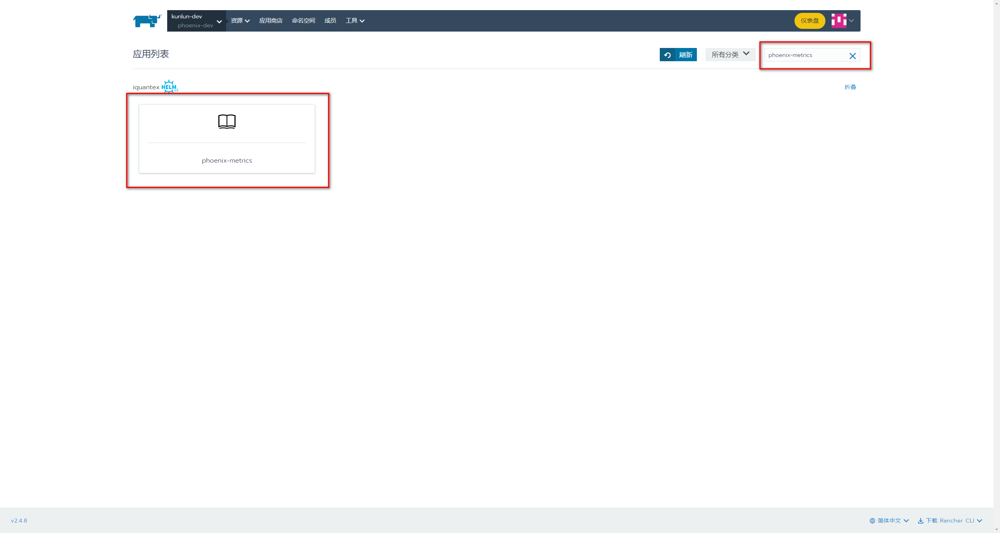

Phoenix 提供了可观测性的监控管理平台，支持对 Phoenix 服务进行系统状态管理、事件管理、性能监控、业务监控、事务调用链追踪以及异常分析。

Phoenix 在可观测性上一共提供了三个模块：

- Phoenix Console：内嵌式网页版运维管理平台，提供应用信息、集群状态、聚合根内存状态、事件管理等运维能力
- Phoenix ElasticSearch：基于 ElasticSearch 事件的可视化平台, 用于快速排查异常数据和异常行为
- Phoenix Metrics：基于可扩展指标导出的 APM(Application Performance Monitor) 体系, 用于洞悉程序的性能指标.

## Phoenix Console \{#console\}

Phoenix 网页内嵌式支持系统状态管理、事件管理、事务调用链追踪以及异常分析等功能。

更详细的功能介绍可参考：[服务管理](/docs/phoenix-console/phoenix-console-service-management)

:::info

为了更好的对 Phoenix 服务的性能以及业务信息进行监控，Phoenix 需要借助一些第三方的监控组件，例如Grafana、Elasticsearch、Prometheus。

:::

## Phoenix ElasticSearch \{#log\}

Event-Publish-ES 是 Phoenix 框架提供的一个 Event Publish 任务, 该任务可以将 Phoenix 服务处理过的事件进行转换并上报至 ElasticSearch , Grafana 通过读取 ElasticSearch 中的数据进行可视化的展示。

同时 Phoenix 还提供了一组业务数据的监控面板，可以更方便的供开发人员进行使用。更详细的功能介绍可参考：[业务监控](/docs/phoenix-console/phoenix-console-business-monitor)

## Phoenix Metrics \{#metrics\}

Phoenix 框架默认集成了 Prometheus Agent 同时配合 [Java Management Extensions (JMX)](https://en.wikipedia.org/wiki/Java_Management_Extensions) 对系统中的一些关键系统节点进行埋点。系统监控数据最终将通过 Grafana 进行可视化的展示。

同样的 Phoenix 也提供了一组系统数据的监控面板，可以更方便的共开发人员进行使用。更详细的功能介绍可参考：[系统监控](/docs/phoenix-console/phoenix-console-system-monitor)

## 快捷部署 \{#deploy\}

业务监控和系统监控需要依赖于prometheus，grafna，elasticsearch，并且需要导入Phoenix配置的[面板数据](../assets/file/phoenix-admin/system-monitor-model.md)。

如果你在公司环境，可以通过rancher一键部署这三个服务在开发环境中使用，这样部署的服务默认集成了phoenix相关的grafna面板，可以直接使用。当然，如果是生产环境，建议让运维部署好这三个服务，然后通过后面[业务监控](/docs/phoenix-console/phoenix-console-business-monitor)和[系统监控](/docs/phoenix-console/phoenix-console-system-monitor)中的使用说明在grafna中手工配置和导入。

**rancher一键部署:**

1. 登陆rancher，打开应用商城，点击**启动**按钮。

2. 搜索phoenix-metric，点击。

3. 可以自定义名称和命名空间，点击**启动**即可部署好三个服务了。

