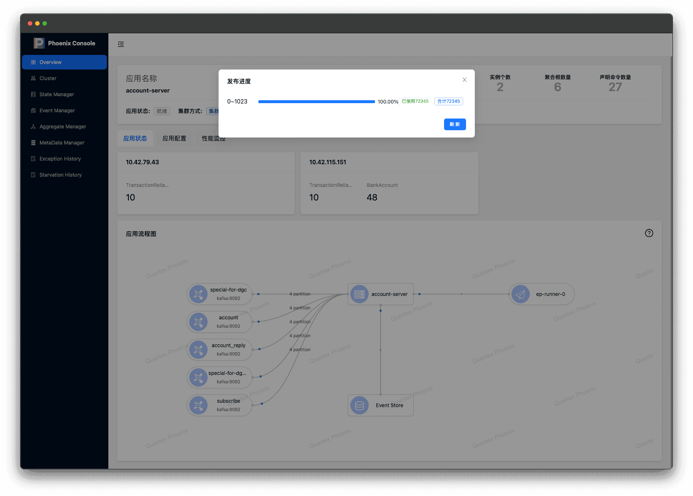
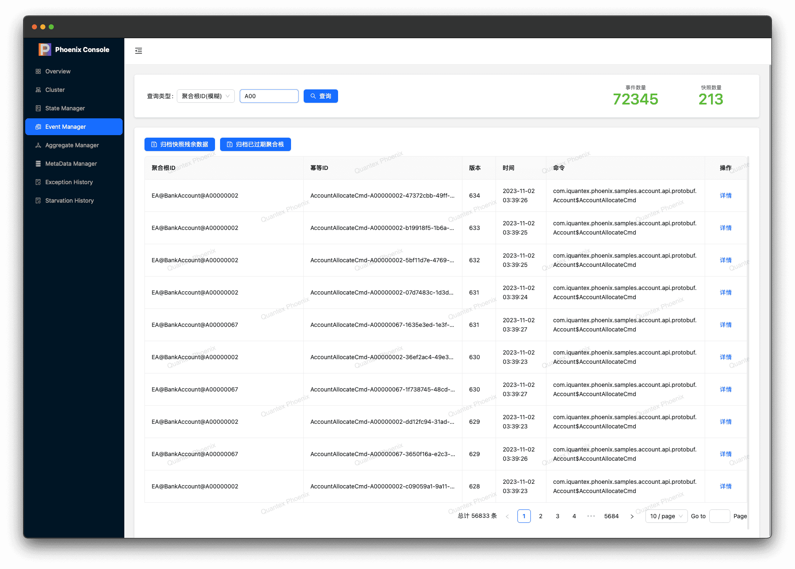
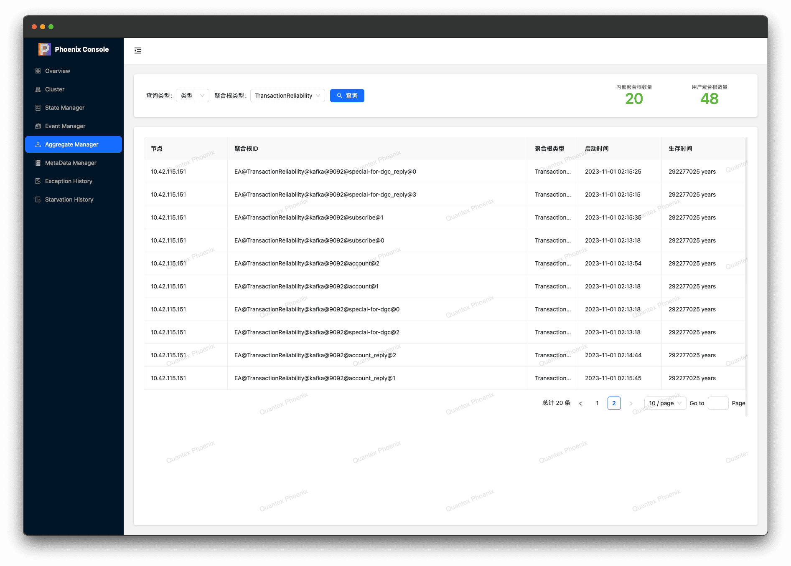
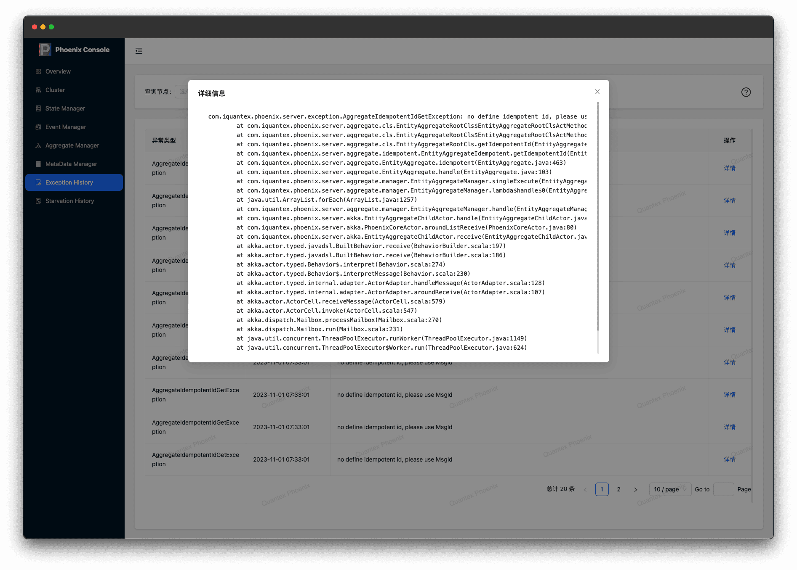

import Tabs from '@theme/Tabs';
import TabItem from '@theme/TabItem';

Phoenix Console(Phoenix 服务监控管理平台)是 Phoenix 框架默认提供的轻量级、嵌入式监控平台。该平台共内置多个功能模块：

- **应用总览**：集群、应用配置情况、运行状态（进度）、性能监控、统计面板
- **集群展示**：集群状态、分片情况
- **内存管理**：查看聚合根的内存状态、历史状态回溯查询、命令管理（发送）
- **事件管理**：全局、精确、模糊查询历史事件，事件数量统计
- **聚合根管理**：查询当前集群存活的聚合根及其分配节点、存活时间、启动时间
- **MetaData管理**: MetaData 是聚合根的元数据信息, 聚合根可以选择向指定的某个订阅中注册, 此页面用于检索已注册 MetaData.
- **历史捕获异常**：查询框架内部历史捕获的异常信息、堆栈、时间
- **线程池饥饿检测器**: 查询线程池饥饿检测器发出的事件

上述模块可帮助用户对 Phoenix 服务的状态进行实时监控，历史回溯，运维排查。


## 快速使用 \{#quick-start\}

1. 打开phoenix 服务监控管理平台的控制开关

```yaml
quantex.phoenix.server.console.enabled: true
```

2. 启动 Phoenix 应用服务。

3. 访问地址：`http://ip:port/phx-console`

## 一. 应用总览 \{#overview\}

应用总览页面展示该 Phoenix服务的一些基本信息和配置。其中包括：

- 集群信息：服务的运行状态、实例个数、服务中存在的聚合根数量
- 应用状态：存活聚合根数量及其分配节点
- 应用流程图：流程图及订阅、发布的进度展示，以及 Phoenix 配置详情（点击元素后展示）
- 应用配置：聚合根的配置信息及 Command 解析
- 性能监控：内置的性能流速监控展示

### 1.1 应用状态总览 \{#application-overview\}

<Tabs className="unique-tabs">
  <TabItem value="应用状态">

  </TabItem>
  <TabItem value="应用配置">

   </TabItem>
  <TabItem value="性能监控">

   </TabItem>
</Tabs>

### 1.2 应用状态详情 \{#application-detail\}

除了页面默认所展示的内容之外，应用流程图还可以点击展开详细信息，如：订阅进度、应用配置等

<Tabs className="unique-tabs">
  <TabItem value="订阅进度">

  </TabItem>
  <TabItem value="Phoenix 配置">

   </TabItem>
  <TabItem value="Event Store 配置">

   </TabItem>
  <TabItem value="Event Publish 进度">

   </TabItem>
</Tabs>

## 二. 集群分片可视化 \{#cluster\}

在Phoenix运行时，最小调度单位为聚合根，在集群管理页面中可以展示Phoenix服务中聚合根的分布情况。

- 红点: 当前 Phoenix 集群的集群名称
- 橙点: 当前 Phoenix 集群内的节点的IP和端口
- 绿点: 聚合根 Shard 集合,数字代表每个 Shard 后聚合根的数量


## 三. 状态管理 \{#memory\}

状态管理也可以叫内存管理，可对内存数据进行查询或修改。其中包括聚合根内存数据查询、事务调用链查询 、手动触发快照、发送万能命令等。

:::info 提示

默认从快照数据库中查询聚合根列表, 可选择从事件数据库中查询聚合根集合（如查询事务聚合根）。

:::

### 3.1 内存查询 \{#memory-query\}

Phoenix 支持从多个维度对聚合根内存状态进行查询。

1. 根据版本号进行精确查询（版本号为 **-1** 时，默认查询聚合根的最新状态）
2. 根据时间戳查看聚合根的历史状态。
3. 根据快照版本号查询聚合根历史状态

<Tabs className="unique-tabs">
  <TabItem value="按版本号回溯">

  </TabItem>
  <TabItem value="按历史时间回溯">

   </TabItem>
  <TabItem value="按快照版本回溯">

   </TabItem>
</Tabs>

### 3.2 状态管理 \{#memory-manager\}

在内存管理模块中的状态管理处，可以通过指定命令的全路径名和命令的 json 数据直接操作聚合根状态。并有两种命令生成方式可选：

<Tabs className="unique-tabs">
  <TabItem value="编辑模式">

  </TabItem>
  <TabItem value="文本模式">

   </TabItem>
</Tabs>


### 3.3 快照管理 \{#snapshot\}


Phoenix 提供手动触发快照功能。可以针对某一聚合根进行快照触发，也可对某一类聚合根进行集体快照触发


:::caution 注意

事务聚合根不提供该功能。

:::


### 3.4 事务调用链路图 \{#transaction\}

对于 Phoenix 的[事务模块](/docs/phoenix-transaction), Console 提供了事务的调用链路追踪图的集成，用户可借助该工具洞悉流程，以及每个流程的事件详情。

<Tabs className="unique-tabs">
  <TabItem value="调用链路">

  </TabItem>
  <TabItem value="事件详情">

   </TabItem>
</Tabs>


## 四. 事件管理 \{#event\}

事件管理模块用于查询历史事件、以及事件详细内容，也支持对历史事件进行一定程度的归档。

### 1. 多种事件列表查询维度 \{#event-query\}

Console 提供了多种维度的事件查询，以便于用户在不确定事件所处偏移、版本时，协助用户定位。

:::tip 提示
聚合根 ID 维度中，按消息 ID 查询可查询`[MsgId, RequestId, TransID]`, 例如用 TransID 查询某个分布式事务在当前聚合根的交互事件.
:::

<Tabs className="unique-tabs">
  <TabItem value="全局维度倒序查询">

  </TabItem>
  <TabItem value="聚合根维度">
        <Tabs className="unique-tabs">
            <TabItem value="聚合根版本倒序查询">
            
            </TabItem>
            <TabItem value="聚合根版本精确查询">
            
            </TabItem>
            <TabItem value="聚合根按命令类型查询">
            
            </TabItem>
            <TabItem value="聚合根按消息 ID 查询">
            
            </TabItem>
        </Tabs>
   </TabItem>
  <TabItem value="ID 维度">
        <Tabs className="unique-tabs">
            <TabItem value="按幂等ID查询">
            
            </TabItem>
            <TabItem value="聚合根ID模糊查询">
            
            </TabItem>
        </Tabs>
   </TabItem>
  <TabItem value="聚合根类型维度">

   </TabItem>
</Tabs>

### 2. 事件详情 \{#event-detail\}

事件默认为懒加载模式，仅当用户点击详情时，获取并展示详细事件内容。如果当前事件为异常事件，则可通过异常详情的方式查看异常堆栈。

<Tabs className="unique-tabs">
  <TabItem value="事件详情">

  </TabItem>
  <TabItem value="事件异常">

  </TabItem>
</Tabs>


### 3. 一键归档 \{#achived\}

点击`一键归档`按钮，可对历史事件进行归档，释放事件存储空间。

归档功能逻辑可参考：[事件归档](../phoenix-core/phoenix-core-event-store#archive)


## 五. 存活聚合根查询 \{#alive-aggregate\}

在聚合根管理页面，Console 支持查询当前存活的聚合根，以及该聚合根所在节点、创建时间、存活时间（注解配置的固定值）

:::info 提示
注意，存活聚合根的信息不完全实时，可能存在一定的延迟，取决于当前系统负载
:::

<Tabs className="unique-tabs">
  <TabItem value="默认视图">

  </TabItem>
  <TabItem value="按节点查询">

  </TabItem>
  <TabItem value="按类型查询">

   </TabItem>
  <TabItem value="组合查询">

   </TabItem>
  <TabItem value="按 ID 查询">

   </TabItem>
</Tabs>


## 六. MetaData 管理 \{#metadata\}

MetaData 目前定义为聚合根的元数据信息，每个聚合根彼此隔离，并通过统一固定的协调者（订阅）来管理和持久化。

因此，在订阅解析命令时，可以通过解析函数（SourceCollect）中通过 `CollectMetaDataQuery` 接口查询所有聚合根的元数据.


<Tabs className="unique-tabs">
  <TabItem value="按订阅查询">

  </TabItem>
  <TabItem value="按聚合根查询">

  </TabItem>
</Tabs>

## 七. 历史异常信息 \{#exception-history\}

Phoenix 支持保留一定数量（默认每个节点20）的框架异常事件. [大小参考 Console 配置](/docs/phoenix-core/phoenix-core-config#server)

用户可以在 Console 中按节点查询异常的基本信息（类型、时间、消息、堆栈）

<Tabs className="unique-tabs">
  <TabItem value="历史异常">

  </TabItem>
  <TabItem value="异常堆栈">

  </TabItem>
</Tabs>

## 八. 线程池饥饿事件查询 \{#starvation\}

开启[**线程池饥饿检查器**](/docs/phoenix-advanced/starvation-detector) 后，除了默认的 WARN 警告日志打印之外，饥饿检查器还会发出事件，Phoenix Console 会订阅该事件并缓存 Console （异常堆栈大小 / 3 ）大小的历史事件，并支持在 Console 中按节点查询, 并支持查询饥饿发生时，整个线程池的堆栈详情.

:::info 提示
线程池饥饿检查器默认情况处于关闭状态，需要用户手动开启.
:::


<Tabs className="unique-tabs">
  <TabItem value="历史检测事件">

  </TabItem>
  <TabItem value="线程堆栈">

  </TabItem>
</Tabs>


