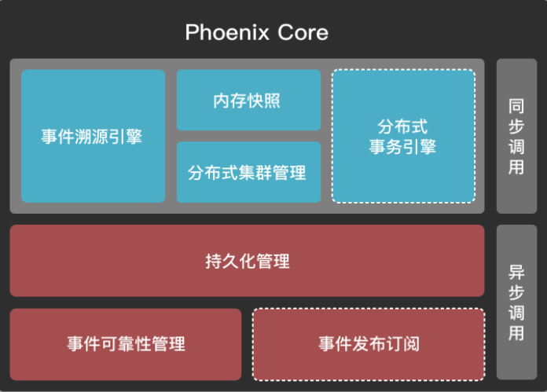
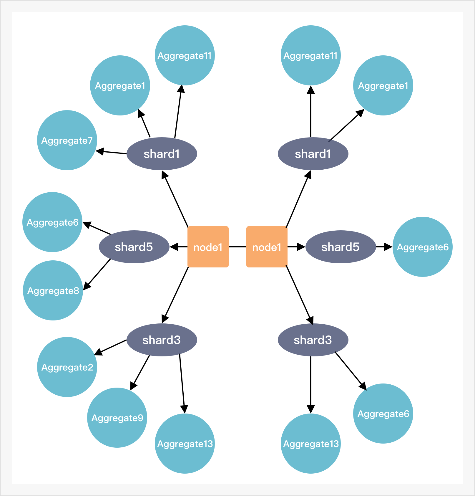

## 前言

完整的Phoenix架构包含Phoenix Core、Phoenix-event-publish、Phoenix-admin等多个模块，基于这些模块我们可以轻松开发出有状态的响应式微服务项目，同时具有高度的可用性、扩展性、易运维与易监控等特性。

Phoenix Core是Phoenix架构的核心部分，本文简要阐述在Phoenix Core里的核心概念，让读者对Phoenix有一个初步了解。

## 架构图

Phoenix Core是一个Phoenix服务所拥有的核心部分，上图中最右侧的"同步调用，异步调用" 属于Phoenix Client的核心功能，而其他的属于Phoenix Server的核心功能。

## 概念介绍

#### Client

客户端，发送Command或者Request的发起者，发送相应的消息到MQ，可以选择同步调用或者异步调用两种方式。同步调用会等待此次事务结果再返回，而异步调用则会直接返回。

#### 聚合

DDD理论中的概念，聚合是一组相关实体的集合，每个聚合定义了一个清晰的边界（边界定义了聚合跟内部都有什么）和定义了一个聚合根。

#### 聚合根

DDD理论中的概念，聚合定义了一组具有内聚关系的相关对象集合，每个聚合都有一个根对象，聚合内的对象只能通过聚合根进行操作。每个聚合根都需要一个全局唯一的聚合根ID。

#####实体聚合根

最通用的聚合根，用来处理用户业务相关的一组聚合数据，用户需要自定义聚合根类和聚合根ID，并维护自己想要的数据结构。

#####事务聚合根

用于管理事务状态的聚合根，赋予了Phoenix分布式事务能力，框架自带的功能，用户无需感知到。

#####可靠性投递聚合根

用于实现消息的可靠性投递的聚合根，赋予了Phoenix的消息可靠性，对于投递失败的消息会自动重发，框架自带的功能，用户无需感知到。

#### 事件溯源引擎

Phoenix服务采用了EventSourcing（事件溯源）的思想，使用Event驱动聚合根的状态改变。事件溯源引擎帮助Phoenix服务在发生crash重启后，恢复聚合根状态至应用crash之前的状态。

#### EventStore

存储领域事件供事件溯源使用。

#### 内存快照

帮助加速EventSourcing的一种重要技术。

#### 分布式事务引擎

Phoenix根据Saga模型提供了分布式事务解决引擎，能够保证在分布式场景中事务的一致性。

#### 分布式集群管理

在Phoenix Core基于Akka框架，提供了分布式集群管理功能，其中包括数据分片，数据一致性，数据可靠性，故障恢复等强悍的功能。基于Akka-Sharding，可以使得聚合根随着Akka中的actor进行数据分片，假如集群的某一节点发生故障，处于该节点上所有shard的聚合根分片，会自动漂移到健康的节点并完成EventSourcing，保证数据的一致性和可靠性。

