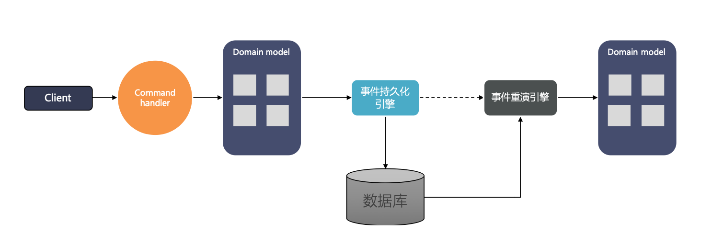

## 设计思想
Phoenix维护内存状态，核心能力是使用EventSouring技术，Phoenix会定时打快照用来加速EventSouring的恢复。




## EventStore配置
使用Phoenix框架时，EventStore是必选项，需要依赖关系型数据库，在`spring boot`配置文件中增加配置。Phoenix框架实现了对事件和快照的管理，用户一般不需要操作。如果需要手动管理快照，参见[接口说明](./phoenix-core-http-api-2x)
```yml
quantex:
  phoenix:
      event-store:
        driver-class-name: org.h2.Driver //支持mysql、h2、oracle
        snapshot:
          enabled: true // 开启打快照
        data-sources:
          - url: jdbc:h2:file:./data/test;DB_CLOSE_DELAY=-1;DATABASE_TO_UPPER=FALSE;INIT=CREATE SCHEMA IF NOT EXISTS PUBLIC
            username: sa
            password:
```

## EventStore设计

一般用户不用管理事件表和快照表，不会手动操作它们。下面简单介绍量招标的设计

**表名：EVENT_STORE**

| **字段名称**       | **字段描述**   | **字段类型**  | **字段形式**     | **备注** |
| :----------------- | :------------- | :------------ | :--------------- | :------- |
| AGGREGATE_ROOT_TYPE | 聚合根类别 | VARCHAR2(255) | java的聚合根类名 |          |
| AGGREGATE_ID       | 聚合根ID       | VARCHAR2(255) |                  |          |
| VERSION            | 事件版本       | NUMBER(19)    | 数值递增         |          |
| IDEMPOTENT_ID      | 幂等ID         | VARCHAR2(64)  | UUID             |          |
| EVENT_CONTENT      | 事件内容       | BLOB          | 二进制内容       |          |
| CREATE_TIME        | 创建时间       | DATE          | 日期时分秒       |          |

**索引**

| **类别** | **变量名**             | **字段**                    |
| :------- | :--------------------- | :-------------------------- |
| 主键     | EVENT_STORE_PK         | AGGREGATE_ID、VERSION       |
| 唯一索引 | EVENT_STORE_CMD_ID_IDX | AGGREAGTE_ID、IDEMPOTENT_ID |

---

**表名：PHOENIX_SNAPSHOT**

| **字段名称**   | **字段描述** | **字段类型**  | **字段形式**     | **备注** |
| :------------- | :----------- | :------------ | :--------------- | :------- |
| AGGREGATE_ID   | 聚合根ID     | VARCHAR2(255) |  |  |
| VERSION        | 版本         | BIGINT(19)    | 整数，由0开始递增 |  |
| SNAPSHOT_DATA       | 快照内容     | BLOB          | 二进制内容       |          |
| CREATE_TIME    | 创建时间     | DATE          | 日期时分秒       |          |

**索引**

| **类别**         | **变量名**                  | **字段**              |
| :--------------- | :-------------------------- | :-------------------- |
| 主键             | SNAPSHOT_STORE_PK                 | AGGREGATE_ID、VERSION |
