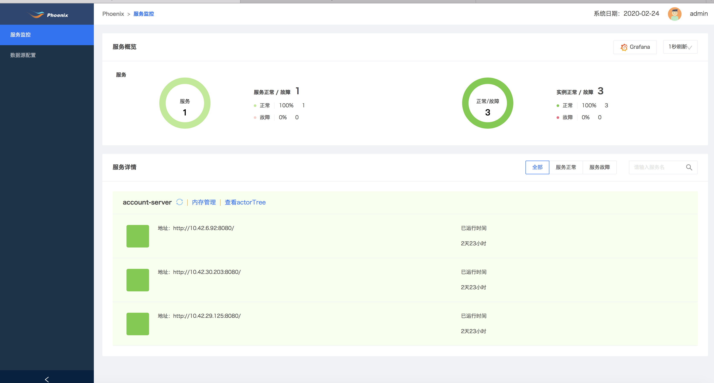
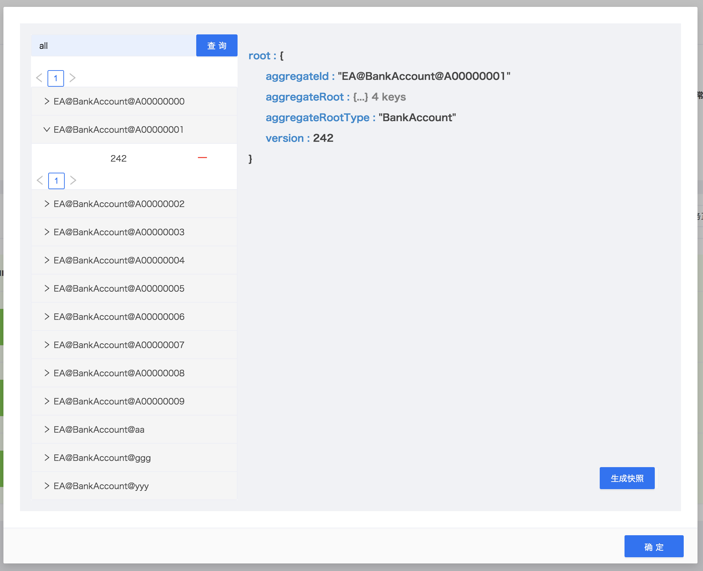
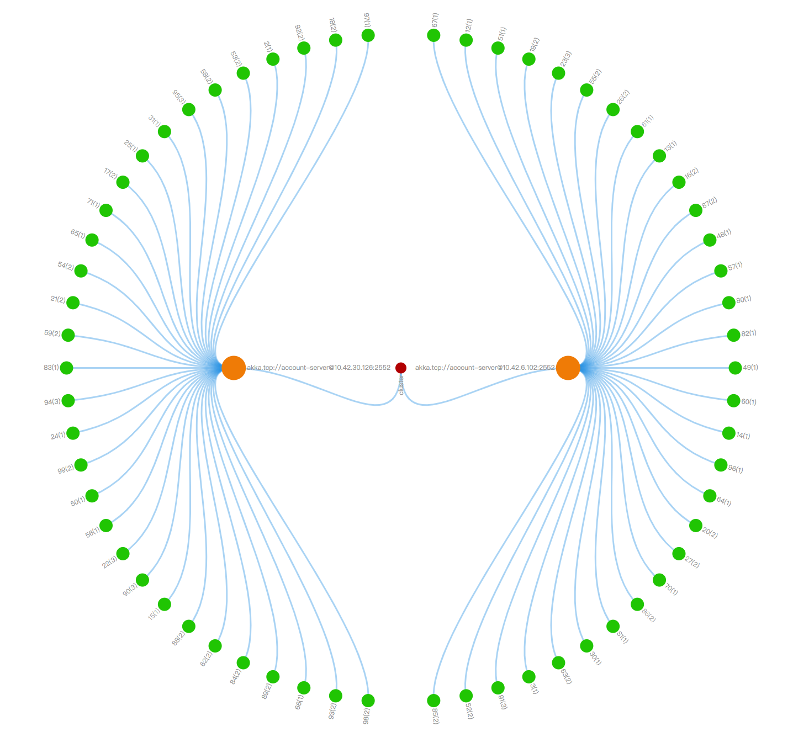
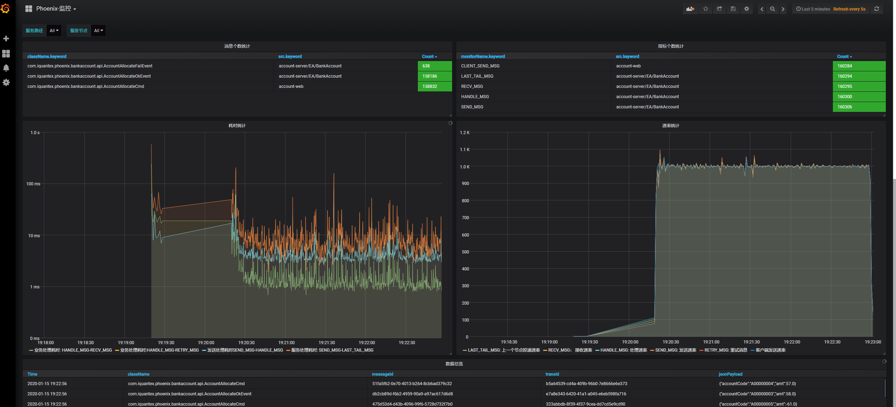

phoniex-admin是配合Phoenix框架使用的服务监控平台，能够实现对多个项目，多服务，多实例层级的监控和内存管理的功能。

## 服务监控

服务监控页面可以看到该项目下的所有Phoenix服务，每个服务也可以看到运行时间，实例个数等。

## 内存管理

在服务监控页面中，点击内存管理可以跳转到内存管理页面。在内存管理当中，可以看到所有聚合根的内存状态，也支持模糊查询。同时可以查看快照、打快照、删除快照等操作管理快照。

## 集群状态
在服务监控页面中，点击`actor tree`按钮可以进入集群状态查看页面。在Phoenix运行时，最小调度单位为聚合根，在集群管理页面中可以展示Phoenix服务的均衡分片，水平伸缩，故障恢复等功能。
- 红点: 当前Phoenix集群的集群名称
- 橙点: 当前Phoenix集群内的节点的IP和端口
- 绿点: 聚合跟shard集合,数字代表每个shard后聚合跟的数量

## 性能监控

phoenix-admin可以实时消费phoenix应用处理的消息写入elasticsearch，并通过grafna展示指标，参见[上报配置](./phoenix-admin-use-2x)。phoenix-admin为每个项目内置了一个通用的监控面板，提供消息归类、性能分析、消息详情等功能。详情如下:

#### 监控总览

#### 筛选栏
可选定系统中，不同的服务集群，和服务集群下面不同的节点的数据

#### 消息个数统计面板
统计系统内各个消息的个数

#### 指标个数统计面板
统计系统内具体埋点的数量

#### 耗时统计面板
统计系统内各种耗时

#### 速率统计面板
统计系统内各种速率

#### 数据总览面板
展示数据的详细信息

## 业务监控
phoenix-admin可以实时消费phoenix应用处理的消息写入elasticsearch，并通过grafna展示指标，参见[上报配置](./phoenix-admin-use-2x)。用户可以根据自己的业务数据，在grafna配置一些业务监控指标。 
