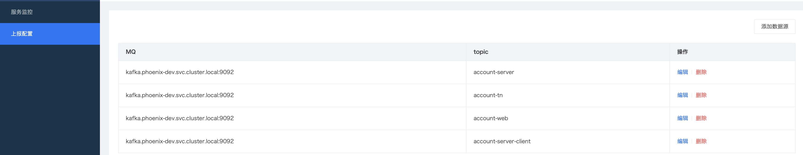

## 运行启动
phoenix-admin提供docker-compose启动方式,赋值下面的docker-compose.yml,执行`docker-compose up -d`命令启动.

``` shell
version: "3"

services:
  phoenix-proxy:
    image: hub.iquantex.com/base/nginx:1.16-alpine
    restart: always
    container_name: phoenix-proxy
    hostname: "phoenix-proxy"
    user: root
    depends_on:
      - grafana
      - phoenix-admin-seed1
      - phoenix-admin-seed2
    ports:
      - 80:8080
      - 443:443
    volumes:
      - ./nginx_conf/:/etc/nginx/conf.d

  phoenix-admin-seed1:
    image: harbor.iquantex.com/phoenix/admin:2.1.5
    user: root
    depends_on:
      - mysql
    container_name: phoenix-admin-seed1
    hostname: "phoenix-admin-seed1"
    restart: always
    environment:
      - server.port=8080
      - quantex.phoenix.akka-conf=application-docker
      - AKKA_CLUSTER_PORT=1601
      - AKKA_CLUSTER_IP=phoenix-admin-seed1
      - AKKA_SEED_NODES.0=akka://phoenix-admin@phoenix-admin-seed1:1601
      - AKKA_SEED_NODES.1=akka://phoenix-admin@phoenix-admin-seed2:1602
      - spring.datasource.driver-class-name=com.mysql.jdbc.Driver
      - spring.datasource.url=jdbc:mysql://mysql:3306/phoenix_admin?useUnicode=true&characterEncoding=utf-8&verifyServerCertificate=false&useSSL=false&requireSSL=false
      - spring.datasource.username=root
      - spring.datasource.password=fw@2014
      - spring.data.elasticsearch.cluster-nodes=10.16.18.206:9300
      - spring.data.elasticsearch.cluster-name=elasticsearch
      - grafana.user=admin
      - grafana.pwd=admin
      - grafana.url=http://grafana:3000
    volumes:
      - ./api_lib/:/api-lib

  phoenix-admin-seed2:
    image: harbor.iquantex.com/phoenix/admin:2.1.5
    user: root
    depends_on:
      - mysql
    container_name: phoenix-admin-seed2
    hostname: "phoenix-admin-seed2"
    restart: always
    environment:
      - server.port=8080
      - quantex.phoenix.akka-conf=application-docker
      - AKKA_CLUSTER_PORT=1602
      - AKKA_CLUSTER_IP=phoenix-admin-seed2
      - AKKA_SEED_NODES.0=akka://phoenix-admin@phoenix-admin-seed1:1601
      - AKKA_SEED_NODES.1=akka://phoenix-admin@phoenix-admin-seed2:1602
      - spring.datasource.driver-class-name=com.mysql.jdbc.Driver
      - spring.datasource.url=jdbc:mysql://mysql:3306/phoenix_admin?useUnicode=true&characterEncoding=utf-8&verifyServerCertificate=false&useSSL=false&requireSSL=false
      - spring.datasource.username=root
      - spring.datasource.password=fw@2014
      - spring.data.elasticsearch.cluster-nodes=10.16.18.206:9300
      - spring.data.elasticsearch.cluster-name=elasticsearch
      - grafana.user=admin
      - grafana.pwd=admin
      - grafana.url=http://grafana:3000
    volumes:
      - ./api_lib/:/api-lib

  mysql:
    image: hub.iquantex.com/public/mysql:5.7
    user: root
    container_name: mysql
    hostname: "mysql"
    restart: always
    ports:
      - 3456:3306
    environment:
      - MYSQL_ROOT_PASSWORD=fw@2014
      - MYSQL_DATABASE=phoenix_admin

  grafana:
    image: grafana/grafana:5.1.4
    user: root
    container_name: grafana
    hostname: "grafana"
    restart: always
    ports:
      - 3000:3000
```

##  项目配置
#### 新建项目

#### 配置项说明

   * 项目ID：
     Phoenix项目的ID，全局唯一，建议使用英文+字母的简短组合。
   * 项目名称：
     Phoenix项目的名称。
   * 项目描述：
     Phoenix项目的简短描述。
   * 注册中心地址：
     phoenix-admin能实现多项目的管理，借住了eureka来实现各个项目内的服务发现。这里需要填写在部署Phoenix项目的时候，eureka的地址。

## 上报配置
phoenix-admin可以监听phoenix应用的命令和事件，在页面中配置phoenix应用通讯所依赖的MQ的地址和topic列表，配置完成之后即可从grafna上查看处理内容


