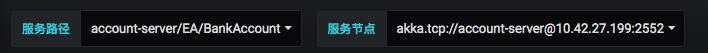
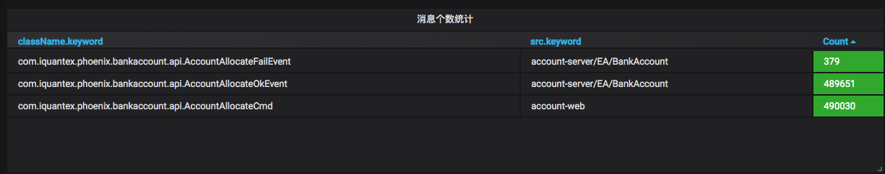
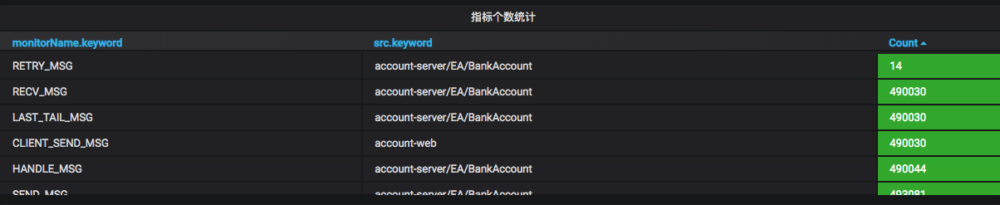
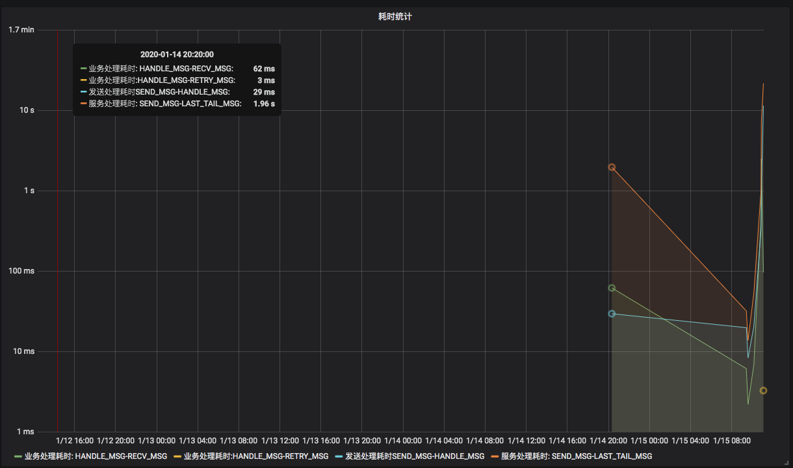
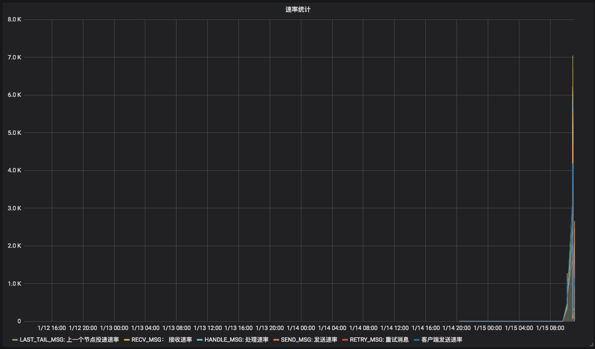
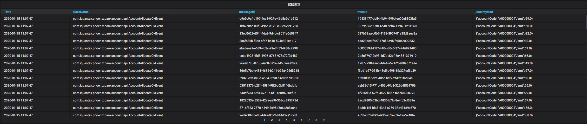

## 前言

phoniex-admin是配合phoenix框架使用的服务监控平台，能够实现对多个项目，多服务，多实例层级的监控和内存管理的功能。

**架构部署**

=======

### 功能介绍

* 服务监控
* grafana监控
* 待补充...

## 服务监控

备注：ui待开发，开发完毕后补图。

### 运行总览

- 服务个数/健康度
- 实例个数/健康度

### 运行详情

- 实例健康状态
- url
- 运行时间
- 补充ing...

### 实例内存管理

- 聚合根列表查询
- 聚合根ID历史快照版本查询
- 打快照
- 删除快照
- 聚合根内存查询

## grafana监控

### 概述

grafana是一款美观、强大的可视化监控指标展示工具，phoenix借住了grafana+elasticsearch来实现监控功能。

phoenix服务在消息内部埋有诸多监控指标，通过phoenix自带的phoenix-persist，将这些消息写入到elasticsearch中，通过配置elasticsearch作为数据源，并进行相关配置，我们可以就在grafana中看到我们关心的各种指标。

### 默认面板

phoenix-admin为每个项目内置了一个通用的监控面板，提供基本的监控功能，详情如下：

1. 总览

   

2. 筛选栏

   可选定系统中，不同的服务集群，和服务集群下面不同的节点的数据

3. 消息个数统计面板

   统计系统内各个消息的个数

   

4. 指标个数统计面板

   统计系统内具体埋点的数量

   

5. 耗时统计面板

   统计系统内各种耗时

   

6. 速率统计面板

   统计系统内各种速率

   

7. 数据总览面板

   展示数据的详细信息

   

### 自定义面板 

phoenix-admin为每个项目在grafana中创建了一个自定义目录，支持用户对该项目下自定义目录的所有操作。用户可以根据自己的需求配置监控面板。