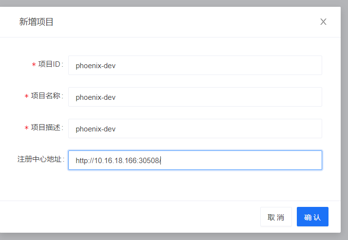
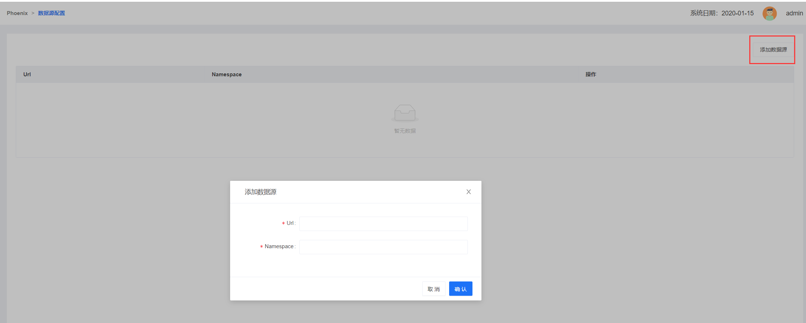
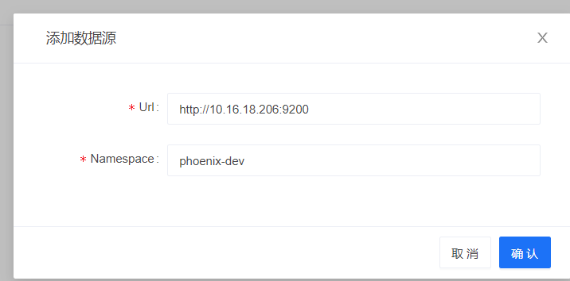
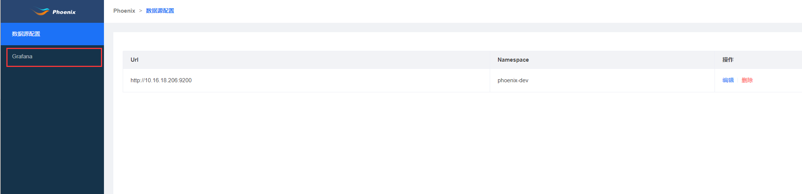

## 部署

phoenix-admin提供了便捷的helm部署方式。可以使用helm命令在kubernates环境一键拉起整套phoenix-admin的集群。

```shell
helm upgrade --kubeconfig devops/.kube/config-demo ${name} --install --namespace=phoenix-admin-demo  --set phoenix_admin.version=$CI_COMMIT_REF_NAME  devops/helm/phoenix-admin/
```


## 配置

### 一. 项目配置

1. 新建项目


2. 配置项说明

   

   * 项目ID：

     phoenix项目的ID，全局唯一，建议使用英文+字母的简短组合。

   * 项目名称：

     phoenix项目的名称。

   * 项目描述：

     phoenix项目的简短描述。

   * 注册中心地址：

     phoenix-admin能实现多项目的管理，借住了eureka来实现各个项目内的服务发现。这里需要填写在部署phoenix项目的时候，eureka的地址。

     <br/>

### 二. 系统配置

1. 添加数据源

   

2. 配置项说明：

   

   * Url

     因为phoenix项目内的phoenix服务，是把监控点上报到elasticsearch的，这里我们填写该项目下的elasticsearch的url。

   * Namespace

     填写利用kubernates部署项目的时候，kubernates的命名空间。
     
     <br/>

### 三. 效果展示

配置完毕后，点击右侧菜单栏的【Grafana】按钮，即可实现免密跳转到grafana的默认dashboard中。




效果如下：


备注：对于上述图表中的各个面板的解释说明，请见上一篇文档。图表中各项指标的含义，在图表中有中文图例说明。