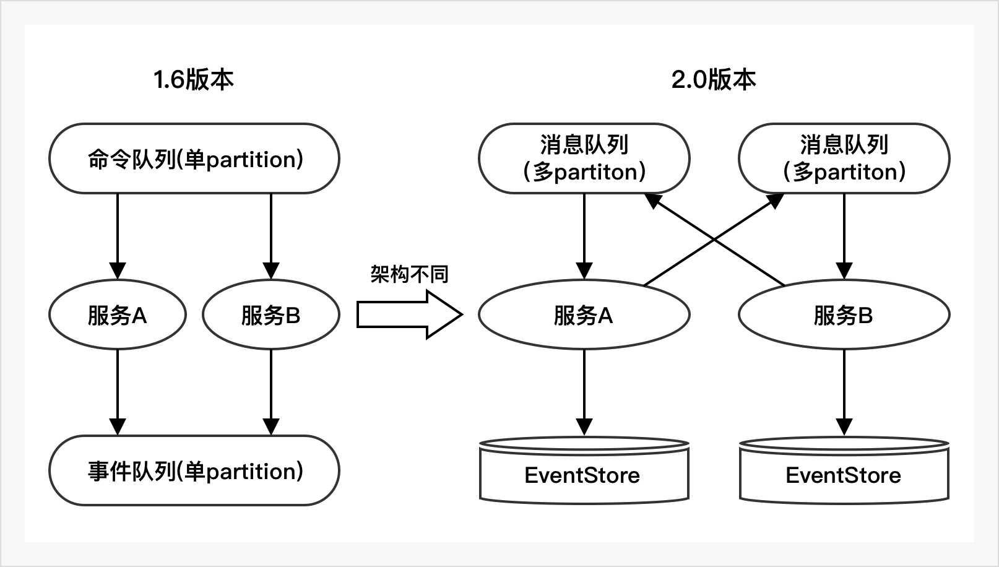

该篇对比1.6介绍2.X版本的架构、代码、依赖区别。旨在帮助用户从1.6容易的过度到2.X

## 架构对比



1.6的版本和2.x的版本的架构不太相同，对第三方组件的依赖定位也有所不同。
<table>     
	<tr>                  
		<td>依赖组件</td>    
		<td>1.6版本</td>   
		<td>2.X版本</td>    
		<td>备注</td> 
	</tr>     
	<tr>         
		<td>消息中间件</td>    
		<td>1.支持RocketMQ或Kafka<br />2.整个系统使用两个topic(command和event)<br />3.每个topic只能支持一个partition要有序不丢</td>   
		<td>1.目前只支持kafka<br />2.每个服务一个topic(默认服务名)<br />3.每个服务的topic支持多个partition<br />4.topic内消息不用有序且不用持久化<br /></td>    
		<td>1.对比1.6版本减轻和对MQ的依赖<br />2.支持MQ的横向扩容</td>      
	</tr>     
	<tr>         
		<td>EventStore</td>  
		<td>不依赖，Event存在MQ里面</td>   
		<td>依赖，可选用关系型数据库</td>    
		<td>关系型数据库存储事件更可靠</td> 	
	</tr> 
</table> 


## 配置对比

### 1.6的配置

1.6版本中配置需要写明mq的地址，以及`cmd`和`event`的topic，如果要使用快照的话，也要配合快照的存储。如果要支持HA需要配置zk地址。
```
quantex:
  phoenix:
    mq:
      type: kafka
      address: 10.16.18.208:9092
    aggregate-worker:
      name: phoenix-counter
      cmd-topic: cmd-test-topic
      event-topic: event-test-topic
      mq-group: phoenix-counter
      mq-queue-id: 0
      group-no: 0
      event-store: mq
      snapshot:
        type: oracle
        url: jdbc:oracle:thin:@10.16.18.85:1521/PDB
        table-name: phoenix_snapshot
        username: test
        password: test
      zk-connect: 10.16.18.206:2181
      ha-enabled: true
```

### 2.X的配置

2.X的配置中同样也会写明mq的地址，但不会再指定topic，因为topic默认是应用名，同时为了服务间通信增加了`routers`，做事件存储的话需要有`event-store`的配置
```
quantex:
  phoenix:
    routers:
      - message: com.iquantex.phoenix.bankaccount.api.AccountAllocateCmd
        dst: account-server/EA/BankAccount
      - message: com.iquantex.phoenix.bankaccount.api.AccountTransferReq
        dst: account-tn/TA/BankTransferSaga
    server:
      name: ${spring.application.name}
      mq:
        type: kafka
        address: embedded
      event-store:
        driver-class-name: org.h2.Driver
        snapshot:
          enabled: true
        data-sources:
          - url: jdbc:h2:file:./data/test;DB_CLOSE_DELAY=-1;DATABASE_TO_UPPER=FALSE;INIT=CREATE SCHEMA IF NOT EXISTS PUBLIC
            username: sa
            password:
```


## 编码对比

### 编程模型
2.x的编程模型对比1.6没有本质的变化

```
.                                   +-------------------------+
                                    |                         |
                                 修改状态(on)                  |
                                    |                         |
+--------------+             +------V--------+          +-----+------+     
|     命令      |--驱动(act)->|    聚合根      |--产生---> |    事件     |
+------+-------+             +---------------+          +------------+      
```

### 注解变化

|注解名|1.6版本|2.x版本|作用|
|-----|------|------|----|
|聚合根注解|@AggregateClsDefinition|@EntityAggregateAnnotation|标明聚合根作用在类上|
|命令处理注解|@AggregateDefinition(aggregateId = "name")|@AggregateRootIdAnnotation(aggregateRootId = "accountCode")|标明聚合根可以处理哪些命令,作用在act方法上

