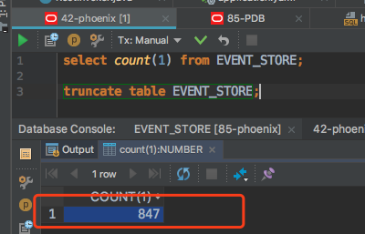
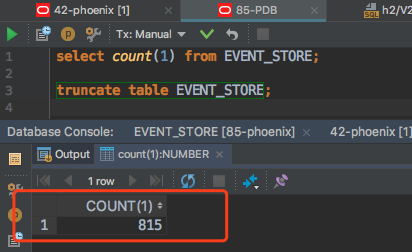
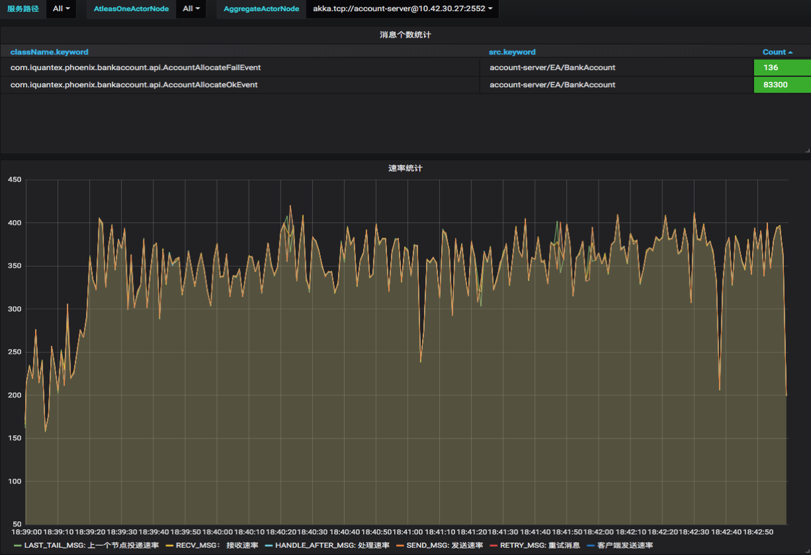

## 概述

均衡性直接标识着一个负载均衡算法/系统的优劣。Phoenix内部有诸多负载均衡点，我们关心这些负载均衡能否很好的将流量分配在多个处理单元中。

Phoenix中的均衡性测试将通过以下几个维度展开：

1. actor分布: atleastOneActor分布和AggregateActor分布在多个实例的情况下是否均匀？
2. kafka的消息分布：通过kafka图形化工具，查看每个topic的每个partion消息数量是否均衡？
3. 数据库记录分布：在使用多个数据库的时候，查看数据库的event数量是否均匀？
4. 整体流量分布 ： 通过phoenix-grafana视图，查看整体流量处理是否均匀？ 
5. cpu使用分布 ： 在上述证明均匀情况下，观察多个实例cpu的使用是否均匀？

## 测试方案（actor分布）

### 测试场景

在kubernates环境部署bank-account服务多活集群，前端发起批量随机划拨请求，处理完毕后，观察集群内每个节点上分布的actor数量。

### 校验方法

观察Grafana上的`Akka Cluster Sharding`图表中的`Shard entities per shard`pannel，看actor的分布是否均匀。

### 测试步骤

1. 在kubernates环境中，使用bank-account服务，部署2个节点。

   

2. 发起随机划拨请求，划拨总数为1000。

   

3. 处理完毕所有请求后，观察Grafana。

   

4. 观察可得在虚拟IP为10.42.27.55和10.42.29.141的两个节点内，分别有10个聚合根，因此actor分布均匀。

## 测试方案（kafka消息分布）

### 测试场景

在kubernates环境部署bank-account服务多活集群，前端发起批量划拨请求，处理完毕后，观察kafka各个partition里的消息数量。

### 校验方法

通过`kafka tool`工具，连接集群使用的kafka，观察每个partition的消息分布是否均匀。

### 测试步骤

1. 在kubernates环境中，使用bank-account服务，部署2个节点。

2. 发起随机划拨请求，划拨总数为1000。

3. 处理完毕所有请求后，观察`kafka manage tool`中每个partition的消息数量。

   

4. 观察可得，消息在kafka的多partition内是分布均匀的。

## 测试方案（数据库记录分布）

### 测试场景

在kubernates环境部署bank-account服务多活集群，前端发起批量划拨请求，处理完毕后，观察服务所使用的每个db中的`eventstore`表的数据量。

### 校验方法

通过`select count(1) from event_store`语句查询数据量，观察数据量是否大致相等。

### 测试步骤

1. 在kubernates环境中，使用bank-account服务，部署3个节点。

2. 发起随机划拨请求，划拨总数为1000。

3. 观察db中`eventstore`表的数据量。

   

   

4. bank-account服务所采用的的event_store表分布于两个db中，观察可得，在每个db里分布的记录也是均匀的。

## 测试方案（整体流量分布）

### 测试场景

在kubernates环境部署bank-account服务多活集群，前端发起批量划拨请求，处理完毕后，观察集群内每个节点的处理速率。

### 校验方法

 通过Grafana中的Phoenix监控中的速率图表，观察每个节点的速率是否大致相同。

### 测试步骤

1. 在kubernates环境中，使用bank-account服务，部署2个节点。

2. 发起随机划拨请求，划拨总数为200000，每秒发起800次。

   

3. 观察Grafana。

   IP为10.42.27.56的节点处理速率图：

   

   IP为10.42.30.27的节点处理速率图：

   

4. 观察可得，每个节点处理的流量是相当均匀的。

## 测试方案（cpu使用分布）

### 测试场景

在kubernates环境部署bank-account服务多活集群，前端发起批量划拨请求，处理完毕后，观察这段时间每个节点的cpu使用率。

### 校验方法

观察rancher上每个服务节点的cpu使用图，观察每个节点的cpu占用是否大致相同。

### 测试步骤

1. 在kubernates环境中，使用bank-account服务，部署2个节点。

2. 发起随机划拨请求，划拨总数为200000，每秒发起800次。

3. 查看rancher的cpu使用图。

   

4. 观察可得，处理过程中，两个节点的cpu占用率也是非常均匀的。

## 结论

经验证，Phoenix能保证每一个负载均衡点都具有非常好均衡性，因而整体上来说，Phoenix具有非常高的均衡性。