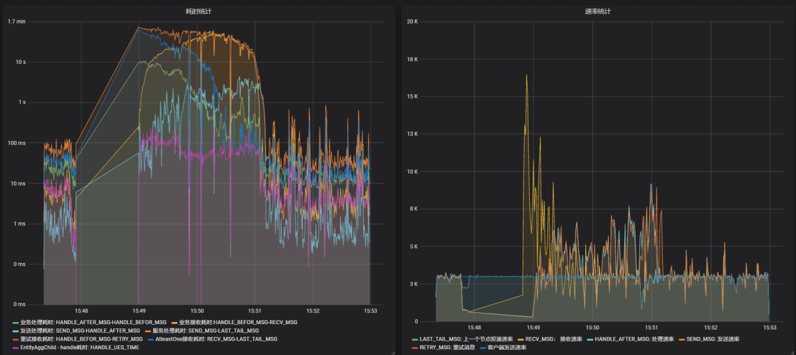

## 概述

可伸缩性(可扩展性)是一种对软件系统计算处理能力的设计指标，在系统扩展成长过程中，高度可伸缩的软件能够保证旺盛的生命力，通过很少的改动甚至只是硬件设备的添置，就能实现整个系统处理能力的线性增长。系统的伸缩性可以使用以下两个维度衡量：

1. 纵向伸缩: 在同一个逻辑单元内增加资源来提高处理能力，比如增加CPU主频。
1. 横向伸缩: 增加更多逻辑单元的资源，令它们像是一个单元一样工作来提高处理能力。

Phoenix重点关心线性的横向伸缩能力，Phoenix的处理单元是聚合根，Phoenix框架可以根据CPU核心数动态调整处理聚合根的能力，可以根据节点个数动态调整每个节点处理聚合根的个数。
下面分别通过实例的伸缩和CPU核心数量的伸缩来证明Phoenix的横向伸缩能力。

## 伸缩性测试（新版）

### 测试场景一

Phoenix框架弹性测试（实例数量伸缩）基于bank-account服务进行。通过在系统濒临崩溃时增加Kubernetes环境中bank-account服务集群的节点数量，来证明Phoenix的弹性。

#### 校验方法

测试过程中使用Grafana监控请求的处理情况，观察系统的负载能力（Phoenix监控图中的TPS）在增加bank-account实例前后的变化。

#### 测试环境

|            | 实例个数 | CPU  | 内存 | 聚合根 | 调优参数                                                     |
| ---------- | -------- | ---- | ---- | ------ | ------------------------------------------------------------ |
| 增加实例前 | 2个      | 2C   | 2Gb  | 10个   | quantex.phoenix.performance.retry-by-nofinished = 0 quantex.phoenix.performance.recv-by-nofinished = 500000 |
| 增加实例后 | 4个      | 2C   | 2Gb  | 10个   | quantex.phoenix.performance.retry-by-nofinished = 0 quantex.phoenix.performance.recv-by-nofinished = 500000 |

#### 测试步骤

1. 在Kubernetes环境中，使用bank-account服务，部署两个节点，给定每个节点 2C（2个核心）的CPU，不断调试前端的压测请求数量，观察Grafana，测出服务的极限TPS(这里测试为3000/s)。
2. 保证每个节点的CPU资源不变，前端的压测程序持续以3000/s的tps发送请求。
3. 待服务处理一段时间之后，节点数量增加到4个.
4. 待服务继续处理一段时间之后，关闭前端请求。观察Grafana。

5. 观察压测结果，发现前期（只有两个节点的时候）服务的处理能力不太稳定，并且处理耗时较高。当增加两个节点之后，服务的处理能力稳定在3000左右，和前端的请求速率持平，且消息处理耗时明显降低。

### 测试场景二

Phoenix框架高伸缩性测试（CPU资源伸缩）基于bank-account服务进行。通过伸缩Kubernetes环境中bank-account服务集群节点的CPU核心数限制阈值，来证明Phoenix能够根据CPU资源来进行横向伸缩，以增大或者减少整个系统的负载能力。

#### 校验方法

测试过程中使用Grafana监控请求的处理情况，观察系统的负载能力（Phoenix监控图中的TPS）在增加CPU资源（核数）前后的变化。

#### 测试环境

|            | 实例个数 | CPU  | 内存 | 聚合根 | 调优参数                                                     |
| ---------- | -------- | ---- | ---- | ------ | ------------------------------------------------------------ |
| 增加实例前 | 2个      | 2C   | 2Gb  | 10个   | quantex.phoenix.performance.retry-by-nofinished = 0 quantex.phoenix.performance.recv-by-nofinished = 500000 |
| 增加实例后 | 2个      | 4C   | 2Gb  | 10个   | quantex.phoenix.performance.retry-by-nofinished = 0 quantex.phoenix.performance.recv-by-nofinished = 500000 |

#### 测试步骤

1. 在Kubernetes环境中，使用bank-account服务，创建两个节点，给定每个节点 2C的CPU，不断调试前端的压测请求数量，观察Grafana，观察Grafana，测出服务的极限TPS(这里测试为4000/s)。
2. 保证实例个数不变，前端的压测程序持续以4000/s的tps发送请求。
3. 待服务处理一段时间之后，升级CPU核心为4C
4. 待服务继续处理一段时间之后，关闭前端请求。观察Grafana。

5. 观察压测结果，发现在增加CPU资源前后服务均能较为平稳的处理。

### 结论

经过上述两个维度的横向伸缩性验证，证明Phoenix具有线程级别和进程级别的横向伸缩能力。