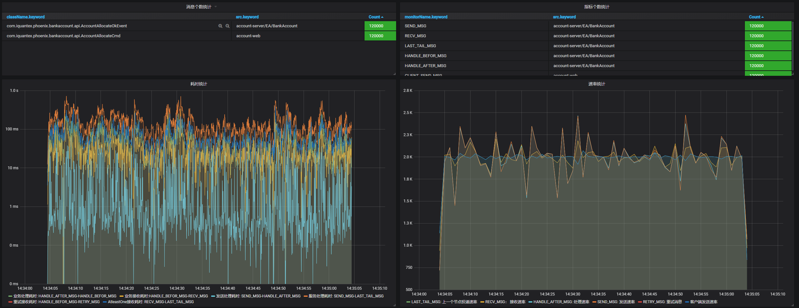
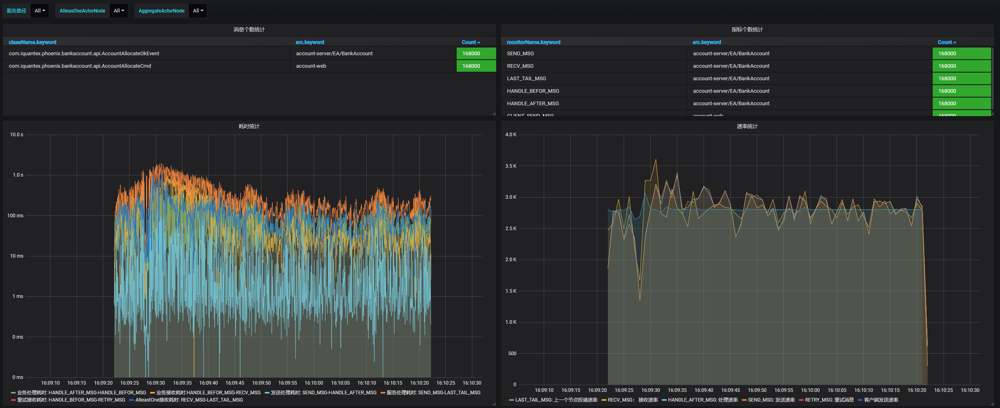
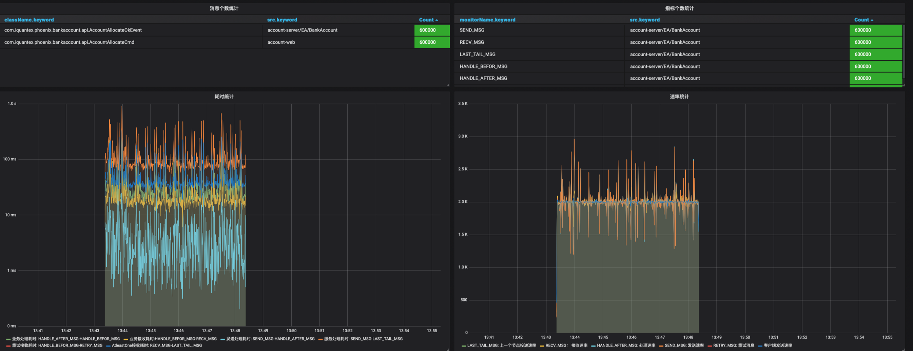

## 概述

可伸缩性(可扩展性)是一种对软件系统计算处理能力的设计指标，在系统扩展成长过程中，高可伸缩性的软件能够保证旺盛的生命力，通过很少的改动甚至只是硬件设备的添置，就能实现整个系统处理能力的线性增长。系统的伸缩性可以使用以下两个维度衡量：

1. 纵向伸缩: 在同一个逻辑单元内增加资源来提高处理能力，比如增加CPU主频。
2. 横向伸缩: 增加更多逻辑单元的资源，令它们像是一个单元一样工作来提高处理能力。

Phoenix重点关心线性的横向伸缩能力，Phoenix的处理单元是聚合根，Phoenix框架可以根据CPU核心数动态调整处理聚合根的能力，可以根据节点个数动态调整每个节点处理聚合根的个数。
下面分别通过实例的伸缩和CPU核心数量的伸缩来证明Phoenix的横向伸缩能力。

## 实例数量伸缩测试

### 测试场景

Phoenix框架高伸缩性测试（实例数量伸缩）基于bank-account服务进行。通过伸缩Kubernetes环境中bank-account服务集群的节点数量，来证明Phoenix能够根据实例的数量来进行横向伸缩，以增大或者减少整个系统的负载能力。

### 校验方法

测试过程中使用Grafana监控请求的处理情况，观察系统的负载能力（Phoenix监控图中的TPS）是否和节点数量大致呈现正相关。

### 测试步骤

 1. 在Kubernetes环境中，使用bank-account服务，部署两个节点，给定每个节点 1C（1个核心）的CPU，不断调试前端的压测请求数量，观察Grafana，测出单个服务实例的极限TPS(这里测试为2000/s)。
    

 2. 保证每个节点的CPU资源不变，节点数量增加到3，请求TPS增加到2800/s。观察Grafana。
    

 3. 保证每个节点的CPU资源不变，节点数量将回2个，请求TPS降回2000/s，观察Grafana。
    

 4. 观察压测结果，发现无论是增加实例还是减少实例，系统的处理能力都呈现出较高的线性。
 

## CPU资源伸缩测试

### 测试场景

Phoenix框架高伸缩性测试（CPU资源伸缩）基于bank-account服务进行。通过伸缩Kubernetes环境中bank-account服务集群节点的CPU核心数限制阈值，来证明Phoenix能够根据CPU资源来进行横向伸缩，以增大或者减少整个系统的负载能力。

### 校验方法

测试过程中使用Grafana监控请求的处理情况，观察系统的负载能力（Phoenix监控图中的TPS）是否和CPU资源（核数）大致呈现正相关。

### 测试步骤

 1. 在Kubernetes环境中，使用bank-account服务，创建两个节点，给定每个节点 1C的CPU，不断调试前端的压测请求数量，观察Grafana，测出单个服务实例的极限TPS(这里测试为2000/s)。
    

 2. 保证节点数量不变，升级CPU核心为2C，使用4000/sTPS压测。观察Grafana。
    

 3. 保证节点数量不变，降低CPU核心为1C，使用2000/sTPS压测。观察Grafana。
    

 4. 观察压测结果，发现无论是增加CPU还是减少CPU，系统的处理能力都呈现出较高的线性。

## 结论

经过上述两个维度的横向伸缩性验证，证明Phoenix具有线程级别和进程级别的横向伸缩能力，并且线性能力较高。

