 ## 前言

 Phoenix是宽拓自主研发的一款消息驱动型的高性能Java开发框架，专注于降低金融行业中业务复杂性高、性能要求高的应用系统的开发难度，助力研发团队打造专业、高效的微服务化的金融应用系统。
 本篇测试报告主要验证了 Phoenix 提供的如下功能：
  - 基于 bank-account 账户划拨功能正常
  - grafana 使用正常
  - EventSourcing 使用正常
  - Snapshot 使用正常

## bank-account 划拨功能

### 概述

验证 bank-account 账户划拨功能是否可以正常使用。

### 原理介绍

bank-account 提供了随机划拨和定向划拨两个功能：
 1. 定向划拨：指定账户进行转入转出操作（每个账户默认初始有1000元，划拨金额大于0为转入操作，划拨金额小于0为转出操作）
 2. 随机划拨：指定账户范围和转账次数，多个账户同时进行划拨操作。

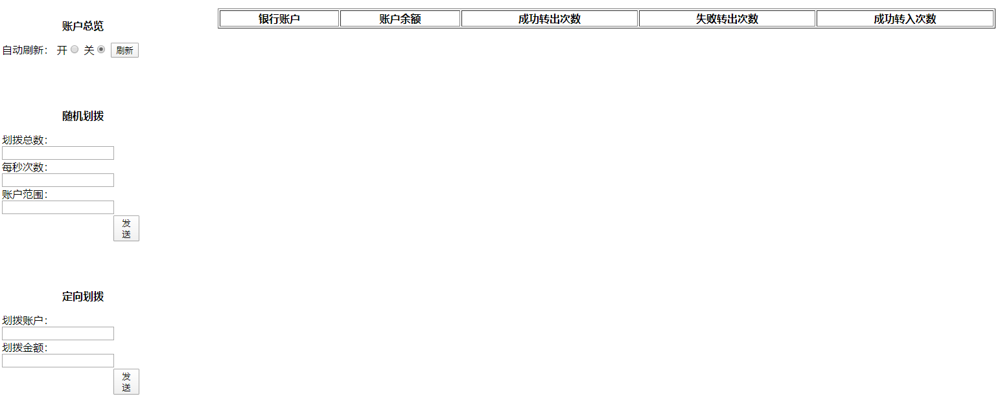

### 测试方案

#### 场景描述

分别使用 bank-account 提供的两个划拨接口进行下单测试。

#### 校验方法

 - 定向划拨：每次划拨之后校验余额
 - 随机划拨：转入次数 + 转出次数 + 错误转出 = 转账次数

### 测试步骤

 1. 使用 bank-account 的下单页面以每秒 100 笔的速率下单，同时限制账户个数为 10 个，划拨总次数为 1000
 2. 待下单完毕后，进行校验.
   使用 bank-account 的内存查询接口查询内存数据 (转入次数 + 转出次数 + 错误转出 = 转账次数)

   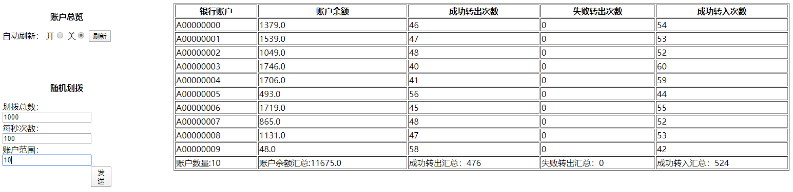

 3. 使用定向转账功能，从 A00000000 账户中转出 100 元（通过以上图片发现经过随机转账之后 A00000000 账户中余额为 411 元）
    转账之后，通过内存查询接口查看账户余额（余额为 311 元）

    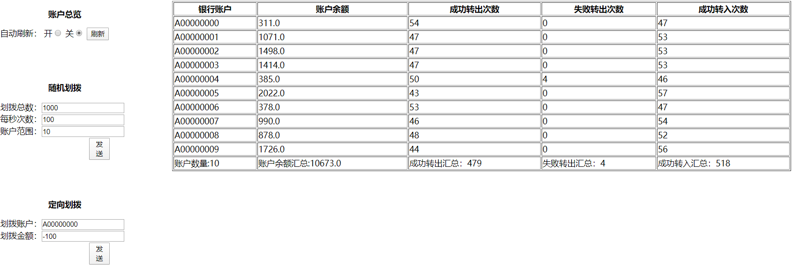

### 测试结果

符合预期，bank-account 账户划拨功能可以正常使用。

## Grafana 功能

### 概述

Phoenix 提供了一套默认的 Grafana 监控面板，用于监控 Phoenix 应用的运行情况。监控指标包括如下内容：
 - 消息个数统计
 - 指标个数统计
 - 耗时统计
 - 速率统计
 - 数据总览
 - 根据服务节点或者服务路径进行筛选过滤

### 原理介绍

通过在 bank-account 服务中进行埋点，并将相应的数据上传至 Elasticsearch 最终通过 Grafana 友好的展示出来。不仅可以实时的监控 Phoenix 应用每次下单之后的运行情况，还可以分析上面的指标判断服务的性能。

### 测试方案

#### 场景描述

使用 bank-account 提供的随机划拨功能以固定的速率进行下单测试，然后打开 Grafana 监控面板监测数据。

#### 校验方法

观察 Grafana 中展示出来的各个指标是否符合预期
Grafana的入口在 Phoenix-admin 中，关于 Phoenix-admin 的使用请参考：[Phoenix-admin 使用说明](../phoenix-admin/admin-instructions-2x)
关于 Grafana 各个监控指标的说明请参考：[Grafana 监控指标说明](../phoenix-admin/grafana-2x)

### 测试步骤

 1. 使用 bank-account 的下单页面以每秒 100 笔的速率下单，同时限制账户个数为 10 个，划拨总次数为 1000
 2. 待下单完毕后，进行校验。
    通过 Grafana 监测服务运行情况。

    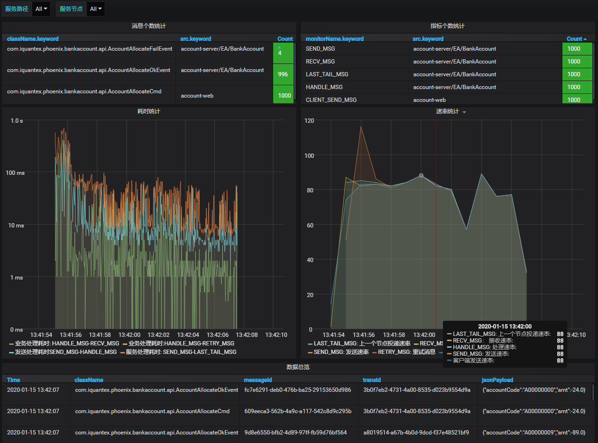

    通过 Grafana 监控面板可以观察到一共发送了 1000 条消息（CLIENT_SEND_MSG = 1000）,并全部处理完成。整个处理过程耗时平均在 10 ms左右。
 3. 根据服务路径进行筛选过滤（只观察其中一个服务的情况）
    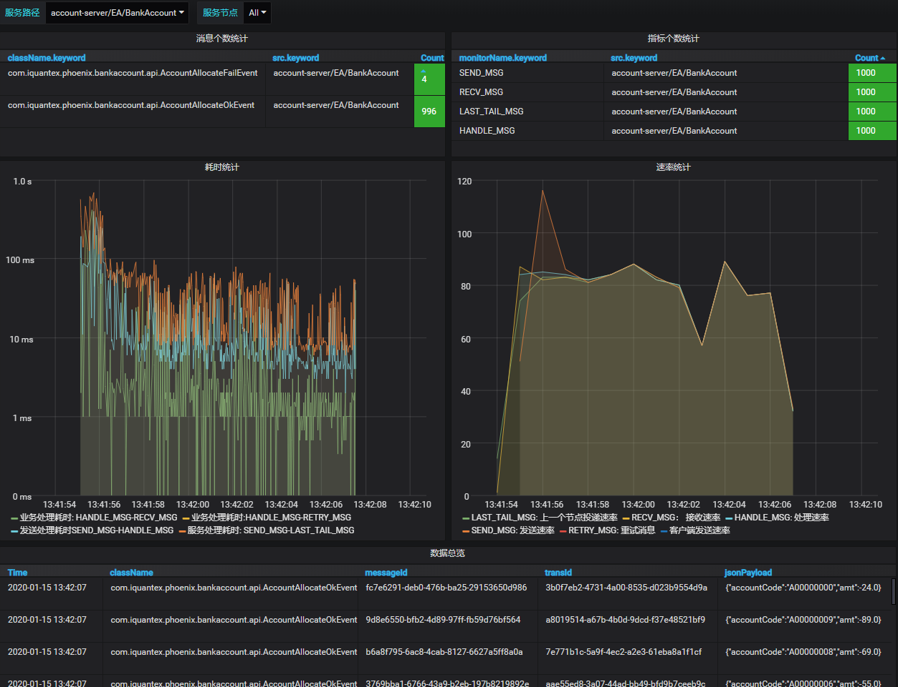
 4. 根据服务节点进行筛选过滤（Server端服务支持多活，可以启动多个节点，但是我们可以只观察其中一个节点的情况）
    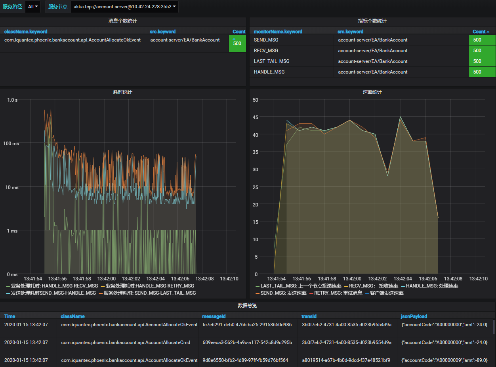
    通过上图我们还可以看出来，该节点一共处理了 500 笔请求（一个 1000 笔请求，共两个处理节点），说明了多个节点之间是可以做到负载均衡的。

### 测试结果

符合预期，可以证明 Phoenix 提供的 Grafana 监控功能够可以正常使用

## EventSourcing 功能

### 概述

Phoenix保证其内存数据正确性的核心原理在于EventSourcing(事件溯源技术)。

### 原理介绍

Phoenix是EDA架构的框架，可以基于事件重塑内存，Phoenix会对所有处理过的事件进行持久化，在节点重启或者聚合根漂移时通过EventSourcing重塑内存状态。

### 测试方案

#### 场景描述

使用 bank-account 提供的随机划拨功能，首先构造固定数量的请求，处理完成之后观察内存数据情况，然后重启节点后再次观察内存状态是否和之前保持一致，重启之后再进行定向划拨观察服务时候能够正常运作。

#### 校验方法

在 bank-account 页面通过内存查询功能，观察最终的结果是否正确。

### 测试步骤

 1. 使用 bank-account 的下单页面以每秒 100 笔的速率下单，同时限制账户个数为 10 个，划拨总次数为 1000
 2. 待所有请求处理完成之后，查询内存数据
    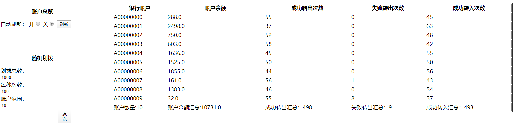
 3. 重启服务之后，再次查询内存数据
    重启过程中发现各个聚合根确实存在Eventsourcing的过程
    
    并且重启前后内存数据没有变化
    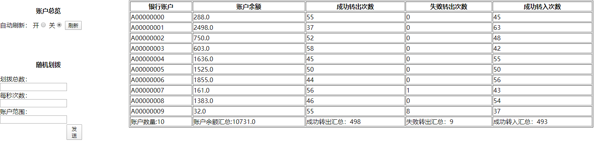

### 测试结果

符合预期，可以证明 Phoenix 提供的 EventSourcing 功能够可以正常使用

## Snapshot 功能

### 概述

Phoenix 应用可以通过EventSourcing功能进行内存数据恢复，使用Snapshot可以加快EventSourcing的内存恢复的速度。

### 原理介绍

Snapshot是对某一瞬间Phoenix应用内存的一次存储。Phoenix 提供的快照功能提供了如下操作：
 1. 每处理1000笔消息自动打一次快照
 2. 手动触发打快照
 3. 查询快照列表
 4. 查询指定聚合根最新状态
 5. 删除指定聚合根指定版本的快照

### 测试方案

bank-account 服务引入了 Swagger 服务，一下测试借助 swagger 提供的页面进行测试。

#### 场景描述

使用 bank-account 提供的随机划拨功能，首先构造一定数量的划拨请求，待处理完成之后执行手打打快照的请求。同时借助swagger提供的能进行快照列表的查询和删除指定版本快照的操作。

#### 校验方法

每次操作之后，校验效果是否符合预期。

### 测试步骤

 1. 使用 bank-account 的下单页面以每秒 100 笔的速率下单，同时限制账户个数为 10 个，划拨总次数为 1000
 2. 使用 swagger 提供的功能给账户 A00000009 打一个快照
    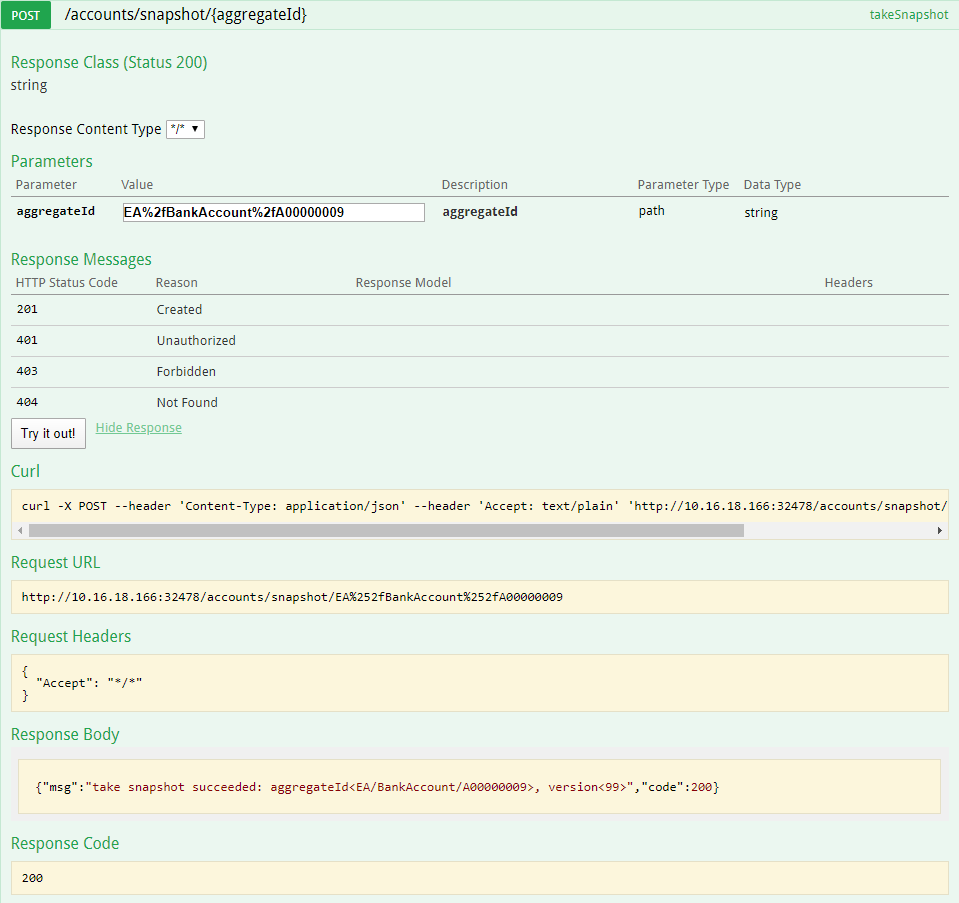
 3. 接着使用 swagger 查询快照列表
    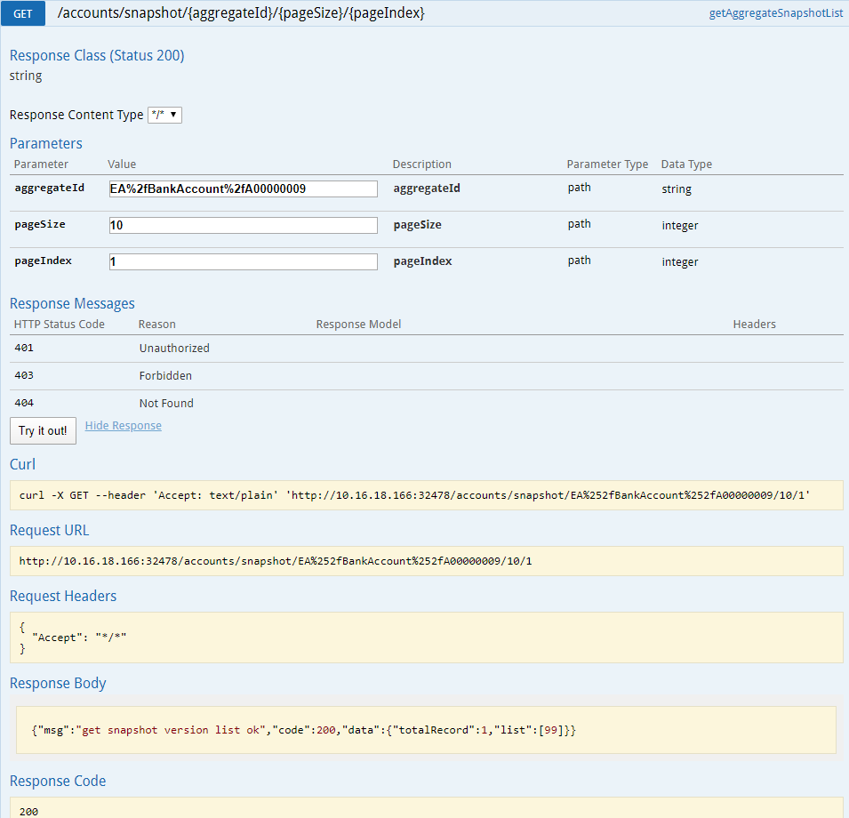
 4. 此时内存中各个账户的余额如下
    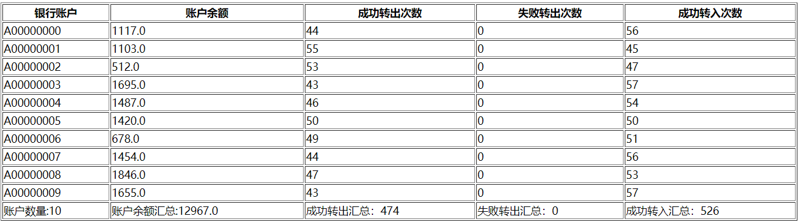
 5. 从 A00000009 账户中转出 100 元，然后使用 swagger 查询 A00000009 的最新状态

    TODO 这个查询最新状态还有点问题，超哥正在修复，修复完成之后再次测试。
 6. 删除 A00000009 的快照
    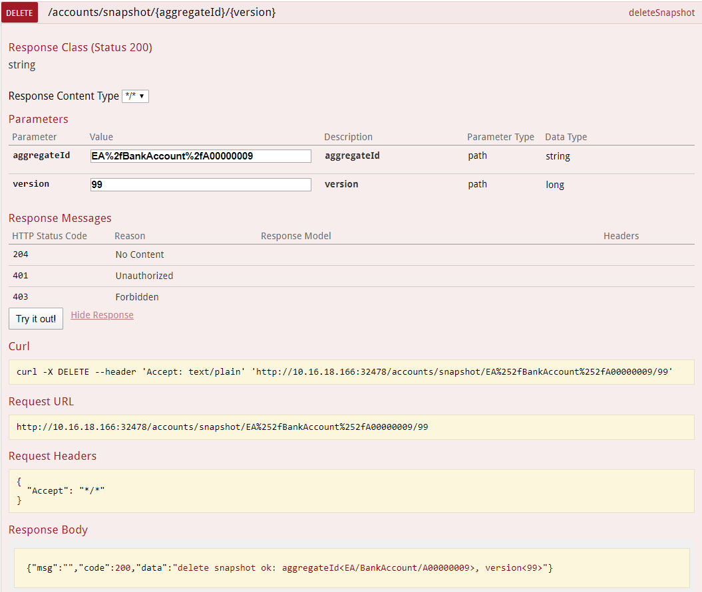
    查询快照列表，观察是否成功删除
    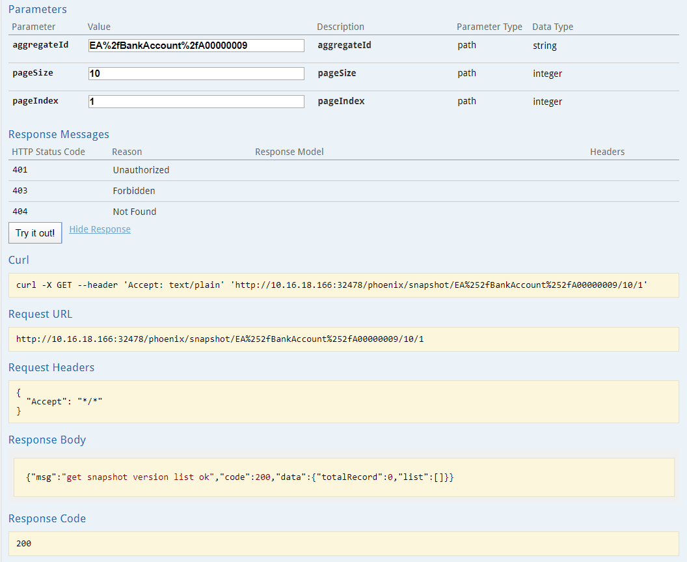
 7. 使用 bank-account 的下单页面以每秒 100 笔的速率下单，同时限制账户个数为 10 个，划拨总次数为 10000
 8. 查询快照列表，观察是否自动触发快照
    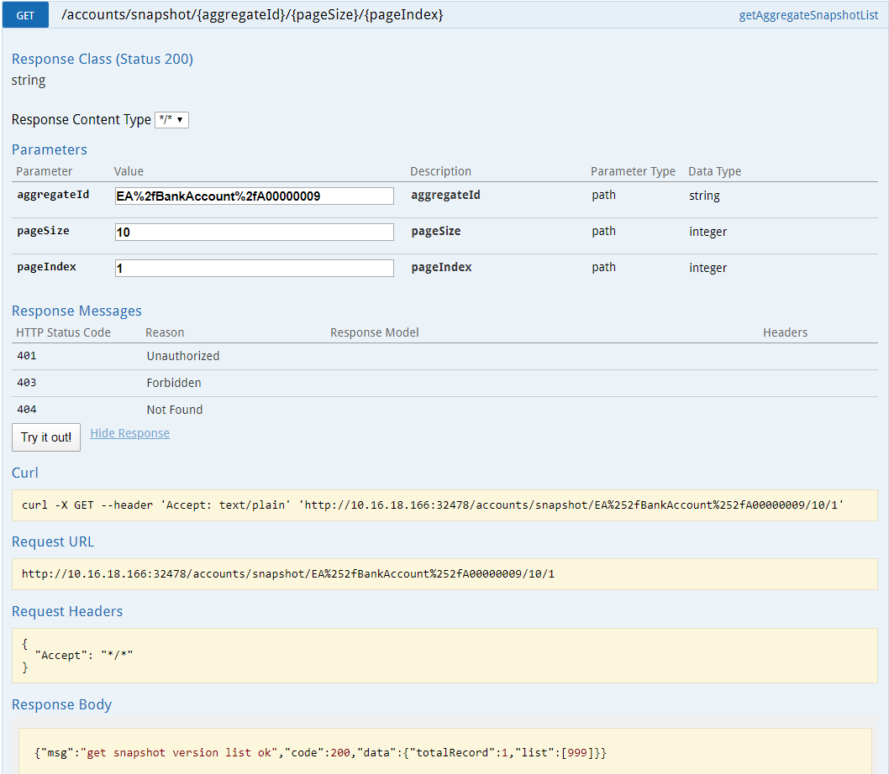

### 测试结果

符合预期，可以证明 Phoenix 提供的 Snapshot 功能够可以正常使用

## 事务功能

### 概述

Phoenix提供了一套分布式事务的解决方案，引入 phoenix-transaction 模块即可使用。

### 原理介绍

bank-account 提供了随机转账和定向转账两个功能：
 1. 定向转账：指定转出账户和转入账户，以及转账金额
 2. 随机转账：指定账户范围和转账次数，多个账户两两之间随机进行转账操作。

### 测试方案

bank-account 构造了账户转账的案例，模拟了两个账户之间的转账操作。

#### 场景描述

分别使用 bank-account 提供的两个转账接口进行下单测试。

#### 校验方法

 - 定向转账：每次转账之后校验余额
 - 随机转账：转入次数 = 转出次数 && 转出次数 + 错误转出 = 转账次数

### 测试步骤

 1. 使用 bank-account 的下单页面以每秒 100 笔的速率下单，同时限制账户个数为 10 个，转账总次数为 1000
 2. 待下单完毕后，进行校验。使用 bank-account 的内存查询接口查询内存数据
    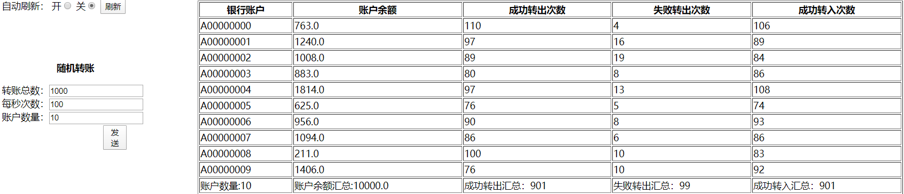
 3. 使用定向转账功能，从 A00000000 账户向 A00000001 账户转入 100 元（通过以上图片发现经过随机转账之后 A00000000 账户中余额为 763 元，A00000001 账户中余额为 1240 元）
    转账之后，通过内存查询接口查看账户余额
    

### 测试结果

符合预期，可以证明 Phoenix 提供的事务功能够可以正常使用
