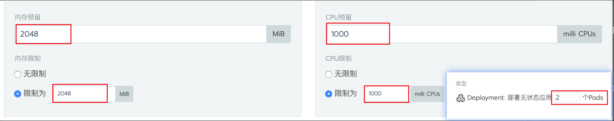

## 概述

高性能是Phoenix的重要特性，Phoenix使用内存计算技术保障单笔事务处理的低延迟，通过横向扩容技术可以保障服务的高吞吐。
对于性能测试，我们关心两个指标:
- 吞吐：指系统每秒可以并发处理事务的个数。
- 时延：指每笔事务处理的耗时情况。

本篇文章测试会保证时延稳定且在百毫秒左右时，记录系统处理的吞吐量。

## 测试方案
> 测试分支为benchmark:7285f2d7930f979c955c503b55d9f012536a1bae
>
> 所有测试案例关闭自动打快照策略，关闭超时重传策略

phoenix的性能和运行的业务形态有密切关系，本次测试采用`银行账户划拨`案例，可以通过压测程序随机批量发起`划入`或`划出`的请求。 测试过程中使用K8S限制CPU、内存、实例个数，在保证时延稳定的前提下，
不断调整系统参数来达到最优的吞吐量。然后逐步增加硬件资源，重复压测，记录下最优的系统处理情况。

我们使用k8s配合phoenix-admin监控每一次测试中应用的CPU使用率，内存GC情况，处理耗时图，速率统计图等等，下面步骤中会逐步演示。

## 测试步骤

1. 使用rancher控制k8s中pod资源

2. 使用压测程序控制压测参数发起压测

3. 待程序压测完毕后, 通过grafana观察记录时延和吞吐量

4. 待程序压测完毕后，通过rancher观察记录CPU使用情况

5. 待程序压测完毕后，通过grafana观察记录内存GC情况

6. 待程序压测完毕后，通过grafana观察记录线程使用情况

7. 记录上述结果, 增倍系统资源，重新调优使用系统在性能上翻倍。重复上述1~6步骤

> 注意: 测试过程中需要进行程序的预热，比如准备压测10聚合根的话，需要以中低的压力预热1分钟再进行压测

## 测试结果

> 压测参数格式：消息总量/TPS/账户范围
>
> CPU规格: Intel(R) Xeon(R) CPU E5-2620 v4 @ 2.10GHz

| 压测参数         | 实例个数 | 硬件配置         |线程池配置 | DB配置 | MQ配置         |  平均时延  | CPU使用率 |GC耗时| 备注             |
| --------------  | ------- | --------------- |--------- | ----- |  -------------|  -------- | ---------|------| -------------   |
| 40W/2000/10     | 2       | 1Core 2048MB    |ForkJoin64| 2实例  |1实例4parttion |  100MS    | 100%\+   |20S   | GC高是因为cpu不够用|
| 80W/4000/10     | 2       | 2Core 2048MB    |ForkJoin64| 2实例  |1实例4parttion |  100MS    | 80%      |6S    | 正常 |
| 120W/6000/20    | 2       | 4Core 2048MB    |ForkJoin64| 2实例  |1实例4parttion |  100MS    | 50%      |6S    | 正常 |
| 160W/8000/20    | 2       | 4Core 2048MB    |ForkJoin64| 2实例  |1实例4parttion |  100MS    | 70%      |8S    | 正常 |
| 320W/16000/40   | 4       | 6Core 2048MB    |ForkJoin64| 2实例  |1实例4parttion |  100MS    | 70%      |9S    | 关闭可靠性投递处理逻辑|

## 结论
1. 目前phoenix使用24个核心做到了1w6的TPS，由于1w6的整体TPS已经接近于数据库上限，所以就没有继续往下测试。
2. phoenix在1w6TPS以下，可以通过增加实例数和CPU数量，提升TPS，整体提升效果线性程度比较高。
3. 整个压测过程中都细致的做了记录，同时也观察了消息的数量，目前所有的消息都可以正确的处理。
4. phoenix框架中eventStore是几个处理单元的竞争点，这和actor模型思想有点违背，应该拆分这些点，消除竞争，可以更高的提升性能。
5. phoenix是内存计算框架，框架层需要小心细致的使用内存，从上面看内存的GC也是影响系统的关键因素。
6. 在1w6TPS以下压测还未达到依赖基础中间件的性能瓶颈，如果后续要接着做突破性测试，需要有能力监控好数据库，MQ等。同时需要使用大容量的固态硬盘部署ES，增加监控指标的写入速度。
7. 目前测试过程中会发现实例处理能力不一致的情况，但是每个实例接收的流量都是相同的，这个暂时还没有找到问题解决。
8. 上述测试结果数据，是通过大量测试记录调优得到的，具体的测试调优详情请参见[附件](https://portal.iquantex.com/confluence/download/attachments/34832535/Phoenix性能测试-2020%3A01%3A15.pdf?version=1&modificationDate=1579254230457&api=v2)。