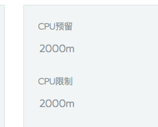
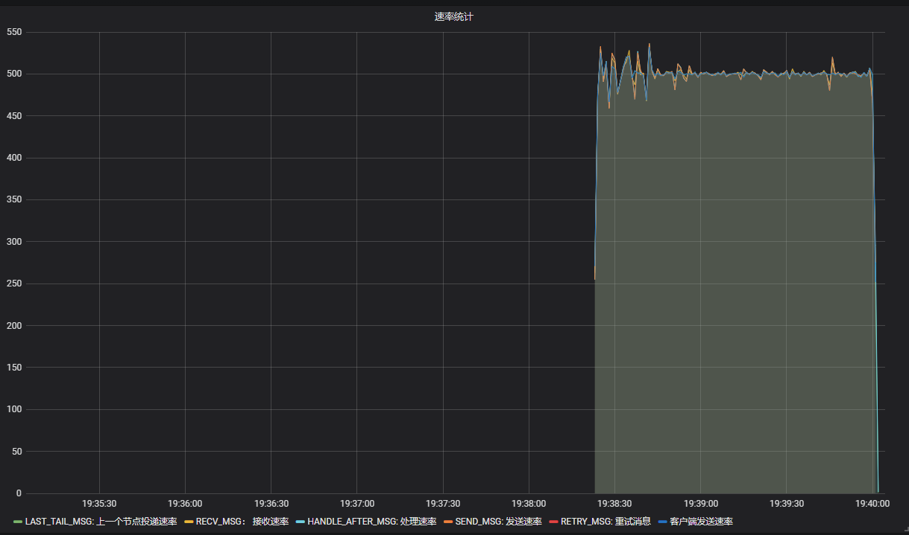
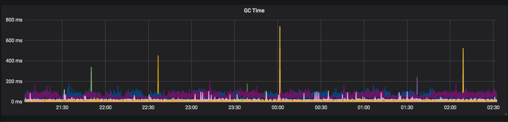
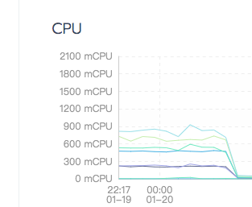
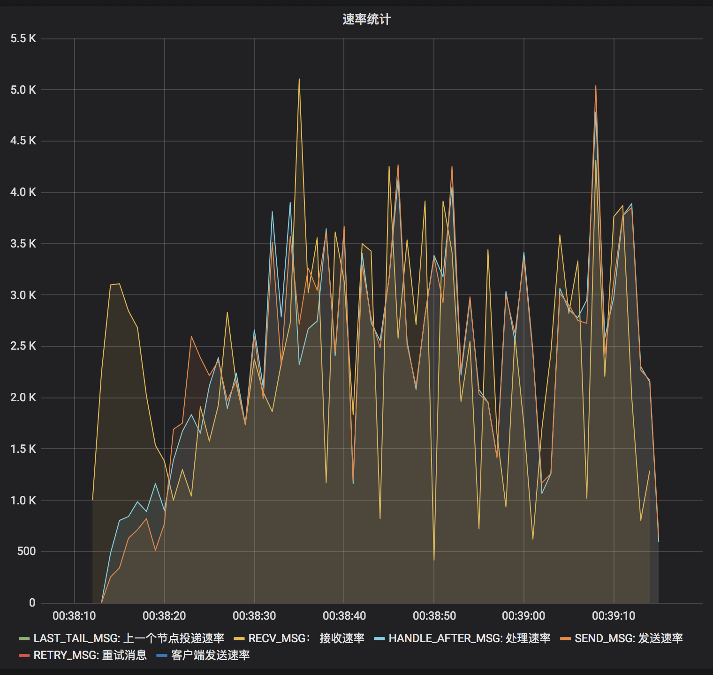

抗压能力是衡量一个软件系统优劣的又一重要指标，我们将通过下面两种维度来对Phoenix进行压力测试：

1. 持续流量压力
2. 瞬间峰值流量压力

## 测试方案(持续流量)

### 测试场景

Phoenix框架持续流量压力测试基于bank-account示例应用进行。部署2个节点，在前端发起长时间（8h）的随机划拨请求，并给到一定流量（500/s）。

### 校验方法

观察Grafana中的Phoenix监控中的速率图表是否稳定，观察JVM Metrics监控中的GC图表是否稳定。

### 测试步骤

1. 在kubernates环境中，使用bank-account服务，部署2个节点，每个节点给定pod 2c的cpu。

   rancher节点：

   

   rancher cpu限制：

   

   

   

2. 调整前端的请求数为500/s，请求时间为8h，开始测试。

3. 待测试完毕后，观察8h内Phoenix监控中的速率图表，JVM Metrics监控中的GC图表，rancher上的cpu使用图表，cpu占用图表等。

   处理速率图：

   

   GC图：

   

   Cpu使用图：

   

4. 观察可知，Phoenix处理速率基本稳定，GC正常，未发生频繁的Full GC，cpu使用平稳，无太大波动。

## 测试方案（峰值流量）

### 测试场景

Phoenix框架峰值流量压力测试基于bank-account示例应用进行。部署2个节点，在前端发起长时间（8h）的随机划拨请求，并给到一定流量（500/s）。

### 校验方法

### 测试步骤

1. 先使用压测程序，一次性发送20万条消息到Kafka中，此时关闭处理程序account_server，模拟消息堆积。

   

2. 打开2个节点的account_server，待所有积压的消息全部处理完毕。

   

3. 观察8h内Phoenix监控中的速率图表，JVM Metrics监控中的GC图表，rancher上的cpu使用图表，cpu占用图表等。

   处理速率图：

   

   GC图：

   

   cpu使用图：

   

4. 根据上面三个图，我们可以看出，累计的20万条消息，被2个节点在1分钟内全部处理完毕，并且应用程序未发生长时间的full GC，且未跑满cpu，因此可以看出来，Phoenix能应对瞬间峰值流量。

## 结论

经验证，对于长时间的流量，Phoenix可以很好的处理；对于20万的瞬间流量，Phoenix也能够在1分钟内处理完，这还是在只有2个节点，且每个节点只给定每个应用2c的cpu的情况。所以我们可以得出，Phoenix具有很好的抗压性。