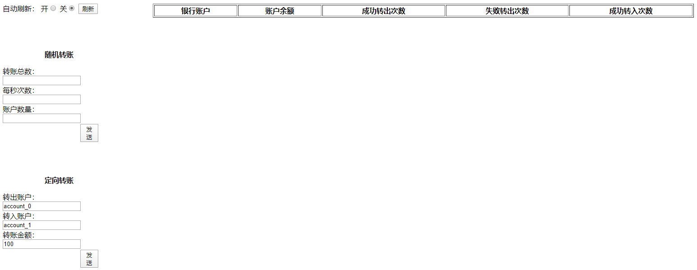
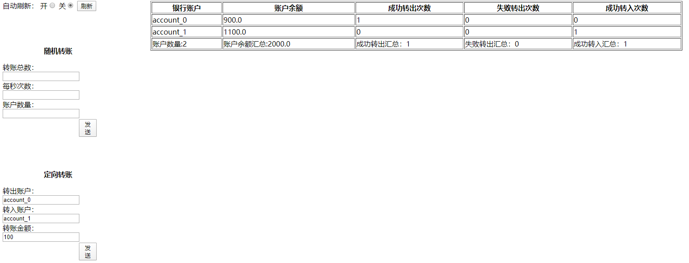
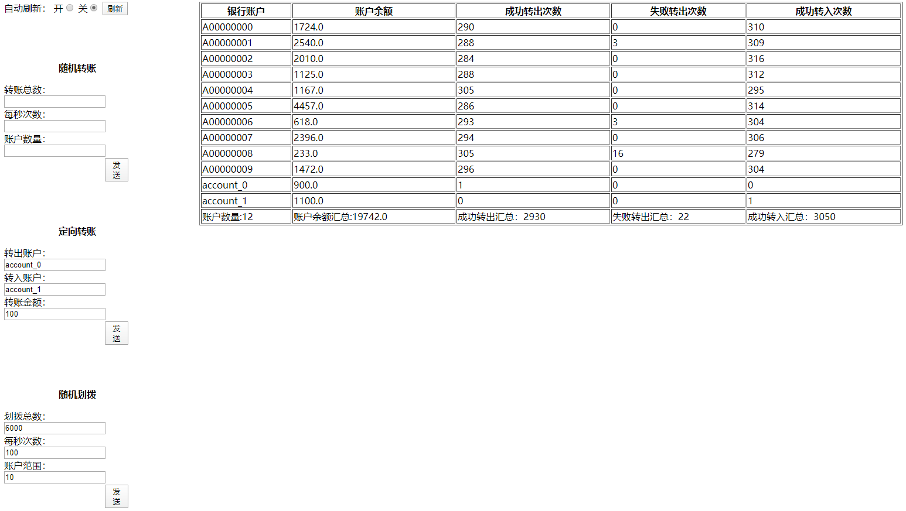
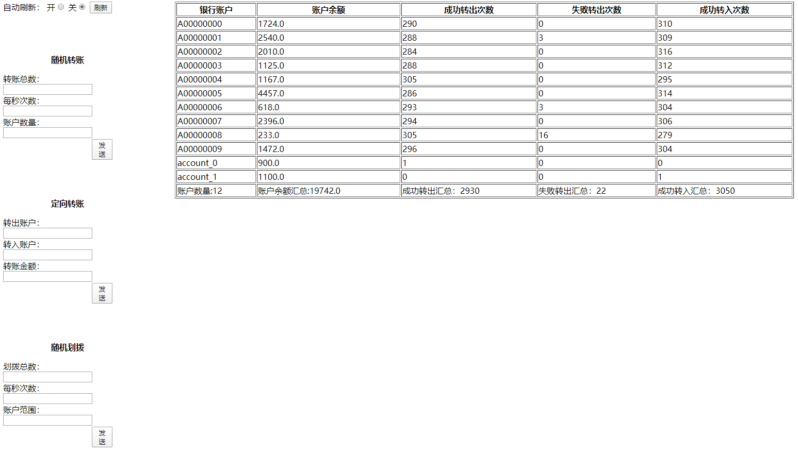

## 概述

可靠性指的是软件系统在规定的时间内以及规定的环境条件下,完成规定功能的能力。不同的系统提供的功能不同其可靠性也不太相同。

Phoenix是一个消息驱动的有状态微服务框架，其可靠性我们重点关心以下几个能力：

1. 可靠的处理：使用案例发起一笔同步调用，如果调用成功，必定能查询到调用处理的结果。
2. 可靠的重启：phoniex为了保证内存状态，会在重启后做eventsouring，需要测试重启后，eventsouring是否正常。
3. 可靠的投递：phoenix底层使用akka-cluster调度，akaa官方是不承诺跨网络的actor之间通信是可靠的，phoenix可以保证所有发送到kafka消息可靠的流转下去。

下面分别对上述维度的可靠性进行测试。

## 测试方案（处理可靠性）

### 测试场景

Phoenix框架处理可靠性基于bank-account示例应用进行。通过模拟一笔资金划拨指令，观察系统处理结果后的前端页面，证明Phoenix可以正确处理请求。

### 校验方法

观察bank-account-server工程的前端页面，最终的处理结果无误则证明Phoenix具有出处理可靠性。

### 测试步骤

 1. 使用bank-account服务，在前端发起一笔资金划拨。给账户[account_1]划拨100元等待请求返回。
    

 2. 请求返回结果为划拨成功后，刷新前端页面数据，查看所有账户的资金数据。
    

 3. 由查询结果可知，账户[account_1]的最终金额为1100元（每个账户默认有1000元的初始资金）。Phoenix正确处理了前端请求，具有处理可靠性。

## 测试方案（重启可靠性）

### 测试场景

Phoenix框架重启可靠性基于bank-account示例应用进行。通过模拟应用处理完毕批量请求后，进行服务重启。证明重启完毕后，应用数据能恢复到重启前的状态。

### 校验方法

观察bank-account-server工程处理批量请求并重启这一操作前后的前端页面，一致则证明Phoenix具有重启可靠性。

### 测试步骤

 1. 使用bank-account服务，在前端发起批量资金划拨。全部处理完毕后，刷新页面数据，查看所有账户的资金数据。（截图：前端下单图，处理完的结果表格）
 
 
 2. 待请求全部处理完毕后，重启服务节点。
 
 
 3. 重启完毕后，刷新页面数据，查看所有账户的资金数据。
 
 
 4. 对比重启前后的账户表格，发现完全一致。Phoenix具有重启可靠性。

## 测试方案（投递可靠性）

### 测试场景

Phoenix框架投递可靠性测试基于bank-account示例应用进行。Phoenix目前会对所有投递到kafka中的消息做可靠性消费，并且保证可靠的投递给下游并产出结果。

1. 在压测前线关闭phoenix服务端，待压测结束后再启动服务端，观察压测的消息都可以正确无误的处理。
2. 通过下单固定账户`monitor_retry`命中网络超时逻辑，触发系统重试投递，最终达到消息可靠的处理。

### 校验方法

1. bank-account-server服务启动后，可以通过grafna页面可以看到应用可以可靠消费消息处理。
2. 待消费结束后，可以通过账户页面查询到处理结果。

### 测试步骤

1. 压测前停掉bank-account-server应用，使用压测页面下单100笔

2. 请求结束后，启动bank-account-server，观察grafana发现未处理的消息正在处理。

3. 待处理结束后，观察账户详情页面，正确无误的处理了所有之前投递的消息。

4. 使用固定账户发起划拨请求`monitor_retry`，观察grafana处理情况，一段时间后会可以看到有`RETRY_MESSAGE`指标产生。证明系统产生了重试达到可靠性投递。

## 结论

