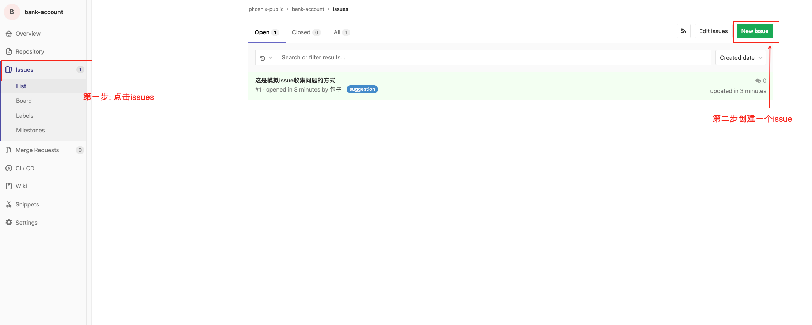

这篇文章一方面会介绍宽拓内部员工如何给phoenix架构组提建议&问题&需求，另外也会把大家所遇到的共性问题统一展示解答。

## 如何提问题？

phoenix架构组每一位同事欢迎大家积极询问phoenix有关问题，目前phoenix团队提供gitlab-issue的信息收集方式。具体步骤如下:

1. 点击链接打开[phoenix公共仓库](https://gitlab.iquantex.com/phoenix-public/bank-account)
2. 点击按钮创建一个issue

3. 补充完整issue内容，按图中标记的内容按含义填写即可。

4. phoenix组内成员可以再微信企业群内实时查看到，会第一时间回复问题。

## 问题列表

### phoenix介绍去哪里看？
请看文档目录里`白皮书`章节

### phoenix组2020年的计划是？
phoenix目前还处于内置研发迭代期间，已经release了一个可用版本，具体计划内容请看[roadmap](Roadmap.md)

