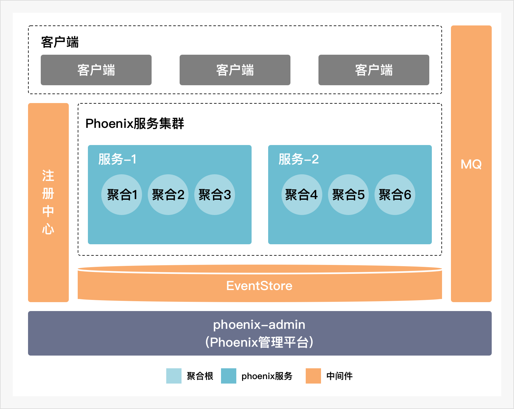
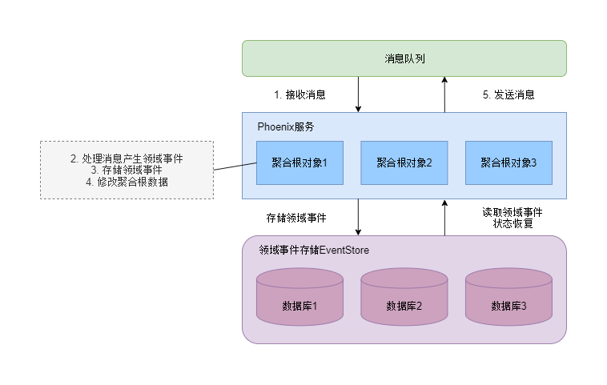
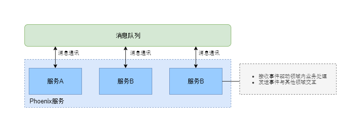
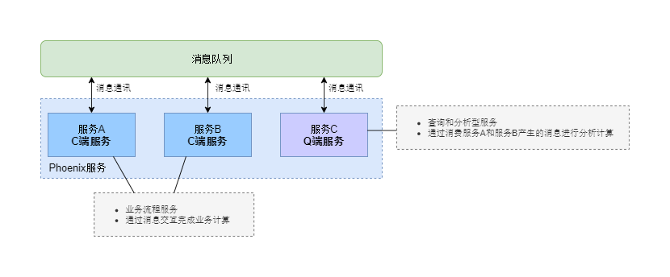

## 背景
随着中国社会财富的迅速膨胀和资管新规的推出，资产管理行业出现了新的发展趋势。首先是一系列监管规则推出，推动资产管理回归本源，对于资产管理人的资产主动管理能力提升产生了强烈诉求。再者，客户特别是机构客户的认知和能力的提升，倒逼资产管理机构要提供更加专业的服务能力。第三，市场越来越充分的竞争，使得所有的资产管理机构都要往精细化管理方向转型。最后，以专户管理为标志的客户个性化、专业化服务的诉求使得管理人也面临创新压力。这些发展趋势，使得整个行业对新型的、高效的、更智能的资产管理系统平台的需求变得越来越迫切。

众所周知，资管系统所承载的业务复杂度极高，涉及到的模块广：组合、交易、头寸、风控、估值、归因、风险等等，覆盖的业务种类多：固收、权益、期货、衍生品、非标等等。这样的业务复杂性，需要系统做到模块化及模块间松耦合，保障模块彼此间不会有“腐败传导”，并且可进行独立升级、优化，通过重新排定组件来应对业务流程的快速改变需求。

当前的资管业务的发展趋势是往数量化、模型驱动型投资管理模式方向发展，要求业务系统在保持很好的操作型能力的同时，还要进行大量的分析计算，这就要求资管系统逐步转型为以分析管理型能力为主的系统。而且，交互型系统需要更加好地符合业务快速响应的能力，强调用户体验和交互的逻辑性，部署和迭代更新足够快，要求这类型系统能够尽可能多地围绕客户体验和场景来打造。
以上这些资管行业的发展与新一代资管系统的发展特点，都要求配套的技术体系建设从设计思想、架构设计、实现技术等方面都要有新的突破，尤其是系统架构和底层基础平台方面，需要做重新的设计。

目前，行业普遍使用基于数据库和存储过程等技术来开发资管系统，支持业务的发展。这些系统其特点是偏操作型，注重流程的处理，所采用的单体化架构，技术相对老旧，功能模块采用紧耦合，导致其开发模式很重，变更交付周期长，无法适应现代资管行业的各种业务创新多、客户需求响应快、分析计算量大等需求，后期架构虽然有所优化，但是没有发生根本性的变化，依然存在有一些缺点，比如在扩展性、可用性、性能瓶颈的解决方案上，都有明显的弱点。
所以，以新架构、新技术、新模式打造新一代资管系统，变得极其迫切。同时，行业机构都开始大力发展金融科技能力，自主研发成为IT战略的核心建设内容之一。如何利用成熟技术解决自主研发能力和有限资源的问题，也是一个亟待解决的新课题。

## 概述
Phoenix是宽拓自主研发的一款消息驱动型的高性能Java开发框架，专注于降低金融行业中业务复杂性高、性能要求高的应用系统的开发难度，助力研发团队打造专业、高效的微服务化的金融应用系统。Phoenix框架封装了复杂的底层技术，提供强大的内存保护机制，为应用提供极高的稳定性、基于内存的高性能的计算能力和动态伸缩扩展的能力，匹配当前和未来金融领域海量数据实时分析的强烈算力需求。同时，针对行业技术架构往微服务迁移的发展趋势和微服务架构使用的核心挑战，Phoenix提供了分布式事务处理引擎，满足金融领域微服务应用间的业务完整性、数据一致性的要求。除此之外，Phoenix还提供了强大的实时监控和在线管理功能，为系统高效智能运维提供了基础。搭配DevOps工具，提升了研发的持续集成和交付能力。

## 整体架构
Phoenix是一套微服务开发框架。在应用系统架构方面，提供了包括客户端开发、服务端开发、消息通讯架构、服务端状态数据存储和恢复、计算层和消息层监控、服务端运维等架构方案。而在业务开发方面，Phoenix提供了一套领域驱动设计模式(DDD)的实现模型，业务开发中的领域模型定义以聚合根(Aggregate Root)的形式作为业务计算的基本单元，在整个业务计算的流程中，聚合根对象之间仅以消息(Message)作为数据交互接口。框架对聚合根对象的状态管理和多层次交互的实现进行了封装。

## 框架特性
基于Phoenix框架开发的业务应用系统不管在业务建模和系统架构上都有别于传统的应用服务系统，同时也跟其他微服务开发框架有所区别。Phoenix框架致力于为复杂业务场景、可靠性要求高、性能要求高和服务模块高度解耦的应用系统提供强大的开发和运维能力。所以，Phoenix框架提供了以下应用架构特性。

### 内存计算
在传统的业务系统中，企业应用系统一般选择使用数据库等存储来实现业务数据存储和管理。业务模型往往与数据模型有着紧密的耦合，如此一来，随着业务模型变得复杂，为了满足这些复杂的业务需求实现，对应的数据模型和算法也开始变得越来越复杂，复杂的数据模型和算法为应用系统带来严重的性能问题。尽管我们有许多手段优化这些数据模型和算法，但这对数据建模和算法实现等开发都是个巨大的挑战，同时大量的IO可能使得各种优化手段都无济于事。

如果业务数据的修改完全在内存中进行，得益于内存极高的速度，将复杂的数据模型和算法实现搬到内存中，业务计算的速度也能得到极大提升。此外，业务数据模型和算法面向内存构建，将复杂的数据模型和算法过程与数据库系统解耦开来，简化计算层和存储层的交互，也能减少IO次数，为整体性能带来提升。

但内存计算技术也带来的其他方面的问题。第一是内存数据在进程结束后无法进行保存，框架需要提供额外的手段，保证服务在遇到故障时，内存中的业务数据能可靠地进行恢复。第二是，相比将数据模型放到数据库等成熟的存储中，将数据完全运行内存中不能方便的提供数据查询能力。所以，针对以上两个问题，Phoenix都提供了解决方案。EventStore领域事件存储解决了内存数据的可靠恢复问题。聚合根对象在处理消息时产生领域事件，领域事件是聚合根对象状态变化的依据，聚合根对象在更新状态的同时会将领域事件(DomainEvent)保存到EventStore中。这样，如果聚合根对象所处的服务节点出现故障时，通过从EventStore中读取领域事件，便可以在节点重启后重新构建该聚合根对象的状态。若是该节点无法重新启动，则可以通过多活集群的能力，在剩余的其他节点中恢复聚合根状态，这种通过领域事件恢复状态的技术称为EventSourcing。

### 消息驱动
应用系统中不同服务之间的数据交互有同步和异步两种方式，服务间同步调用会使得各服务在调用接口上相互耦合。同时，同步调用也可能导致服务出现大量等待和阻塞，影响系统性能。区别于同步调用的服务交互方式，各模块的服务面向消息队列定义消息接口，相对独立地自治消息接口和响应逻辑。这样，不同领域的服务通过消息队列实现了解耦，我们能够更方便地构建高度解耦的应用系统。另一方面，消息驱动是异步的交互方式，基于Fire-and-Forget原则，服务将消息发出后即可进行后续事务，不必阻塞式地等待相关的处理结果。减少了阻塞等待，系统的整体性能和并发度都能得以提升。

消息驱动模式是一种异步交互模式，服务在调用时无法及时响应调用的结果，此时，为了提高业务响应的及时性，我们需要解决消息传递可靠性问题。在Phoenix架构中，服务间消息通讯使用消息队列实现，虽然不少消息队列提供了可靠传递的解决方案，但需要保证消息可靠传递仍是一件成本很高的事情。为了应对服务间消息传递可能出现的消息丢失，我们在框架中为业务的可靠性执行提供了一套消息重试机制，该机制可以通过定时重发消息，保证在出现消息丢失时，业务的执行不会被遗漏而失去服务响应的及时性。

### 微服务
应用系统的微服务化是当下的趋势，微服务化的应用系统拥有组件化、松耦合、自治等优势。Phoenix框架对开发微服务化的应用系统提供了支持，根据领域划分，我们可以构建模块化的服务，并对服务进行独立的开发、测试和部署。服务间通讯使用消息队列，使得应用系统可以进行灵活的模块配置和功能扩展。

### 易于编程
在进行应用系统开发的过程中，若要在面临高度复杂业务场景的同时，保证系统架构的高度解耦和高性能，对开发人员是个极大的挑战，也带来巨大的开发时间成本。开发人员不仅要考虑业务模型和数据模型的设计，同时还要出于性能考虑，对业务并发的颗粒度进行把控，实现复杂的多线程并发程序。若业务的规模较大，可能还需要考虑复杂的分布式集群设计。而Phoenix将这些技术实现进行了封装，业务开发只要按照一定的编程约定，便可以在不考虑多线程并发和集群调度实现的情况下，构建高度解耦、多线程高并发的应用系统。

要保持对业务变化的及时响应，保证应用系统的高度解耦，要求我们在进行业务开发前，对业务进行领域模型分析，DDD模式可以帮助我们更好地对业务进行领域建模，以实现服务的模块化和独立自治。Phoenix框架封装了一套DDD实现方式，业务模型的划分和定义基于DDD领域模型，在框架中则是对应为一个聚合根(Aggregate Root)模型定义，其包含了该领域业务计算所需的上下文数据。一个领域模型可对应一个聚合根定义，在实际进行业务计算时，一个聚合根定义可生成不同实例，这些实例之间相互独立，有着独立的状态数据。而聚合根对象之间的数据交互则是通过消息(Message)，聚合根对象可以接收消息并对消息做出相应的处理，以更新自己的状态。

聚合根是Phoenix框架业务和计算模型的最基本单元，但它不仅是业务计算的载体和基本单位，也是框架进行计算调度的基本单位。框架在技术实现上使用Actor模型，每个Actor实例与一个聚合根对象对应，管理着聚合根对象的内存状态、消息收发处理和聚合根计算调度。而聚合根的线程调度和集群调度实现对业务开发是透明的，这大大降低了开发高并发应用系统的难度。

### 横向伸缩
高并发场景对应用系统的处理能力是个严峻的挑战。在提高系统的并发处理能力上，Phoenix框架使用Actor模型以聚合根对象为调度单位进行线程调度，以提升单节点部署的情况下线程资源的利用效率。此外，借助Akka-Cluster和Akka-Sharding的能力实现横向扩展，通过部署多个服务节点组成集群，聚合根对象可以在集群节点之间灵活调度，使得系统可以通过增加节点的方式提升处理能力。

Phoenix框架提供应用系统的伸缩性。与横向扩展相似，Phoenix服务集群可以动态缩减节点数量。Akka-Cluster和Akka-Sharding可以对聚合根对象进行集群调度和管理，在集群减少服务节点数量时，Akka可以将这些节点中的聚合根对象转移到剩余节点中。在进行节点移除的过程中，配合EventSourcing的能力，被移除节点中的聚合根可以在剩余节点中重新构建并恢复状态。

### 高可用
高可用性指系统无中断地执行其功能的能力，代表系统的可用性程度。是进行系统设计时的准则之一。高可用性系统与构成该系统的各个组件相比可以更长时间运行。高可用性通常通过提高系统的容错能力来实现。

系统的高可用性可以使用以下两个指标衡量：
1. 恢复时间目标(RTO)：RTO指在业务可接受的范围内，应用系统最多可以中断或关闭（业务不可用）多长时间。
2. 恢复点目标(RPO)：RPO指在业务可接受的范围内，应用系统最多可在系统故障恢复后丢失多长时间的业务数据。

Phoenix框架提供的高可用性同样基于Akka集群调度能力和EventSourcing，服务在集群部署的情况下，可以应对一定数量的节点故障。在出现节点故障时，Akka通过集群调度能力将故障节点的聚合根对象转移到剩余节点中，配合EventSourcing能力恢复聚合根对象的状态。由于EventSourcing的过程中有快照的支持，可以加速状态恢复，所以这些聚合根对象可以在较短时间内恢复，继续提供服务。

### 读写分离
Phoenix服务的业务开发基于消息驱动和DDD模式，这使得Phoenix服务同时可以方便进行读写分离的设计，读写分离可以为应用系统提供更好的服务解耦。在Phoenix架构中我们可以将业务服务区分为两种类型，一种为写端服务(Command Side Service)，亦可称为C端服务，该类型的服务可以负责主业务流程的状态数据计算和管理，这些服务的数据属于数据一致性要求范围内。另一种服务类型为读端服务(Query Side Service)，亦可成为Q端服务，该类型服务可以作为业务数据一致性要求外的查询服务或分析服务等，这些查询或分析事务不署于业务主流程的事务内，但依赖于相同的业务数据。而这些业务数据我们能够通过消费读取C端服务产生的消息或领域事件来构建，以此实现读写分离。

所以基于以上Q端的实现方式，当应用系统的C端服务构建完成后，我们可以很方便地以Q端服务的形式构建监控和分析服务。基于这种实现方式，Phoenix提供了一套消息层监控分析方案。在应用系统中部署一个消息持久化服务消费所有Topic队列的消息，该服务会将消费到的消息持久化到Elasticsearch存储中，随后，我们便可以使用Grafana连接上Elasticsearch存储，对消息进行监控和分析。系统中流转的消息反应着系统的运行状态，如果能合理监控和分析这些消息，应用系统将具备业务告警、业务分析和问题排查等强大的能力。

### 运维监控
Phoenix-Admin是配合Phoenix框架使用的服务监控平台，能够实现对多个项目，多服务，多实例层级的监控和内存管理的功能。微服务化的系统架构下，服务模块数量众多，加之每个领域服务都可以各自进行集群化多活部署，服务实例的数量只增不减，这对系统的监控和运维带来极大挑战。Phoenix-Admin通过注册中心进行服务注册发现，对各服务实例提供了如服务状态监控、服务数据查询等运维管理功能。此外，Phoenix-Admin集成了Grafana监控面板，Grafana中可读取不同的数据源，分别对业务消息数据和Akka系统运行数据进行监控和分析，并支持用户对数据面板进行自定义，提供了灵活强大的业务和系统监控手段。

## 框架性能

框架的性能使用以下两个指标衡量，下面展示不同硬件资源，不同实例配置下，phoenix的性能表现情况。

1. 吞吐：指系统每秒可以并发处理事务的个数。
2. 时延：指每笔事务处理的耗时情况。

> CPU规格: Intel(R) Xeon(R) CPU E5-2620 v4 @ 2.10GHz

| 压测参数         | 实例个数 | 硬件配置         |线程池配置 | DB配置 | MQ配置         |  平均时延  | CPU使用率 |GC耗时| 备注             |
| --------------  | ------- | --------------- |--------- | ----- |  -------------|  -------- | ---------|------| -------------   |
| 40W/2000/10     | 2       | 1Core 2048MB    |ForkJoin64| 2实例  |1实例4parttion |  100MS    | 100%\+   |20S   | GC高是因为cpu不够用|
| 80W/4000/10     | 2       | 2Core 2048MB    |ForkJoin64| 2实例  |1实例4parttion |  100MS    | 80%      |6S    | 正常 |
| 120W/6000/20    | 2       | 4Core 2048MB    |ForkJoin64| 2实例  |1实例4parttion |  100MS    | 50%      |6S    | 正常 |
| 160W/8000/20    | 2       | 4Core 2048MB    |ForkJoin64| 2实例  |1实例4parttion |  100MS    | 70%      |8S    | 正常 |
| 320W/16000/40   | 4       | 6Core 2048MB    |ForkJoin64| 2实例  |1实例4parttion |  100MS    | 70%      |9S    | 关闭可靠性投递处理逻辑|

## 行业案例

### 案例概述
富国基金交易支持平台(简称TSP系统)是运用Phoenix1.6版本实现的交易实时风控系统，其功能主要帮助集中交易室管理交易过程中事中风控情况，提升交易执行环节的效率。交易室会根据业务需求，提出了不少交易环节的风控要求，这些条款需要在交易中进行实时监控，为交易员提供实时的风控。

该系统充分利用phoenix消息驱动、高性能、易编程等特点，在半年的研发时间周期内成功上线运行，系统可以在每秒1000笔以上的复杂风控计算保证整个链路计算耗时在2~5ms。目前在富国基金生产环境运行良好，反馈颇佳。

### 案例特点

#### 零侵入
TSP风控系统使用消息驱动，可以做到对于上游交易系统的零侵入，只需要在交易过程中，实时把交易数据按照TSP系统的消息模型发送过来，就可完成对交易的实时计算，计算结果通过客户端推送给交易员。

#### 低时延
TSP系统要求整个链路端到端时延在毫秒级别，这对金融风控系统的挑战是很大的，一方面在于金融风控模型计算逻辑复杂，另一方面数据维护难度较高。TSP系统充分利用phoenix的内存计算特性，可以在内存中完成风控模型的计算，再加上可靠的基础数据维护，做到了整个链路2~5ms的时延。

#### 低成本扩展
低成本扩展和易于编程都属于该系统的附加特性，这是和该系统的建设方式密不可分的。该系统不仅仅是作为产品输出给客户，更需要客户理解编程模型，易于上手，易扩展增加条款。系统建设初期涉及到了phoenix编程模型的培训，由于phoenix面向对象易于编程易于测试的特点，甲方程序员的上手程度特别高，而且在后续的条款扩展中，增加条款的发布周期很短，这都得益于phoenix易于编程易于测试的特点。
 

### 案例展示

#### 风控总览
TSP系统的风控总览页面，前端实现了每个条款的组件化，可以灵活根据交易员的权限和需求，灵活配置监控屏幕。

#### 系统监控
phoenix提供的系统监控页面，可以很直观的看出当天交易量，请求速率，处理速率，以及数据内容等等。

## 总结展望
综上，Phoenix借鉴先进的软件架构设计方法和理念，基于消息驱动和内存计算，实现了一套能够方便构建松耦合、高性能微服务系统的开发框架，配套运维监控平台，望能在金融领域提供一种全新的先进应用系统开发和运维解决方案。