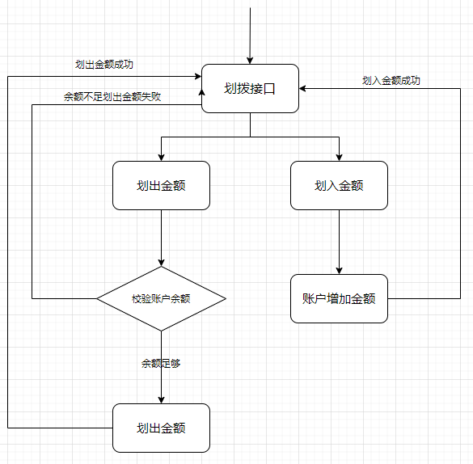
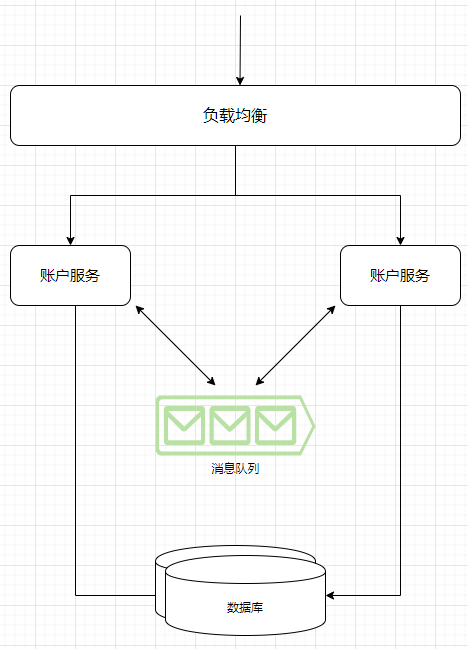
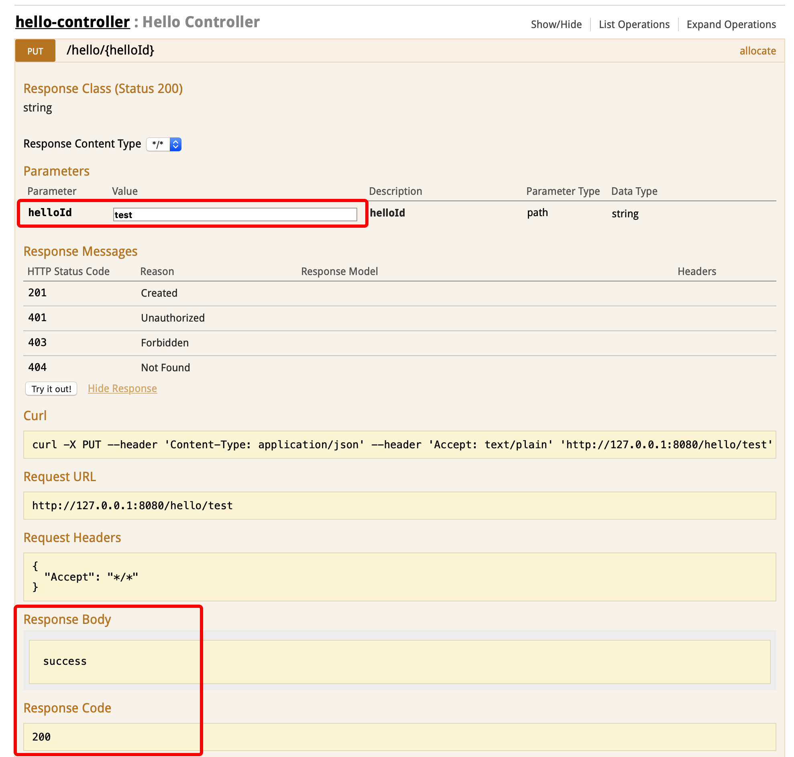
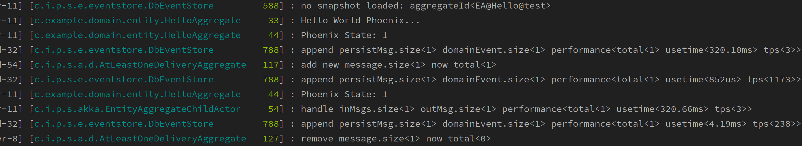

[Demo 下载](https://gitlab.iquantex.com/phoenix-public/bank-account.git)

## 银行账户划拨案例介绍

本文将展示如何使用 `Phoenix` 构建一个银行账户划拨的应用程序。

### 业务场景

业务场景如下:
- 每个账户初始化1000元
- 支持账户转入或转出指定金额
- 支持查看系统内所有账户的金额

### 统一语言

基于上述业务场景，在本案例里面，我们得出如下统一术语
- **银行账户：**此案例里面提到的可以进行转入或转出金额的账户， 下文中可简称为账户
- **账户余额：**账面上的钱
- **银行总账：**银行里面所有账户的总额汇总

### 业务逻辑

资金划入：划拨金额大于0

资金划出：划拨金额小于0

如果账户余额 + 划拨金额 小于0，返回账户划拨失败，账户余额不足。

### 业务分析





## Phoenix工程搭建

下面将从phoenix服务搭建开始，一步一步完善银行划拨案例的开发。搭建phoenix工程十分容易，可以使用下述命令即可生成一个完整的phoenix的maven工程。其中 `DarchetypeVersion` 为phoenix的版本，`groupId`、`artifactId`、`version`为生成工程的定义。

```
mvn archetype:generate \
 -DarchetypeGroupId=com.iquantex \
 -DarchetypeArtifactId=phoenix-archetype \
 -DarchetypeVersion=dev-SNAPSHOT \
 -DgroupId=com.example \
 -DartifactId=helloworld \
 -Dversion=1.0-SNAPSHOT \
 -DinteractiveMode=false
```

生成成功之后，将会得到如下结构的maven项目。

```shell
└── helloworld
    ├──application
    ├──coreapi 
    ├──domain  
    ├──tools 
	├──pom.xml
```

### 模块介绍

Phoenix开发工程奔着模块自治的思想，把分为了三个子Module，依赖关系如下:
```shell
.
.                  +----------------+
                   |   application  |
                   +-----+----+-----+
                         |    |
                 +-------+    +------+
                 |                   |
          +------v-----+     +-------v-------+
          |    domain  <-----+  coreapi      |
          +------+-----+     +-------+-------+
```

### application
应用的顶层模块，启动模块，入口模块，包括：

- SpringBoot启动类，启动配置等
- 用户交互层（Web、RESTFul API）

``` shell
├── pom.xml
└── src
    ├── main
    │   ├── java
    │   │   └── com.example
    │   │       ├── HelloworldApplication.java   # spring启动类
    │   │       ├── controller
    │   │       │   ├── HelloController.java      # 交互层类 
    │   │       └── runner
    │   │           └── Runner.java               # phoenix启动类
    │   └── resources
    │       ├── application.yaml                  # 配置文件
    │       ├── logback.xml                       # 日志配置
```

### coreapi
应用的消息定义模块，包括：
- cmd:   聚合根入口命令
- event: 聚合根处理后事件

```shell
├── pom.xml
└── src
    ├── main
    │   ├── java
    │   │   └── com.example
    │   │       ├── Hello.java     # 消息定义(命令和事件)
    │   │       └── description.md
    │   └── resources
    │   │       └── Hello.proto    # protobuf定义

```

### domain
phoenix业务领域核心模块，包括：
- 聚合根： 核心业务领域聚合根，处理core中的命令并返回事件
- 聚合根测试：针对聚合根的完整测试
- 依赖服务： 聚合根计算过程中依赖的服务逻辑

``` shell
├── pom.xml
└── src
    ├── main
    │   ├── java
    │   │   └── com.example
    │   │     └── domain
    │   │         ├── entity                       # 聚合实体定义包
    │   │         │   ├── HelloAggregate.java      # 聚合根定义(特殊的实体)
    │   │         │   └── description.md          
    │   │         └── service
    │   │             └── description.md
    │   └── resources
    └── test
        ├── java.com.example
        │    └── domain
        │        └── HelloAggregateTest.java       # 聚合根测试
```

### tools
包含常用的工具脚本

```shell 
.
├── build-restart  # 便捷打包重启脚本
├── gen_proto      # protobuf生成脚本
└── maven-deploy   # 便捷发布coreapi脚本
```

### 运行测试

使用mvn archetype生成示例工程后可直接启动application模块下的HelloworldApplication，通过以下步骤验证工程是否正常构建：

1. 启动HelloworldApplication，服务正常启动。

2. 打开swagger http://127.0.0.1:8080/swagger-ui.html

3. 调用接口测试，进行连通性测试：



4. 观察启动日志：



## 领域对象定义

### 消息定义

通过上面的 `银行账户划拨案例介绍` 我们可以在coreapi模块中清晰的定义出如下命令和事件。phoenix 的API定义支持 `google protocol-buffers` 和 `java bean` ， 这里为了快速实现选用 `java bean` 来定义类定义必须支持Serializable，因为消息在通讯传输和存储的时候需要支持序列化和反序列化

```java
// 账户划拨命令
@Data
@NoArgsConstructor
@AllArgsConstructor  
public class AccountAllocateCmd implements Serializable {
  private String accountCode; // 划拨账户
  private double amt; // 划拨金额,允许正负
}

// 账户划拨失败事件
@Data
@NoArgsConstructor
@AllArgsConstructor
public class AccountAllocateFailEvent implements Serializable {
  private String accountCode; // 划拨账户
  private double amt; // 划拨金额
  private String result; // 失败原因
}

// 账户划拨成功事
@Data
@NoArgsConstructor
@AllArgsConstructor
public class AccountAllocateOkEvent implements Serializable {
  private String accountCode; // 划拨账户
  private double amt; // 划拨金额
}

```

### 聚合根定义

通过上面的 `银行账户划拨案例介绍` 我们可以在domain模块中清晰的定义出银行账户聚合根实体 `BankAccountAggregate`。银行账户聚合根是整个账户的所有消息的统一入口，银行账户聚合根拥有 `账户` 和 `余额` 等核心业务数据，以及 `成功转出次数` 、 `失败转出次数` 和 `成功转入次数` 等辅助统计数据。聚合根是phoenix的对象定义，开发时需要遵循phoenix规范。具体代码如下。

***注意聚合根类需要实现Serializable接口并定义`serialVersionUID`，如以下所示***

```java
@EntityAggregateAnnotation(aggregateRootType = "BankAccount")
@Getter
@Setter
public class BankAccountAggregate implements Serializable {

    private static final long serialVersionUID = -1L;

	// 核心业务数据
	private String account; // 账户代码

	private double balanceAmt; // 账户余额

	// 辅助统计数据
	private int successTransferOut; // 成功转出次数

	private int failTransferOut; // 失败转出次数

	private int successTransferIn; // 成功转入次数

	public BankAccountAggregate() {
		this.balanceAmt = 1000;
	}

	/**
	 * 处理账户划拨命令
	 * @param cmd
	 * @return
	 */
	@AggregateIdAnnotation(aggregateId = "accountCode")
	public ActReturn act(AccountAllocateCmd cmd) {
		if (balanceAmt + cmd.getAmt() < 0) {
			String retMessage = String.format("账户划拨失败,账户余额不足: 账户余额:%f, 划拨金额：%f", balanceAmt, cmd.getAmt());
			return ActReturn.builder(RetCode.FAIL, retMessage,
					new AccountAllocateFailEvent(cmd.getAccountCode(), cmd.getAmt(), retMessage)).build();
		}
		else {
			String retMessage = String.format("账户划拨成功：划拨金额：%.2f，账户余额：%.2f", cmd.getAmt(), balanceAmt + cmd.getAmt());
			return ActReturn.builder(RetCode.SUCCESS, retMessage,
					new AccountAllocateOkEvent(cmd.getAccountCode(), cmd.getAmt())).build();
		}
	}

	/**
	 * 处理账户划拨成功事件
	 * @param event
	 */
	public void on(AccountAllocateOkEvent event) {
		balanceAmt += event.getAmt();
		if (event.getAmt() < 0) {
			successTransferOut++;
		}
		else {
			successTransferIn++;
		}
	}

	/**
	 * 处理账户划拨失败事件
	 * @param event
	 */
	public void on(AccountAllocateFailEvent event) {
		failTransferOut++;
	}

}
```

### 聚合根测试

Phoenix提供了优秀的测试工具类，极大地降低了编写业务单元测试的难度。

**测试工具类EntityAggregateFixture简介**

`EntityAggregateFixture`类可以为我们模拟聚合根处理消息和返回的完整流程，并提供了一系列的断言方法，方便我们进行结果断言。我们重点关注以下几个方法。

- ``when(Object msg)``：给定工具类一个入参消息，模拟真实环境下，我们的业务聚合根处理消息的场景。

- `expectMessage(Class respons)`：判断使用when()接收并处理消息后，返回对象的类型是否符合预期。
- `expectRetCode(RetCode retCode)`：判断使用when()接收并处理消息后的返回码是否符合预期。
- `expectRetSuccessCode()`：判断使用when()接收并处理消息的过程是否成功。
- `expectRetFailCode()`：判断使用when()接收并处理消息的过程是否失败。

**聚合根测试代码**

```java
public class BankAccountAggregateTest {

   private final static String accountCode = "test";
	 // 单元测试工具类
   private EntityAggregateFixture testFixture;

   @Before
   public void init() {
      testFixture = new EntityAggregateFixture();
   }

   /**
    * 转入测试，只会成功不会失败
    */
   @Test
   public void test_trans_in_ok() {
      AccountAllocateCmd cmd = new AccountAllocateCmd(accountCode, 100);
      		      testFixture.when(cmd).expectMessage(AccountAllocateOkEvent.class).expectRetSuccessCode().printIdentify();
   }

   /**
    * 转出测试，成功
    */
   @Test
   public void test_trans_out_ok() {
      AccountAllocateCmd cmd = new AccountAllocateCmd(accountCode, -100);
      testFixture.when(cmd).expectMessage(AccountAllocateOkEvent.class).expectRetSuccessCode().printIdentify();
   }

   /**
    * 转出测试，失败
    */
   @Test
   public void test_trans_out_fail() {
      AccountAllocateCmd cmd = new AccountAllocateCmd(accountCode, -1100);
      testFixture.when(cmd).expectMessage(AccountAllocateFailEvent.class).expectRetFailCode().printIdentify();
   }

}
```

## 客户端实现

### 增加路由

Phoenix是消息驱动的微服务框架，为了达到服务间通信，需要依赖一份路由表，现在还不支持注册中心，需要手动在配置文件中配置路由表信息。

```yaml
quantex:
  phoenix:
    routers:
      - message: com.iquantex.phoenix.bankaccount.coreapi.AccountAllocateCmd
        dst: bank-account/EA/BankAccount
```

### 客户端编写

Phoenix是消息驱动框架，一切都是消息通信。为了与前端交互方便，可以再application模块中增加发送消息的Controller。Controller可以接受页面请求，转换为命令发送给phoenix服务端，PhoenixClient提供了这样的消息发送接口。

```java
    /**
     * 随机划拨
     * @param total
     * @param tps
     * @param aggregateNum
     * @return
     */
    @GetMapping("/allocate/pf/{total}/{tps}/{aggregateNum}")
    public String startMessageTest(@PathVariable int total, @PathVariable int tps, @PathVariable int aggregateNum) {
        if (tps <= 0) {
            return "tps cannot be less than 1";
        }
        if (total <= 0) {
            return "total cannot be less than 1";
        }
        if (aggregateNum < 1) {
            return "aggregateNum cannot be less than 1";
        }

        log.info("start a message test: aggregateNum<{}> total<{}>, tps<{}>", aggregateNum, total, tps);
        int timeout = total / tps + 5;
        RateLimiter messageTestTask = new RateLimiter(tps, total, timeout, () -> {
            String account = String.format("A%08d", new Random().nextInt(aggregateNum));
            int amt = (100 - new Random().nextInt(200));
            AccountAllocateCmd cmd = new AccountAllocateCmd(account, amt);
            client.send(cmd, "");
        }, "account", new RateLimiter.RunMonitor(false));
        messageTestTask.start();
        return String.format("开始随机转账:total=<%d>,tps=<%d>,aggregateNum=<%d>", total, tps, aggregateNum);
    }

    /**
     * 定向划拨
     * @param account
     * @param amt
     * @return
     */
    @PutMapping("/allocate/{account}/{amt}")
    public String allocate(@PathVariable String account, @PathVariable double amt) {
        AccountAllocateCmd cmd = new AccountAllocateCmd(account, amt);
        Future<RpcResult> future = client.send(cmd, "");
        try {
            RpcResult result = future.get(10, TimeUnit.SECONDS);
            return result.getMessage();
        }
        catch (InterruptedException | ExecutionException | TimeoutException e) {
            return "rpc error: " + e.getMessage();
        }
    }
```

## 运行启动

> 运行启动前，还需要增加一些简单的html方便查看效果，请看源代码中resources/static。

1. 执行脚本: sh tools/build-restart
2. 打开浏览器: [http://localhost:8080/](http://localhost:8080/)
3. 查看效果

phoenix-lite 提供两种下单方式

 - 随机划拨：指定划拨总数、 每秒划拨的次数、账户总数，账户之间可进行随机的划拨
 - 定向划拨：可以向指定账户划拨指定的金额

下面我们分别使用上面的两种下单方式进行测试：

1. 模拟10个账户之间随机划拨100次，每秒划拨10笔


2. 向账户 `Colin` 转入 100 元


