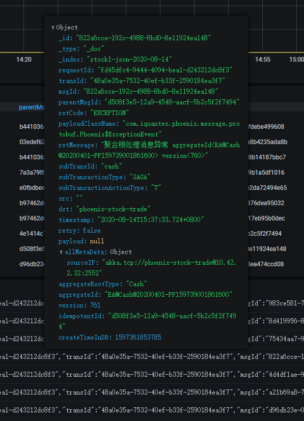

phoniex-admin是配合Phoenix框架使用的服务监控平台，能够实现对多个项目，多服务，多实例层级的监控和内存管理的功能。

## 服务监控

服务监控页面可以看到该项目下的所有Phoenix服务，每个服务也可以看到运行时间，实例个数等。

## 内存管理

在服务监控页面中，点击内存管理可以跳转到内存管理页面。在内存管理当中，可以看到所有聚合根的内存状态，也支持模糊查询。同时可以查看快照、打快照、删除快照等操作管理快照。

## 调用链查询

在内存管理中,如果查询的是事务聚合根,则会展示该笔事务当下调用链的情况

## 集群状态
在服务监控页面中，点击`actor tree`按钮可以进入集群状态查看页面。在Phoenix运行时，最小调度单位为聚合根，在集群管理页面中可以展示Phoenix服务的均衡分片，水平伸缩，故障恢复等功能。
- 红点: 当前Phoenix集群的集群名称
- 橙点: 当前Phoenix集群内的节点的IP和端口
- 绿点: 聚合跟shard集合,数字代表每个shard后聚合跟的数量

## 业务监控

phoenix-admin可以实时消费phoenix-event-publish应用**monitor-task**推送的监控消息写入elasticsearch，并通过grafna展示指标，参见[上报配置](./phoenix-admin-use-2x)。phoenix-admin为每个项目内置了一个通用的监控面板，提供消息归类、性能分析、消息详情等功能。详情如下:

#### 监控总览

#### 筛选栏
可以通过监控的信息进行自定义筛选

也可以通过表格中的加号进行筛选

#### 消息个数统计面板
统计系统内各个消息的个数，包括消息总数，异常消息总数等统计信息

#### 消息详情

白面板对消息的一些重要指标进行单独展示，可以通过表格提供的筛选功能定位一条消息的处理流程

#### 数据总览面板
展示数据的详细信息，这里展示了采集到的所有监控信息

该监控面板采用最近的grafana监控面板，鼠标移动到某条消息上可以展示完整的json数据

## 性能监控
从2.2.1版本开始phoenix引入jmx+Prometheus+grafana监控机制，可以实时采集服务的运行情况，并通过grafana进行展示.

## jvm监控
