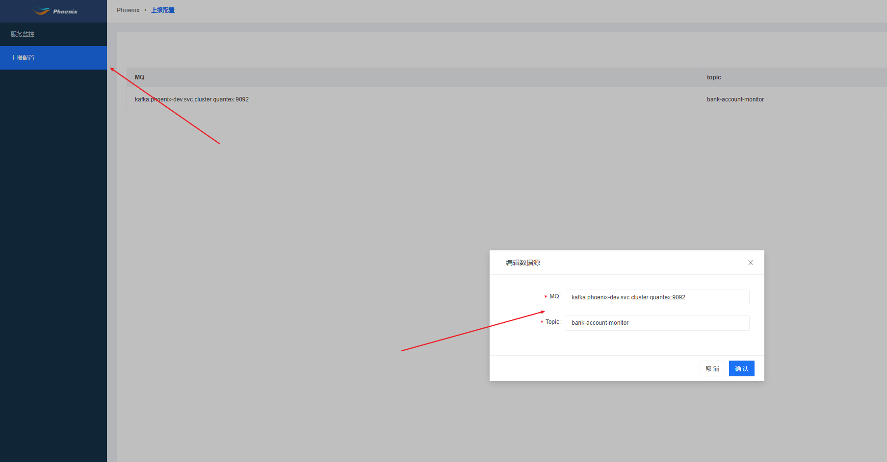
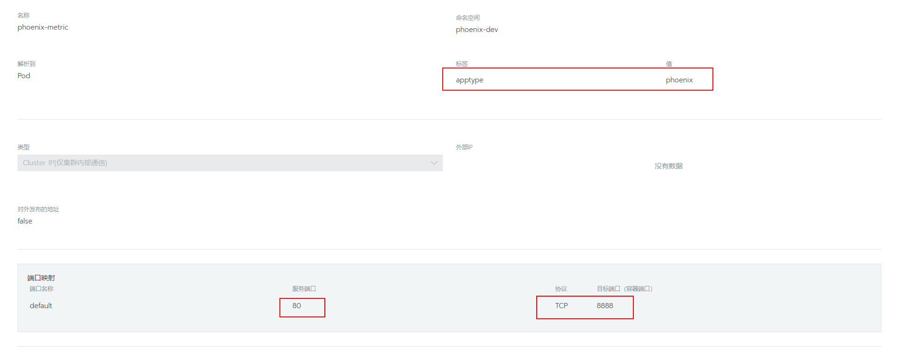

## 运行启动
phoenix-admin可以通过rancher应用商店进行一键部署

##  项目配置
#### 新建项目

#### 配置项说明

   * 项目ID：
     Phoenix项目的ID，全局唯一，建议使用英文+字母的简短组合。
   * 项目名称：
     Phoenix项目的名称。
   * 项目描述：
     Phoenix项目的简短描述。
   * 注册中心地址：
     phoenix-admin能实现多项目的管理，借住了eureka来实现各个项目内的服务发现。这里需要填写在部署Phoenix项目的时候，eureka的地址。

## 上报配置
phoenix-admin可以监听phoenix-event-publish服务上报的的信息，在页面中配置phoenix应用通讯所依赖的MQ的地址和topic列表，配置完成之后即可从grafna上`phoenix-message`页面查看处理内容



phoenix-message监控页面


## 使用jmx监控服务性能


### docker-compose变更

1. 引入Prometheus配置镜像
2. 拷贝镜像中的配置文件的到`/prometheus-agent`目录
3. 在启动服务时需要添加以下指令

`-javaagent:/prometheus-agent/jmx_prometheus_javaagent.jar=8888:/prometheus-agent/config.yml`

接入示例：

```dockerfile
#增加Prometheus配置镜像,起一个别名为agent
FROM harbor.iquantex.com/phoenix/prometheus-agent:1.0.0 as agent
FROM harbor.iquantex.com/base_images/openjdk:8u212-jre-with-tool

MAINTAINER "lan"

VOLUME /tmp

#拷贝镜像中的配置文件到指定目录
COPY --from=agent /prometheus-agent/ /prometheus-agent
ADD app.jar app.jar

#增加-javaagent:/prometheus-agent/jmx_prometheus_javaagent.jar=8888:/prometheus-agent/config.yml
ENTRYPOINT java -jar -javaagent:/prometheus-agent/jmx_prometheus_javaagent.jar=8888:/prometheus-agent/config.yml ${JAVA_OPTS} -XX:+UseConcMarkSweepGC -XX:+UseContainerSupport -XX:InitialRAMPercentage=75.0 -XX:MinRAMPercentage=75.0 -XX:MaxRAMPercentage=75.0  -XshowSettings:vm /app.jar
​```
```


暴露`jmx`采集数据的端口，helm-chart文件如下：

```yaml
apiVersion: v1
kind: Service
metadata:
  annotations:
    prometheus.io/path: /metrics
    prometheus.io/port: "8888"
    prometheus.io/scheme: http
    prometheus.io/phoenix_scrape: "true"
  name: phoenix-metric
spec:
  ports:
  - name: default
    port: 80
    protocol: TCP
    targetPort: 8888
    selector:
    apptype: phoenix
    type: ClusterIP
status:
    loadBalancer: {}
​```

同时要在服务的helm chart中增加标签

​```yaml
spec:
  template:
    metadata:
      labels:
        app.name: bank-account
        apptype: phoenix
​```
```

#### 使用rancher操作

rancher => 服务发现 => 添加DNS记录




被监控的服务增加以下标签


### 检查服务是否被监控

- 通过访问本地端口来查看是否暴露监控数据

进入容器访问8888端口，查看是否有暴露`com_iquantex_Phoenix`打头的监控信息

```bash
bash-5.0# curl localhost:8888
...
# HELP com_iquantex_Phoenix_ReceiverActor_NoHandlerMessageTotal Attribute exposed for management (com.iquantex.Phoenix<type=ReceiverActor,  aggregateRootId=kafka-9092-account-web-event-0><>NoHandlerMessageTotal)
# TYPE com_iquantex_Phoenix_ReceiverActor_NoHandlerMessageTotal untyped
com_iquantex_Phoenix_ReceiverActor_NoHandlerMessageTotal{_aggregateRootId="kafka-9092-account-web-event-0",} 0.0
com_iquantex_Phoenix_ReceiverActor_NoHandlerMessageTotal{_aggregateRootId="kafka-9092-account-server-2",} 0.0
com_iquantex_Phoenix_ReceiverActor_NoHandlerMessageTotal{_aggregateRootId="kafka-9092-account-web-event-2",} 0.0
com_iquantex_Phoenix_ReceiverActor_NoHandlerMessageTotal{_aggregateRootId="kafka-9092-account-server-0",} 0.0
...
```

- 通过Prometheus查看监控信息

通过Prometheus服务的targets页面查看是否有被监控的服务


