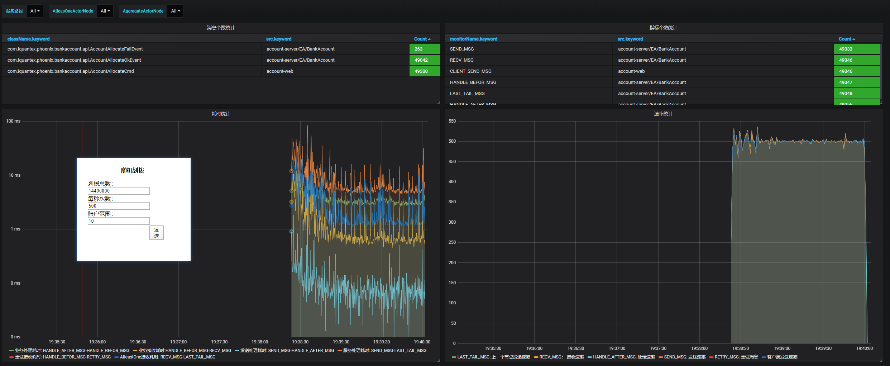

## 概述

抗压能力是衡量一个软件系统优劣的又一重要指标，Phoenix目前比较关心下面两个不同维度的流量压力：

1. 持续流量压力：持续的流量压力可以全方面的考研系统的稳定性，防止内存泄漏等。
2. 洪峰流量压力：瞬间的流量压力可以测试出系统的抗洪能力，防止系统在洪峰流量下崩溃。

## 持续流量测试

### 测试场景

Phoenix框架持续流量压力测试基于bank-account服务进行。部署2个节点，使用压测程序以500/s的TPS压测8个小时。

### 校验方法

观察Grafana中的Phoenix监控中的速率图表是否稳定，观察JVM Metrics监控中的GC图表是否稳定。

### 测试步骤

1. 在Kubernetes环境中，使用bank-account服务，部署2个节点，每个节点给定pod 2c的CPU。

   

2. 调整前端的请求数为500/s，请求时间为8h，开始测试。

3. 待测试完毕后，观察8h内Phoenix监控中的速率图表，JVM Metrics监控中的GC图表，Rancher上的CPU使用图表，CPU占用图表等。

   速率图：

   

   GC图：

   

   CPU使用图：

   

4. 观察可知，Phoenix处理速率基本稳定，GC正常，未发生频繁的Full GC，CPU使用平稳，无太大波动。

## 洪峰流量测试

### 测试场景

Phoenix框架洪峰流量压力测试基于bank-account示例应用进行。通过积压消息，来模拟洪峰流量。

### 校验方法

观察bank-account服务能否快速且稳定地消费完积压的消息。

### 测试步骤

1. 先使用压测程序，一次性发送20万条消息到Kafka中，此时关闭处理程序account_server，模拟消息堆积。

   

2. 打开2个节点的account_server，待所有积压的消息全部处理完毕。

   

3. 观察8h内Phoenix监控中的速率图表，JVM Metrics监控中的GC图表，Rancher上的CPU使用图表，CPU占用图表等。

   速率图：

   

   GC图：

   

   CPU使用图：

   

   Kafka消费图：

   

4. 根据上图，我们可以看出，4条Kafka partition有1条只被消费了5332条消息就停止消费了，其他的消息被2个服务节点在1分钟内消费完毕。

## 结论

经验证，对于长时间的流量，Phoenix可以很好的处理；但是对于积压的瞬间流量，Phoenix还不能很好的处理，会有一条Kafka partition不能消费完全。