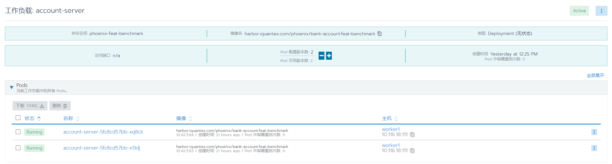
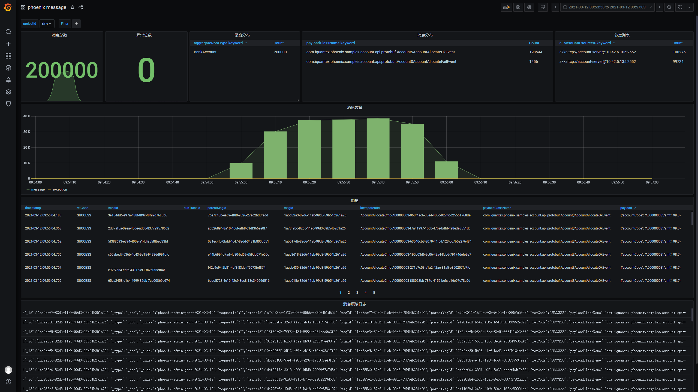

## 概述

抗压能力是衡量一个软件系统优劣的又一重要指标，Phoenix 目前比较关心下面两个不同维度的流量压力:

1. 持续流量压力:持续的流量压力可以全方面的考研系统的稳定性，防止内存泄漏等。
2. 洪峰流量压力:瞬间的流量压力可以测试出系统的抗洪能力，防止系统在洪峰流量下崩溃。

## 持续流量测试

### 测试场景

Phoenix 框架持续流量压力测试基于 bank-account 服务进行。部署 2 个节点，使用压测程序以 500/s 的 TPS 压测 8 个小时。

### 校验方法

观察 Grafana 中的 Phoenix 监控中的速率图表是否稳定，观察 JVM Metrics 监控中的 GC 图表是否稳定。

### 测试步骤

1. 在 Kubernetes 环境中，使用 bank-account 服务，部署 2 个节点，每个节点给定 pod 4c 的 CPU。

   

2. 调整前端的请求数为 500/s，请求时间为 8h，开始测试。

3. 待测试完毕后，观察 8h 内 Phoenix admin各监控面板信息。

   phoenix client 监控图:

   

   phoenix overview 监控图:

   
   
   JVM 监控图
   
   
   

4. 观察可知，Phoenix 处理速率基本稳定，GC 正常，未发生频繁的 Full GC，CPU 使用平稳，无太大波动。

## 洪峰流量测试

### 测试场景

Phoenix 框架洪峰流量压力测试基于 bank-account 示例应用进行。通过积压消息，来模拟洪峰流量。

### 校验方法

观察 bank-account 服务能否快速且稳定地消费完积压的消息。

### 测试步骤

1. 先使用压测程序，一次性发送 20 万条消息到 Kafka 中，此时关闭处理程序 account_server，模拟消息堆积。

   

2. 打开 2 个节点的 account_server，待所有积压的消息全部处理完毕。

   

3. 打开 phoenix admin 的监控页面，查看各监控面板监控指标

   phoenix client 监控面板:
   
   

   phoenix source aggregate 监控面板:

   

   JVM 监控面板:

   

   phoenix message 监控面板:

   

4. 根据上图，我们可以看出，堆积消息在系统启动后，全部正常消费掉了

## 结论

经验证，对于长时间或者积压的流量，Phoenix 可以很好的处理