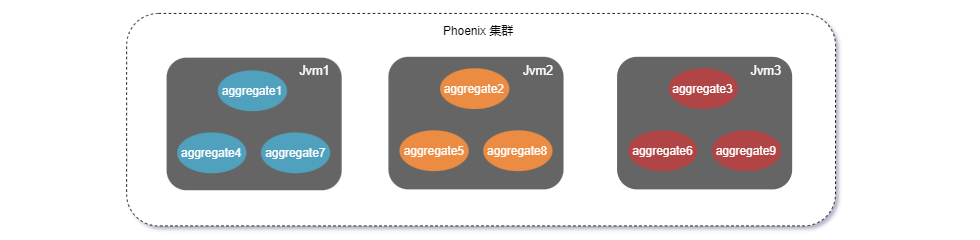

## 分布式数据

Phoenix 提供分布式数据能力，用来实现在集群环境中多个分布式节点共享数据。同时还可以和数据建立订阅关系，实现数据更新自动推送通知的能力。

如有兴趣，可查看更详细的介绍：[DistributedData](../02-phoenix-core/07-distributed-data.md)

## 订阅与广播

在流/批计算场景，上游业务系统会把数据发送至消息队列。但并不是按聚合根用户定义的命令的协议，而是上游系统自己的协议。这时可以使用Phoenix的Subscribe功能，扩展订阅的功能，做协议转换，分发，广播等操作。

如有兴趣，可查看更详细的介绍：[Subscribe and broadcast](../02-phoenix-core/06-subscribe-pub.md)

## 图依赖计算

DGC 全称 Dependence Graph Compute, 用于构建java中对象属性值和对象方法之间的依赖关系，当对象属性值变化后，可自动根据依赖关系图更新对应方法的返回值，从而大大减少重复计算工作量, 提升程序的运行效率。

经过测试，使用 DGC 之后可以使运算效率提高几十倍。

如有兴趣，可查看更详细的介绍：[DGC](../08-phoenix-dgc/00-introduce.md)

## 分布式事务

Phoenix 框架提供事务模块，用来解决分布式事务问题。目前 Phoenix 提供两种事务模式：TCC、SAGA。

Phoenix 提供了对应的API，可以使用户很方便的使用这两种事务模式，同时 Phoenix 还支持在同一个分布式事务中同时使用两种事务模式。

关于事务模块更详细的介绍可参考：[分布式事务](../03-phoenix-transaction/02-transaction-aggregate.md)

## 集群管理

在高并发场景中，应用系统的处理能力通常是个严峻的挑战。

在提高系统的并发处理能力上，Phoenix 框架使用聚合根对象作为调度单位进行线程调度，以提升单节点部署的情况下线程资源的利用效率。此外，借助 Akka-Cluster 和 Akka-Cluster-Sharding 的能力实现横向扩展，通过部署多个服务节点组成集群，聚合根对象可以在集群节点之间灵活调度，使得系统可以通过增加节点的方式提升处理能力。

Phoenix 框架提供应用系统的伸缩性。与横向扩展相似，Phoenix 服务集群可以动态缩减节点数量。Akka-Cluster 和 Akka-Cluster-Sharding 可以对聚合根对象进行集群调度和管理，在集群减少服务节点数量时，Akka可以将这些节点中的聚合根对象转移到剩余节点中。在进行节点移除的过程中，配合 EventSourcing 的能力，被移除节点中的聚合根可以在剩余节点中重新构建并恢复状态。

关于集群管理更详细的介绍可参考：[集群管理](../02-phoenix-core/08-cluster.md)

## 监控管理

Phoenix 提供了监控管理平台，支持对 Phoenix 服务进行系统状态管理、事件管理、性能监控、业务监控、事务调用链追踪以及异常分析。

phoenix 服务监控管理平台是 Phoenix 框架默认提供的轻量级、嵌入式监控平台。该平台共提供四大操作模块：

- 应用总览
- 集群展示
- 内存管理
- 事件管理

如有兴趣，可查看更详细的介绍：[DistributedData](../05-phoenix-console/01-overall.md)
