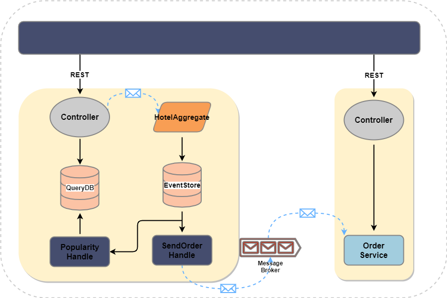

# 酒店预订示例架构

本教程说明了如何使用 Phoenix 来实现酒店预订系统。并展示了如何从头开始一点一点地构建该服务。

酒店预订系统包含如下功能：

- 支持用户选择酒店房间。
- 根据用户选择生成订单。
- 根据预定数据分析各类酒店房间的流行程度。

下图展示了酒店预订系统的整体架构图：

该系统中包含如下几个服务：

1. HotelAggregate: 每个酒店由一个实体聚合根表示，使用事件源保持酒店状态。N酒店会生成N个酒店聚合根对象。该聚合根可以提供预定房间、取消预定、查询房间剩余信息等功能。

2. Popularity Handle: 处理所有存储于数据库中的预订事件，分析事件内容，以回答有关房间受欢迎程度的查询。

3. Order Service: 通过酒店预订服务生成订单，由独立的订单服务管理。
