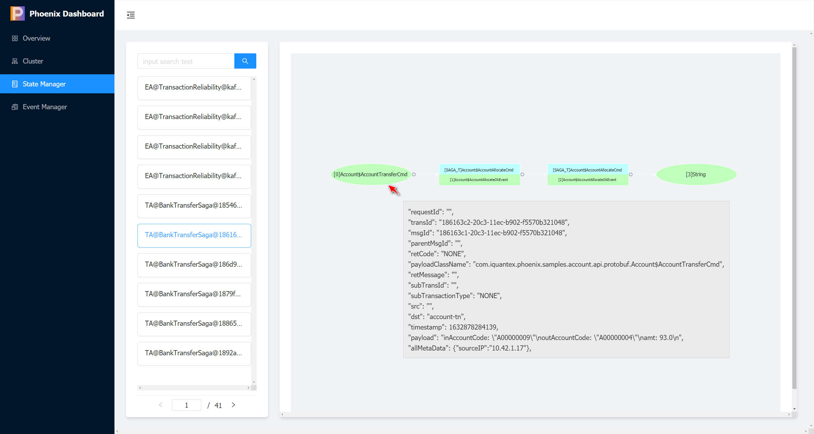

phoenix 服务监控管理平台是 Phoenix 框架默认提供的轻量级、嵌入式监控平台。该平台共提供四大操作模块：

- 应用总览
- 集群展示
- 内存管理
- 事件管理

以上四大模块可实现对 Phoenix 服务的状态进行实时监控。


## 快速使用

1. 打开phoenix 服务监控管理平台的控制开关

```yaml
quantex.phoenix.server.console.enabled: true
```

2. 启动phoenix服务。

3. 访问地址：`http://ip:port/phx-console`

## 应用总览

应用总览页面展示该 Phoenix服务的一些基本信息。其中包括：服务的运行状态、实例个数、服务中存在的聚合根数量（包括每个聚合根的配置信息以及可处理的Command信息）、订阅信息（包括每个topic的消费进度）以及Phoenix相关的配置。


1. 点击图中服务模块，可查看该服务的Phoenix配置信息。


2. 点击图中topic模块，可查看该服务（消费者）的消费进度。


## 集群展示

在Phoenix运行时，最小调度单位为聚合根，在集群管理页面中可以展示Phoenix服务中聚合根的分布情况。

- 红点: 当前Phoenix集群的集群名称
- 橙点: 当前Phoenix集群内的节点的IP和端口
- 绿点: 聚合根shard集合,数字代表每个shard后聚合根的数量


## 状态管理

状态管理也可以叫内存管理，可对内存数据进行查询或修改。其中包括聚合根内存数据查询、事务调用链查询 、手动触发快照、发送万能命令等。


### 内存查询

Phoenix 支持从多个维度对聚合根内存状态进行查询。

1. 根据版本号进行精确查询（版本号为 **-1** 时，默认查询聚合根的最新状态）


2. 根据时间戳查看聚合根的历史状态。
 


3. 根据快照版本号查询聚合根历史状态


4. 查看事务聚合根调用链，当鼠标悬停在某条调用命令上时，会展示命令具体信息



#### 手动触发快照

Phoenix 提供手动触发快照功能。可以针对某一聚合根进行快照触发，也可对某一类聚合根进行集体快照触发


:::caution 注意

事务聚合根不提供该功能。

:::


### 状态管理

在内存管理模块中的状态管理处，可以通过指定命令的全路径名和命令的json数据直接操作聚合根状态。


## 事件管理

事件管理模块支持对历史事件进行查询和归档。


1. 根据关键字进行模糊查询（需要指定聚合根关键字）


2. 根据完整的聚合根 ID 和版本进行精确查询


3. 根据幂等ID进行精确查询。


4. 一键归档

点击`一键归档`按钮，可对历史事件进行归档，释放事件存储空间。

归档功能逻辑可参考：[事件归档](../phoenix-core/phoenix-core-event-store#事件归档)

