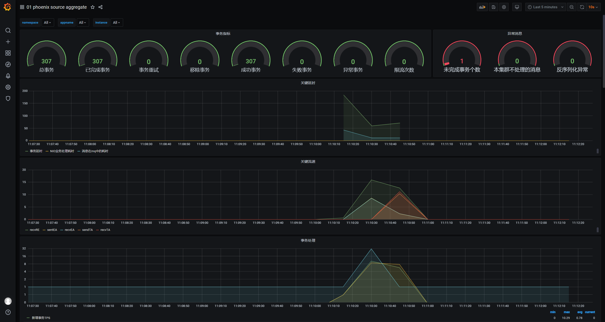
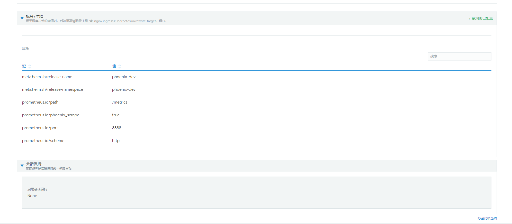

从2.2.1版本开始phoenix引入 `JMX + Prometheus + Grafana` 监控机制，可以实时采集服务的运行指标，并通过Grafana进行展示。

目前可监控的数据有：

- JVM 指标监控(phoenix jvm)
- 事件发布指标监控(phoenix event publish)
- 事件存储指标监控(phoenix event store)
- 客户端指标监控(phoenix client)
- 源聚合根指标监控(phoenix source aggregate)
- 实体聚合根指标监控(phoenix entity aggregate)
- 事务聚合根指标监控(phoenix transaction aggregate)


## 性能监控

**jvm监控面板**

监控JVM的状态信息、使用时长、开机时间、CPU负载等。


**event publish监控面板**

监控事件发布的相关指标，发送事件总数、发送失败次数、读库tps、发送事件tps、发送事件时延等。


**event store监控面板**

监控事件存储的相关指标，事件存储总数、接收和持久化时tps，发生异常次数等。


**phoenix client监控面板**

监控phoenix客户端行为，同步或异步发送消息数量、异常发送次数、相关速率等。


**source aggregate监控面板**

监控聚合根处理事务的能力，事务相关指标、处理的关键延时、事务处理tps等。


**entity aggregate监控面板**

监控实体聚合根相关指标，实体聚合根处理消息tps、实体聚合根处理消息时的延时等。


**transaction aggregate监控面板**

监控事务聚合根相关指标，事务聚合根幂等处理tps、事务actor累计接收心跳个数等。


## 使用说明

1. 部署prometheus和grafana。
2. 项目中[配置prometheus](#项目配置)。
3. 启动项目，[检查服务是否被监控](#检查服务是否被监控)。
4. 使用grafana展示数据。
- 在grafana中配置elasticsearch数据源<br/>


- 使用grafana一键导入自定义面板，用于展示数据


- 使用json-model数据即可快速生成监控面板，以phoenix jvm为例：[model](../../assets/file/phoenix-admin/system-monitor-model.md)


### 项目配置

1. 引入Prometheus配置镜像
2. 拷贝镜像中的配置文件的到`/prometheus-agent`目录
3. 在启动服务时需要添加以下指令

`-javaagent:/prometheus-agent/jmx_prometheus_javaagent.jar=8888:/prometheus-agent/config.yml`

接入示例：

```dockerfile
#增加Prometheus配置镜像,起一个别名为agent
FROM harbor.iquantex.com/phoenix/prometheus-agent:1.0.0 as agent
FROM harbor.iquantex.com/base_images/openjdk:8u212-jre-with-tool

MAINTAINER "lan"

VOLUME /tmp

#拷贝镜像中的配置文件到指定目录
COPY --from=agent /prometheus-agent/ /prometheus-agent
ADD app.jar app.jar

#增加-javaagent:/prometheus-agent/jmx_prometheus_javaagent.jar=8888:/prometheus-agent/config.yml
ENTRYPOINT java -jar -javaagent:/prometheus-agent/jmx_prometheus_javaagent.jar=8888:/prometheus-agent/config.yml ${JAVA_OPTS} -XX:+UseConcMarkSweepGC -XX:+UseContainerSupport -XX:InitialRAMPercentage=75.0 -XX:MinRAMPercentage=75.0 -XX:MaxRAMPercentage=75.0  -XshowSettings:vm /app.jar
```


暴露`jmx`采集数据的端口，helm-chart文件如下：

```yaml
apiVersion: v1
kind: Service
metadata:
  annotations:
    prometheus.io/path: /metrics
    prometheus.io/port: "8888"
    prometheus.io/scheme: http
    prometheus.io/phoenix_scrape: "true"
  name: phoenix-metric
spec:
  ports:
  - name: default
    port: 80
    protocol: TCP
    targetPort: 8888
    selector:
    apptype: phoenix
    type: ClusterIP
status:
    loadBalancer: {}
```

同时要在服务的helm chart中增加标签

```yaml
spec:
  template:
    metadata:
      labels:
        app.name: bank-account
        apptype: phoenix
```

#### 使用rancher操作

rancher => 服务发现 => 添加DNS记录




被监控的服务增加以下标签


### 检查服务是否被监控

- 通过访问本地端口来查看是否暴露监控数据

进入容器访问8888端口，查看是否有暴露`com_iquantex_Phoenix`打头的监控信息

```bash
bash-5.0# curl localhost:8888
# HELP com_iquantex_Phoenix_ReceiverActor_NoHandlerMessageTotal Attribute exposed for management (com.iquantex.Phoenix<type=ReceiverActor,  aggregateRootId=kafka-9092-account-web-event-0><>NoHandlerMessageTotal)
# TYPE com_iquantex_Phoenix_ReceiverActor_NoHandlerMessageTotal untyped
com_iquantex_Phoenix_ReceiverActor_NoHandlerMessageTotal{_aggregateRootId="kafka-9092-account-web-event-0",} 0.0
com_iquantex_Phoenix_ReceiverActor_NoHandlerMessageTotal{_aggregateRootId="kafka-9092-account-server-2",} 0.0
com_iquantex_Phoenix_ReceiverActor_NoHandlerMessageTotal{_aggregateRootId="kafka-9092-account-web-event-2",} 0.0
com_iquantex_Phoenix_ReceiverActor_NoHandlerMessageTotal{_aggregateRootId="kafka-9092-account-server-0",} 0.0
```

- 通过Prometheus查看监控信息

通过Prometheus服务的targets页面查看是否有被监控的服务


