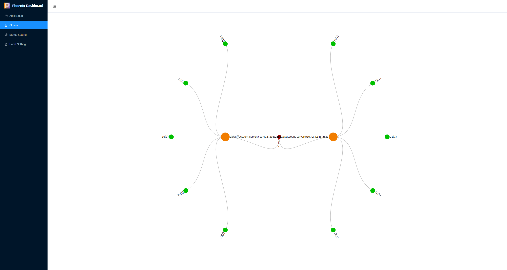

## 集群能力

在高并发场景中，应用系统的处理能力通常是个严峻的挑战。

在提高系统的并发处理能力上，Phoenix 框架使用聚合根对象作为调度单位进行线程调度，以提升单节点部署的情况下线程资源的利用效率。此外，借助 Akka-Cluster 和 Akka-Cluster-Sharding 的能力实现横向扩展，通过部署多个服务节点组成集群，聚合根对象可以在集群节点之间灵活调度，使得系统可以通过增加节点的方式提升处理能力。


Phoenix 框架提供应用系统的伸缩性。与横向扩展相似，Phoenix 服务集群可以动态缩减节点数量。Akka-Cluster 和 Akka-Cluster-Sharding 可以对聚合根对象进行集群调度和管理，在集群减少服务节点数量时，Akka可以将这些节点中的聚合根对象转移到剩余节点中。在进行节点移除的过程中，配合 EventSourcing 的能力，被移除节点中的聚合根可以在剩余节点中重新构建并恢复状态。

## 集群配置

Phoenix 支持在多种环境中运行。 下面分别介绍下 Phoenix 服务在集群时 Akka 的配置项需要如何进行配置。


|  | Config           | Kubernetes-API                    | Kubernetes-DNS                                                    | Consul               | Nacos| Eureka           |
| ------ |------------------|-----------------------------------|-------------------------------------------------------------------|----------------------|  ----------------------|------------------|  
| **动态种子节点** | 不支持 | 支持 | 支持 | 支持 |  支持 | 支持               |  
| **必要条件** | 需要配置种子节点 | 需要运行服务的 POD 能够访问 `Kubernetes-API` | 需要定义 Headless service 并且 Kubernetes 支持 `publishNotReadyAddresses` | 外部服务 Consul          | 外部服务 Nacos          | 外部服务 Eureka      | 
| **运行环境** | 无显式要求 | Kubernetes                        | Kubernetes                                                        | 无显式要求 | 无显式要求 | 无显式要求            | 
| **优势** | 配置简单, 仅靠程序就可以运行 | 交由 Kubernetes API Server 管理 | 使用 DNS 作为服务发现, 无需 POD 权限 | 无运行环境限制, 支持配置中心，强一致性 |  无运行环境限制, 支持配置中心，同时支持 AP,CP | 无运行环境限制, 高可用注册中心 |
| **劣势** | 静态配置，容错能力差 | 需要 Kubernetes 环境和 POD 权限 | 需要 Kubernetes 环境，依赖于 DNS 解析，性能不好 | 强一致导致服务不可用，手动注销实例 | | 需要客户端维护服务状态      |
| **分区功能** |  不支持  |  不支持 |  不支持 | 不支持 | 支持 |支持 |


### 完整配置

```yaml
quantex:
  phoenix:
   cluster: # 集群配置
      # 集群组建方式
      discovery-method: config / kubernetes / kubernetes_dns / consul / nacos / eureka
      # 配置文件组建集群
      config:
        seed-node:  # 集群种子节点
          - akka://account-server@127.0.0.1:2551
          - akka://account-server@127.0.0.1:2552
      # Kubernetes-API 方式
      kubernetes:
        k8s-pod-domain: "cluster.local" # k8s服务发现默认集群域名后缀
        pod-label-selector: "app=%s" #[可选配置]:设置 Selector label 的格式，`%s` 将替换为配置的有效名称（这个需要在 Deployment 自己设置）
      # Kubernetes-DNS 方式
      kubernetes-dns:
        port-name: management # management 端口
        headless-service-name: account-server-headless # Headless 服务名
      # Consul 方式
      consul:
        consul-host: 127.0.0.1 # consul host
        consul-port: 8500 # consul 端口
        group-name: default # 可选参数, 分组名
      # Nacos 方式
      nacos:
        nacos-host: 127.0.0.1 # nacos host
        nacos-port: 8500 # nacos 端口
        group-name: default # 分组功能. 当两个不同网络区域的程序，使用了相同的 Nacos 时, 支持以该参数区分数据中心, 以形成不同的集群.
     # Eureka 方式
      eureka:
        eureka-host: 127.0.0.1 # Eureka host
        eureka-port: 8761 # Eureka 端口
        eureka-path: eureka # 资源路径, 最终组成 http://127.0.0.1:8761/eureka/
        group-name: default # 可选参数, 分组名
        renew-interval: 30000 # 可选参数, 续租间隔(ms)
```

### 1. 本地单点运行

Phoenix 的默认配置就是本地模式，直接启动即可，不用在 `application.yaml` 或者 `application.properties` 中显式配置。

### 2. Config 模式运行集群

添加或修改以下几项配置，保证多个实例的端口不能冲突。

配置文件方式：
```yaml
quantex:
  phoenix:
    # 节点专属配置
    akka:
      artery-canonical-port: 2552  # 节点通信端口,多个实例不相同
      management-http-port: 8559 # 集群管理的 HTTP 端口,多个实例不相同
      artery-canonical-hostname: 127.0.0.1   # 节点的 IP 地址
    # 集群通用配置
    cluster:
      discovery-method: config # 使用 Config 组建集群
      # 配置文件组建集群
      config:
        seed-node:  # 集群中 种子节点的地址, 一般会把所有节点都设置, 另外`account-server`要和应用${spring.application.name}的名字相同
          - akka://account-server@127.0.0.1:2551
          - akka://account-server@127.0.0.1:2552
```
JVM参数配置方式：
```text
-Dquantex.phoenix.cluster.discovery-method=config
-Dquantex.phoenix.cluster.config.seed-node=akka://bank-account@127.0.0.1:2551,akka://bank-account@127.0.0.1:2552
-Dquantex.phoenix.akka.arteryCanonicalHostname=127.0.0.1
-Dquantex.phoenix.akka.artery-canonical-port=2552
-Dquantex.phoenix.akka.management-http-port=8559
-Dserver.port=8081
-Dspring.datasource.url="jdbc:h2:file:./data/test2;DB_CLOSE_DELAY=-1;DATABASE_TO_UPPER=FALSE;INIT=CREATE SCHEMA IF NOT EXISTS PUBLIC"
-Dquantex.phoenix.server.event-store.data-sources[0].url="jdbc:h2:~/data/test2;DB_CLOSE_DELAY=-1;DATABASE_TO_UPPER=FALSE;INIT=CREATE SCHEMA IF NOT EXISTS PUBLIC"
-Dquantex.phoenix.server.event-store.data-sources[0].username="sa"
-Dquantex.phoenix.server.event-store.data-sources[0].password=123
```


:::info[注意]

本地组建集群时需要注意

1. 使用内存数据库时保证每个数据库只有一个有效连接 或 连接不同内存数据库。
2. 使用内存版Kafka时避免端口冲突。

:::

### 3. Kubernetes-API 模式运行集群

Phoenix 的集群能力依赖于 Akka-Cluster, Akka-Cluster 提供了方便的 Kubernetes API 来帮助我们在 kubernetes 环境中发现服务以及组集群。

Phoenix 服务同时还需要进行如下配置

```yaml
quantex:
  phoenix:
    cluster:
      discovery-method: kubernetes # 使用 Kubernetes-API 组建集群
      # Kubernetes-API 方式
      kubernetes:
        k8s-pod-domain: "cluster.local" # k8s服务发现默认集群域名后缀
        pod-label-selector: "app=%s" #[可选配置]:设置 Selector label 的格式，`%s` 将替换为配置的有效名称（这个需要在 Deployment 自己设置）
```

Kubernetes 还需要以下配置:

- Deployment：用来在 kubernetes 中创建一个服务 pod
- Role 和 RoleBinding：使phoenix服务（akka pod）可以访问 kubernetes api

一个 Deployment 示例。

```yaml
apiVersion: apps/v1
kind: Deployment
metadata:
  name: phoenix-demo # 服务名
  labels:
    app: phoenix-demo # 需要设置labels
...
```

允许节点查询 Kubernetes API 服务器的Role 和 RoleBinding示例：

```yaml
# 创建一个角色 `pod-reader`，它可以列出 pod，并将绑定部署到的命名空间中的默认服务帐户绑定到该角色。
kind: Role
apiVersion: rbac.authorization.k8s.io/v1
metadata:
  name: pod-reader
rules:
  - apiGroups: [""] # "" indicates the core API group
    resources: ["pods"]
    verbs: ["get", "watch", "list"]
---
kind: RoleBinding
apiVersion: rbac.authorization.k8s.io/v1
metadata:
  name: read-pods
subjects:
  # Create the default user for the akka-cluster-1 namespace
  - kind: User
    name: system:serviceaccount:{{- printf "%s" .Release.Namespace | trunc 63 -}}:default
roleRef:
  kind: Role
  name: pod-reader
  apiGroup: rbac.authorization.k8s.io
```

### 4. Kubernetes-DNS 模式运行集群

如果你的生产环境中不允许为运行程序的 POD 添加 `Kubernetes-API` 权限，则可以尝试使用 `Kubernetes-DNS` 的方式组建集群

参考配置如下:

```yaml
quantex:
  phoenix:
    cluster:
      discovery-method: kubernetes_dns # 使用 Kubernetes-DNS 组建集群
      # Kubernetes-DNS 方式
      kubernetes-dns:
        port-name: management # management 端口
        headless-service-name: account-server-headless # Headless 服务名
```

DNS 模式下，需要为程序创建 Headless Service，并允许 POD 在未启动完成时发布自身的地址。

参考配置如下:

```yaml
#public, 程序对外的服务
apiVersion: v1
kind: Service
metadata:
  name: {{ .Values.bank_account.server.name | quote }}
  labels:
{{ include "phoenix.labels" . | indent 4 }}
    app.name: {{ .Values.bank_account.server.name | quote }}
spec:
  type: {{ .Values.bank_account.server.service.type }}
  ports:
    - name: {{ .Values.bank_account.server.name | quote }}
      port: 80
      targetPort: 8080
      protocol: TCP
  selector:
    app.kubernetes.io/name: {{ include "phoenix.name" . }}
    app.kubernetes.io/instance: {{ .Release.Name }}
    app.name: {{ .Values.bank_account.server.name | quote }}
#public
---
#headless 用于 Forming 集群的内部 Headless 服务
apiVersion: v1
kind: Service
metadata:
  labels:
    app: {{ .Values.bank_account.server.name | quote }}
  annotations:
    service.alpha.kubernetes.io/tolerate-unready-endpoints: "true" # 关键参数, 旧版注解方式发布自身地址
  name: "account-server-headless" # 此值需要在配置中指定 quantex.phoenix.cluster.kubernetes-dns.headless-service-name
spec:
  ports:
    - name: management # 开放management的端口，用于查找seed-node
      port: 8558      # 该端口不影响集群组建
      protocol: TCP
      targetPort: 8558
    - name: remoting
      port: 2551
      protocol: TCP
      targetPort: 2551
  selector:
    app: {{ .Values.bank_account.server.name | quote }}
  clusterIP: None
  publishNotReadyAddresses: true # 关键参数, 新版使用属性的方式发布自身地址
#headless

```


### 5. Consul 集群运行

使用 Consul 运行集群则较为简单，Phoenix 会维护 Consul 中服务的上线和下限, 配置如下参数即可。

```yaml
quantex:
  phoenix:
    cluster:
      discovery-method: consul # 使用 Consul 组建集群
      # Consul 方式
      consul:
        consul-host: 127.0.0.1 # consul host
        consul-port: 8500 # consul 端口
        group-name: default # 可选参数, 分组名
```

### 6. Nacos 集群运行

使用 Nacos 运行集群支持分组功能. Phoenix 维护了服务的注册, 只需要配置如下参数即可。

```yaml
quantex:
  phoenix:
    cluster:
      discovery-method: nacos # 使用 Nacos 组建集群
      # Nacos 方式
      nacos:
        nacos-host: 127.0.0.1 # nacos host
        nacos-port: 8848 # nacos 端口
        group-name: dc1 # 可选参数, 分组名
```

### 7. Eureka 集群运行

使用 Eureka 运行集群支持分组功能. Phoenix 维护了服务的注册, 只需要配置如下参数即可。

```yaml
quantex:
  phoenix:
    cluster:
      discovery-method: eureka # 使用 Eureka 组建集群
      # Eureka 方式
      eureka:
        eureka-host: 127.0.0.1 # Eureka host
        eureka-port: 8761 # Eureka 端口
        eureka-path: eureka # 资源路径, 最终组成 http://127.0.0.1:8761/eureka/
        group-name: default # 可选参数, 分组名
        renew-interval: 30000 # 可选参数, 续租间隔(ms)
```

## 分区容忍性

目前 Phoenix 的集群暂不支持部署在多个数据中心, 如果跨多个数据中心使用普通的 Phoenix 集群会导致：

- 集群成员的管理在网络分区期间停止，导致无法添加和删除节点
- 跨数据中心的网络连接会导致频繁的故障检测误报，数据中心内部和跨数据中心的故障检测无法拥有不同的设置
- 集群单例和集群分片从一个数据中心到另一个数据中心的快速故障转移难以安全进行
- 缺乏位置信息导致通信难以优化

Phoenix 目前正在筹备多数据中心方案的开发，目前对于多数据中心的分区容忍性，可以通过 Phoenix 目前提供的**多机冷备**方案实现。

- 多个数据中心之间使用共同的数据库作为默认的聚合根存储
- 每个数据中心使用独立的可靠性投递存储(`quantex.phoenix.server.event-store.dataSources[0].label=reliablity`)
- 默认情况下只会有一个数据中心消费, 当主节点故障时通过人工在 `Phoenix-Console` 页面中激活从节点.

参考部署步骤如下:

### 1. 配置

Phoenix 多机冷备相关配置如下

```yaml
quantex:
  phoenix:
    # 集群配置
    cluster:
      # 是否开启冷备
      enable-standby: true
      # 所属数据中心名称, ID
      data-center: dc1
    server:
      # 数据库配置
      event-store:
        # 数据源配置
        data-sources:
          # 多数据中心共享数据源
          - url: jdbc:h2:~/data/test_share;DB_CLOSE_DELAY=-1;DATABASE_TO_UPPER=FALSE;INIT=CREATE SCHEMA IF NOT EXISTS PUBLIC # 读取用户目录下的文件夹.
            username: sa
            password: 123
            label: default # 聚合根存储
          # 数据中心独立数据源
          - url: jdbc:h2:~/data/test_unique;DB_CLOSE_DELAY=-1;DATABASE_TO_UPPER=FALSE;INIT=CREATE SCHEMA IF NOT EXISTS PUBLIC # 读取用户目录下的文件夹.
            username: sa
            password: 123
            label: reliablity # 可靠性投递存储
```

### 2. 启动

在多个数据中心使用不同配置 (数据中心ID、可靠性投递存储不同) 后, 启动所有 Phoenix 集群(无顺序要求, 默认都为从节点, 集群初次启动时需要手动开启消费, 设置该集群为主节点)

启动 Phoenix 集群后, 进入主数据中心 Phoenix 集群的 Phoenix Console 中, 确认数据中心 ID、开启消费:


### 3. 运维

多机冷备下, Phoenix 的集群管理通过 Phoenix Console 控制, 每个集群的消费开关各自独立.

**故障转移**：当某个数据中心出现故障, 需要迁移到另一个数据中心时. 首先需要将数据中心独立的可靠性投递存储中的集群消费状态关闭, 然后在另一个数据中心的 Phoenix-Console 中开启消费开关.


## 集群运维

使用集群能力之后，可以配合 phoenix-console 提供的监控面板来实时查看集群的状态。

#### 应用状态查看

phoenix-console 提供的应用总览页面，可以查看一下两个信息：

- 应用状态 [就绪/组集群中/故障]
- 集群方式 [集群/单点]

通过以上两个信息，可以方便的判断当前服务运行状态是否正常。

#### 集群状态展示

在Phoenix运行时，最小调度单位为聚合根，在 phoenix-console 提供的集群管理页面中可以展示Phoenix服务中聚合根的分布情况。

红点: 当前Phoenix集群的集群名称
橙点: 当前Phoenix集群内的节点的IP和端口
绿点: 聚合根shard集合,数字代表每个shard后聚合根的数量




## 中间件集群兼容性


:::info[兼容性说明]

目前 Phoenix 集群的中间件集群都是使用的 HTTP 的方式查找服务而非 DNS. Eureka 则不支持 DNS 方式.

在兼容性的测试中, Consul 及 Eureka 都是基于官方提供的 REST API 标准实现的客户端. Nacos 则是使用了官方的客户端.

除了 Nacos 在大版本上有兼容性问题之外, Eureka 和 Consul 在跨多个年度的版本的测试中均表现正常.

:::

|          | Consul                                  | Nacos                                         | Eureka                                                                                              |
|----------|-----------------------------------------|-----------------------------------------------|-----------------------------------------------------------------------------------------------------|
| 客户端版本    | `com.orbitz.consul:consul-client:1.4.2` | `com.alibaba.nacos:nacos-client:1.4.2`        | 基于 HTTP REST                                                                                        |
| HTTP 客户端 |   `com.squareup.retrofit2` 基于 `okhttp3`  | Nacos HTTP Client 基于 Apache HttpClient    | 基于 Akka HTTP                                                                                        |
| 不兼容版本    | 受版本影响较小, 测试中,能够单机的最低版本 0.6.0 能够正常运行     | Nacos v1.0.0 以下版本                             | 受版本影响较小, Eureka Server 中, REST endpoint 的路径由版本参数拼接, 其余资源路径的位置没有变化. Phoenix 提供了 `eureka-path` 兼容不同版本 |
| 兼容服务端版本  | 0.6.0 ~ 1.11.3                          | 1.0.0 ~ 1.4.2 (~ 2.0.3)                       | Brixton.SR1 ~ 2021.0.0 (以 Spring Cloud 版本为例)                                                        |                                                                                                   |


