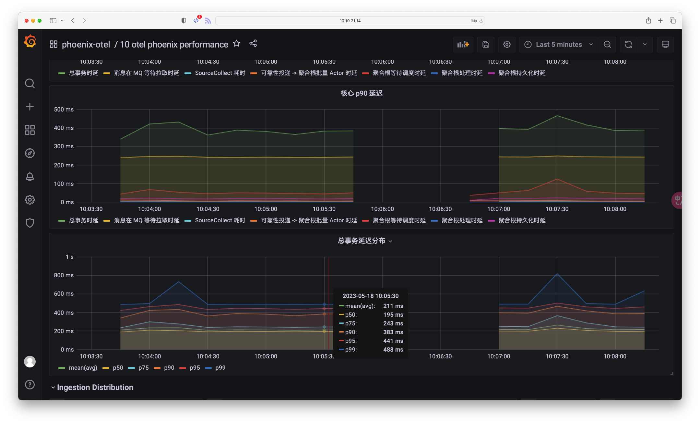
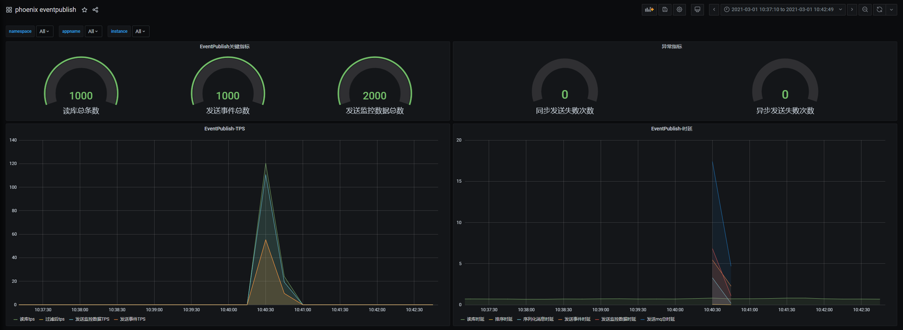

Phoenix 的监控经 2.2.1 以及 2.6.0 两个大版本的迭代, 现已建立基于 `Telemetry` 接口的核心链路埋点和指标导出的体系, 有助于用户洞悉 Phoenix 应用性能。

基于 Phoenix Metrics，用户可以：

- 分析集群运行状况
- 分析集群读写流量分布以及趋势变化
- 分析各个组件的性能数据
- 分析应用的错误、异常指标

目前可监控的数据有：

- JVM 指标监控(phoenix jvm)
- 事件发布指标监控(phoenix event publish)
- 事件存储指标监控(phoenix event store)
- 客户端指标监控(phoenix client)
- 源聚合根指标监控(phoenix source aggregate)
- 实体聚合根指标监控(phoenix entity aggregate)
- 事务聚合根指标监控(phoenix transaction aggregate)
- 性能指标(phoenix performance): 仅 OpenTelemetry 导出器支持

除此之外，Phoenix 也支持线程池指标的监控（仅 OpenTelemetry 导出器支持），如有需要请联系我们的开发团队。


## 指标导出器 \{#exporter\}

在 2.6.0 之前，Phoenix 仅支持 JMX 导出指标，基于 JMX 的指标导出非常方便快捷，除了 `Prometheus + Grafana` 监控体系外也支持通过各种 JDK 工具(jConsole、JProfiler、VisualVM 等)
快速查看，能够让用户在无需复杂环境即可观测到程序性能，这在开发阶段有助于提前识别到程序的性能问题。

当然 JMX 也不是完全的选择，对于复杂的生产环境，我们可能需要更强大的直方图指标，来帮助我们洞悉程序“延迟”时间的分布情况，更深入的了解性能原因。然而 JMX 对于直方图的支持远复杂于直接使用其他框架。（如 MicroMeter 和 OpenTelemetry等）

因此，Phoenix 在 2.6.0 中重构了整个监控体系，将指标做到了同时支持 OpenTelemetry + JMX, 用户也可以基于 Telemetry 自定义自己的指标导出器.

Phoenix OpenTelemetry 的指标导出器增加了性能指标的直方图，因此部分 Grafana Dashboard 在 JMX 下不可用。


:::tip 提示

Telemetry 和 Metrics 的关系为：Telemetry 是 Metrics 的采集器, 而 Metrics 则是 Telemetry 采集的结果.

:::


## Prometheus + Grafana 监控体系 \{#prometheus-grafana\}

当提到监控体系时，Prometheus和Grafana通常会被一起提及。

- Prometheus是一个开源的指标收集和查询系统，它可以从各种来源（包括JMX、OpenTelemetry等）收集时间序列数据，并为用户提供强大的查询语言和可视化工具来分析和展示这些数据。
- Grafana则是一个开源的可视化平台，它可以与Prometheus集成，以便用户能够使用炫酷的仪表板和图形来展示监控数据。

通过将Prometheus和Grafana结合使用，用户可以轻松地收集、存储、查询和可视化监控数据。

- Prometheus提供了一个强大的查询语言，使用户能够快速准确地获取所需的数据。
- Grafana提供了一个直观易用的可视化界面，使用户能够使用图表、仪表板等方式展示数据，同时还提供了警报功能，当指标超过预设的阈值时会自动发送通知。

Prometheus和Grafana是非常出色的监控体系，它们可以帮助用户收集并可视化关键的性能指标和其他监控数据。如果你正在使用Phoenix框架进行开发，我建议你考虑将这两个工具集成到你的监控策略中，以便更好地了解和优化你的应用程序。

## 集成步骤 \{#integration\}

### 1. 部署 Prometheus + Grafana \{#deploy\}


1. 部署prometheus和grafana。
2. 项目中[配置prometheus](#1-部署-prometheus--grafana)。
3. 启动项目，[检查服务是否被监控](#5-检查服务是否被监控)。
4. 使用grafana展示数据。
- 在grafana中配置elasticsearch数据源<br/>
  

- 使用grafana一键导入自定义面板，用于展示数据
  

- 使用json-model数据即可快速生成监控面板，以phoenix jvm为例：[配置示例](../assets/file/phoenix-admin/system-monitor-model.md)
  

### 2. 选择指标导出器模块 \{#choose-exporter\}

目前 Phoenix Telemetry 共有两款指标导出器可选，分别是 JMX 和 OpenTelemetry，使用时只需要添加下面的其中一个依赖，即可使用相应的指标导出器，用户也可以参考指标导出器实现制作自己的指标导出器，如 `micrometer`.
此外，目前 Phoenix 不支持同时使用两个指标导出器.

```xml
<dependency>
    <groupId>com.iquantex</groupId>
    <artifactId>phoenix-telemetry-otel</artifactId>
</dependency>
<dependency>
    <groupId>com.iquantex</groupId>
    <artifactId>phoenix-telemetry-jmx</artifactId>
</dependency>
```

### 3. 配置指标导出器 \{#config-exporter\}

#### 3.1 JMX \{#jmx\}

当将JMX数据导出到Prometheus时，有许多不同的方法可供选择。其中一种方法是使用JMX exporter。这是一个开源项目，可以将JMX数据转换为Prometheus格式，并将其公开发布给Prometheus服务器。

要使用JMX exporter，请按照以下步骤操作：

1. 下载 JMX exporter 的 agent jar 包
2. 编辑`config.yml`文件以指定要导出的JMX端口和监控对象。
3. 启动你的应用，并在虚拟机参数中添加 JMX exporter 的 agent 参数，并附加配置: `-javaagent:/prometheus-agent/jmx_prometheus_javaagent.jar=8888:/prometheus-agent/config.yml`

有关如何配置JMX exporter和Prometheus的更详细说明，请查看官方文档。

#### 3.2 OpenTelemetry \{#otel\}

1. 下载 OpenTelemetry Agent. [Github 最新版本链接](https://github.com/open-telemetry/opentelemetry-java-instrumentation/releases/latest/download/opentelemetry-javaagent.jar)
2. 使用 JVM 的 -javaagent 标志启用 Agent。`java -javaagent:path/to/opentelemetry-javaagent.jar -jar myapp.jar`
3. 配置代理参数

OpenTelemetry 支持高度配置，例如将指标导出到 Prometheus 的配置为: [Agent 配置详情](https://github.com/open-telemetry/opentelemetry-java/blob/main/sdk-extensions/autoconfigure/README.md#prometheus-exporter)

```bash
-Dotel.metrics.exporter=prometheus	\
-Dotel.exporter.prometheus.port=8888 \
-Dotel.exporter.prometheus.host=0.0.0.0
```

除此之外，你还可以将 trace 的导出器关闭，目前 Phoenix 暂不支持链路追踪（基于 Phoenix Telemetry 的体系下，用户也可以自己实现)

```bash
-Dotel.traces.exporter=none  // 关闭 trace exporter
```

最后，OpenTelemetry 支持扩展，例如 Phoenix 用 OpenTelemetry 制作了 Akka 相关的指标采集扩展. 配置如下：

```bash
-Dotel.javaagent.extensions=/path-to-phoenix-akka-agent.jar
```


### 4. 集成到 Kubernetes \{#integration-k8s\}


```dockerfile
#增加Prometheus配置镜像,起一个别名为agent
FROM harbor.iquantex.com/phoenix/prometheus-agent:1.0.0 as agent
FROM harbor.iquantex.com/base_images/openjdk:8u212-jre-with-tool

MAINTAINER "lan"

VOLUME /tmp

#拷贝镜像中的配置文件到指定目录
COPY --from=agent /prometheus-agent/ /prometheus-agent
ADD app.jar app.jar

#增加-javaagent:/prometheus-agent/jmx_prometheus_javaagent.jar=8888:/prometheus-agent/config.yml
ENTRYPOINT java -jar -javaagent:/prometheus-agent/jmx_prometheus_javaagent.jar=8888:/prometheus-agent/config.yml ${JAVA_OPTS} -XX:+UseConcMarkSweepGC -XX:+UseContainerSupport -XX:InitialRAMPercentage=75.0 -XX:MinRAMPercentage=75.0 -XX:MaxRAMPercentage=75.0  -XshowSettings:vm /app.jar
```

#### helm-chart 暴露端口 \{#expose\}

暴露`jmx`采集数据的端口，helm-chart文件如下：

```yaml
apiVersion: v1
kind: Service
metadata:
  annotations:
    prometheus.io/path: /metrics
    prometheus.io/port: "8888"
    prometheus.io/scheme: http
    prometheus.io/phoenix_scrape: "true"
  name: phoenix-metric
spec:
  ports:
  - name: default
    port: 80
    protocol: TCP
    targetPort: 8888
    selector:
    apptype: phoenix
    type: ClusterIP
status:
    loadBalancer: {}
```

同时要在服务的helm chart中增加标签

```yaml
spec:
  template:
    metadata:
      labels:
        app.name: bank-account
        apptype: phoenix
```

#### 使用 Rancher 操作暴露端口 \{#rancher-expose\}

rancher => 服务发现 => 添加DNS记录


被监控的服务增加以下标签


### 5. 检查服务是否被监控 \{#telnet\}

- 通过访问本地端口来查看是否暴露监控数据

进入容器访问8888端口，查看是否有暴露`com_iquantex_Phoenix`打头的监控信息

```bash
bash-5.0# curl localhost:8888
# HELP com_iquantex_Phoenix_ReceiverActor_NoHandlerMessageTotal Attribute exposed for management (com.iquantex.Phoenix<type=ReceiverActor,  aggregateRootId=kafka-9092-account-web-event-0><>NoHandlerMessageTotal)
# TYPE com_iquantex_Phoenix_ReceiverActor_NoHandlerMessageTotal untyped
com_iquantex_Phoenix_ReceiverActor_NoHandlerMessageTotal{_aggregateRootId="kafka-9092-account-web-event-0",} 0.0
com_iquantex_Phoenix_ReceiverActor_NoHandlerMessageTotal{_aggregateRootId="kafka-9092-account-server-2",} 0.0
com_iquantex_Phoenix_ReceiverActor_NoHandlerMessageTotal{_aggregateRootId="kafka-9092-account-web-event-2",} 0.0
com_iquantex_Phoenix_ReceiverActor_NoHandlerMessageTotal{_aggregateRootId="kafka-9092-account-server-0",} 0.0
```

- 通过Prometheus查看监控信息

通过Prometheus服务的targets页面查看是否有被监控的服务


## 最佳实践 \{#best-practice\}

在开头介绍了 Phoenix Metrics 的意义在于观察流量趋势、分布以及分析性能数据。下面我们以程序性能面板来一步一步分析，洞悉 Phoenix 应用的性能。

下面是 Phoenix 内部处理流程的关键路径图，其序号分别代表：

1. 消息从产生，进入到 Kafka 后直到被 Phoenix 消费期间的等待时间（消息阻塞在 MQ 的时间）
2. 消息经过 KafkaConsumer 拉取后，由 SourceCollect 反序列化处理的耗时
3. 消息从可靠性投递/KafkaConsumer 发送给聚合根攒批 Actor，在 Actor 的 Mailbox 中等待的时间（等待线程池调度该攒批 Actor 执行），这里应低于 10ms
4. 消息经过攒批处理后，发送给聚合根 Child Actor，在 ChildActor 的 Mailbox 中等待的时间（等待线程池调度聚合根执行，这里和 2 用的不是一个线程池）
5. 聚合根处理 Command 的耗时（无数据库交互）
6. 聚合根将处理结果的事件（Event）插入到数据库的耗时
7. 消息从产生，直到聚合根处理完毕，即将进行回复时的时间。（事务时间）

1～6 的指标合计就是一个消息从 Client 产生后到 Phoenix 计算完毕总共花费的时间（事务时间）


### 1. 观察应用流量分布 \{#distribute\}

Phoenix 提供了 5 个关键路径的流量视图，从下面的示例中，我们能够观察到，流量在聚合根处理阶段开始下降，这是因为聚合根是个阻塞模型，其需要等待下层的数据交互
层完成才能释放线程资源，因此在聚合根处理过程中，可能会面临线程池繁忙（阻塞）的问题。

而在数据库交互层（EventStore IO），流量的下降更加明显，这是因为 Phoenix 在内部对数据库的交互做了优化（批量处理），来避免频繁进行网络 IO，以此来提高程序效率。

> Phoenix 目前并未实现聚合根对异步插入事件到数据库的支持，这是因为我们用数据库事务来保证聚合根操作的原子性
> 
> 用户应避免在聚合根内频繁的执行 I/O 等阻塞线程的操作，一定程度上这会影响其他聚合根的执行效率；也应避免在 SourceCollect 中执行 I/O 操作，以避免阻塞流量进入。


### 2. 观察应用处理延迟 \{#latency\}

在延迟上，相较于流量我们增加一个事务延迟指标（消息从 Client 端产生后，到 Phoenix 计算完毕总共花费的时间），如果在 RPC 模式下，事务时间近似于于响应时间。

通过下图的面板，用户能洞悉 Phoenix “响应时间” 如何，以及整个响应时间分别花费在应用的哪个步骤中.

例如：当“聚合根阻塞”这一指标过高，而其他指标属于正常范围内，并且 CPU 利用率不高的情况下，我们可以推断出消息总是阻塞在等待聚合根线程池调度的路上。
针对这一问题，用户可以通过提高聚合根线程池大小来加速消息被调度的过程。其他例子如下：

- 当 `SourceCollect` 处理耗时较高，考虑优化 SourceCollect 中对外部信息的依赖，也可以用缓存的方式加速。
- 当”消息在 MQ 等待拉取时延“较高，去观察 KafkaConsumer 流速，具体到某个 Topic、Partition 粒度，看看是否是并行度不够，或者 SourceCollect 影响了消费速度。也可以通过提高最大在途事务大小来提高消费通道的带宽。
- 当“可靠性投递 -> 聚合根批量 Actor 时延”较高，则可能是整体的线程数量过多，抢占了内部消息流转的 CPU 资源。
- 当“聚合根处理时延”较高，则考虑在聚合根内是否避免了 I/O 行为，抽象为纯计算模型，以此提高速度。


### 3. 观察百分数延迟 \{#histogram\}

平均延迟作为性能指标看起来诱人，因为它能捕捉流量的大部分变化，事实也确实如此，但流量的多数变化并不能反映出系统的整体性能。

如：一个系统的性能要求是低于 250ms 的延迟，否则用户则会取消该请求，也就是说大于 250ms 的请求大概率会被取消，这在业务上是无效流量。

假设用户使用的平均延迟，那么从下图中可以看到平均延迟满足了这一指标，大多数用户都能在 200ms 内返回，但具体有多少流量是无效的，被取消的，我们无从而知。
然而当我们拥有了直方图/百分位指标时，我们发现有大概 75% 左右的请求在 250ms，也就是说整个系统有 25% 的无效流量，然而只使用平均指标的情况下并不能洞悉这个结果。



### 4. 观察延迟分布 \{#latency-distribute\}

仅仅依靠百分数延迟和流量分布也并不能完全覆盖应用性能的各个方面，这时我们需要利用延迟的直方分布。Phoenix 性能面板提供了分布系列面板帮助分析。

如：在某个时间内，发现无论是百分数延迟，还是平均延迟，都出现了峰刺，如下图所示。

在下图中我们可以提取一些信息：

1. 平均和百分位延迟被部分异常流量拉高统计数值
2. 1 提到的异常流量并不影响整体的吞吐量

这种情况下我们则可以分析，是否某些操作进入到某个路径，在这个路径下存在问题（如网站的某个 API 背后有数据库查询的 N + 1 问题）


## Grafana 面板介绍 \{#panel\}

### 1. JVM 监控面板 \{#jvm-panel\}

监控JVM的状态信息、使用时长、开机时间、CPU负载等。


### 2. Event Publish监控面板 \{#ep-panel\}

监控事件发布的相关指标，发送事件总数、发送失败次数、读库tps、发送事件tps、发送事件时延等。


### 3. Event Store监控面板 \{#es-panel\}

监控事件存储的相关指标，事件存储总数、接收和持久化时tps，发生异常次数等。


### 4. Phoenix Client监控面板 \{#client-panel\}

监控phoenix客户端行为，同步或异步发送消息数量、异常发送次数、相关速率等。


### 5. Source Aggregate监控面板 \{#source-panel\}

监控聚合根处理事务的能力，事务相关指标、处理的关键延时、事务处理tps等。


### 6. Entity Aggregate监控面板 \{#ea-panel\}

监控实体聚合根相关指标，实体聚合根处理消息tps、实体聚合根处理消息时的延时等。


### 7. Transaction Aggregate监控面板 \{#ta-panel\}

监控事务聚合根相关指标，事务聚合根幂等处理tps、事务actor累计接收心跳个数等。


### 8. Performance 监控面板 \{#perf\}

监控关键路径上的吞吐率、延迟性能相关指标。

